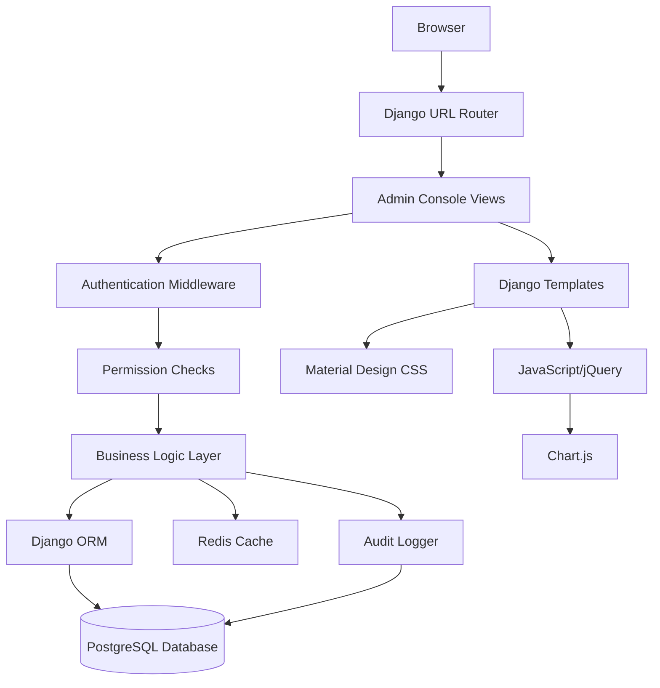

# Design Document: Custom Admin Console System

## Overview

The Custom Admin Console System is a comprehensive administrative interface built using Django's template system, Material Design CSS framework, and a left sidebar navigation pattern. The system provides superusers and administrators with powerful tools to manage vehicle types, pricing grids, users, and audit logs through an intuitive, responsive web interface.

### Key Design Principles

1. **Separation of Concerns**: Complete isolation from Django's default admin interface
2. **Material Design**: Modern, professional UI using Material Design Lite (MDL) or Materialize CSS
3. **Progressive Enhancement**: Core functionality works without JavaScript, enhanced with AJAX
4. **Security First**: Role-based access control, CSRF protection, and comprehensive audit logging
5. **Performance**: Optimized queries, pagination, and caching for large datasets
6. **Accessibility**: WCAG 2.1 AA compliant with keyboard navigation and screen reader support

### Technology Stack

- **Backend**: Django 5.2.7 with class-based and function-based views
- **Frontend**: Django Templates with template inheritance
- **CSS Framework**: Material Design Lite (MDL) or Materialize CSS
- **JavaScript**: Vanilla JS / jQuery for interactivity
- **Charts**: Chart.js for data visualizations
- **Authentication**: Django session-based authentication
- **Database**: PostgreSQL with existing models
- **Caching**: Redis for performance optimization

## Architecture

### High-Level Architecture




### Directory Structure

```
administration/
├── templates/
│   └── admin_console/
│       ├── base.html                 # Base template with sidebar
│       ├── dashboard.html            # Main dashboard
│       ├── vehicle_types/
│       │   ├── list.html            # Vehicle types list
│       │   ├── detail.html          # Vehicle type detail
│       │   ├── form.html            # Create/Edit form
│       │   └── bulk_edit.html       # Bulk operations
│       ├── price_grids/
│       │   ├── list.html            # Price grids list
│       │   ├── detail.html          # Price grid detail
│       │   ├── form.html            # Create/Edit form
│       │   └── import.html          # Import interface
│       ├── users/
│       │   ├── list.html            # Users list
│       │   ├── detail.html          # User detail
│       │   ├── form.html            # Edit form
│       │   └── permissions.html     # Permission management
│       ├── audit_logs/
│       │   ├── list.html            # Audit logs list
│       │   ├── detail.html          # Log detail
│       │   └── reports.html         # Report generation
│       └── auth/
│           ├── login.html           # Admin login
│           ├── 2fa_setup.html       # 2FA enrollment
│           └── 2fa_verify.html      # 2FA verification
├── static/
│   └── admin_console/
│       ├── css/
│       │   ├── admin_console.css    # Custom styles
│       │   └── themes.css           # Dark/Light themes
│       ├── js/
│       │   ├── admin_console.js     # Main JavaScript
│       │   ├── charts.js            # Chart configurations
│       │   ├── bulk_operations.js   # Bulk edit logic
│       │   └── search_filters.js    # Search/filter logic
│       └── img/
│           └── logo.png             # Admin console logo
├── views/
│   ├── __init__.py
│   ├── dashboard.py                 # Dashboard views
│   ├── vehicle_types.py             # Vehicle type views
│   ├── price_grids.py               # Price grid views
│   ├── users.py                     # User management views
│   ├── audit_logs.py                # Audit log views
│   └── auth.py                      # Authentication views
├── forms/
│   ├── __init__.py
│   ├── vehicle_types.py             # Vehicle type forms
│   ├── price_grids.py               # Price grid forms
│   ├── users.py                     # User forms
│   └── auth.py                      # Authentication forms
├── mixins.py                        # Reusable view mixins
├── decorators.py                    # Custom decorators
├── utils.py                         # Utility functions
├── urls.py                          # Admin console URLs
└── api_urls.py                      # AJAX API endpoints
```

### URL Structure

```
/admin-console/                                    # Dashboard
/admin-console/login/                              # Login page
/admin-console/logout/                             # Logout
/admin-console/2fa/setup/                          # 2FA setup
/admin-console/2fa/verify/                         # 2FA verification

/admin-console/vehicle-types/                      # List vehicle types
/admin-console/vehicle-types/create/               # Create vehicle type
/admin-console/vehicle-types/<id>/                 # View vehicle type
/admin-console/vehicle-types/<id>/edit/            # Edit vehicle type
/admin-console/vehicle-types/<id>/delete/          # Delete vehicle type
/admin-console/vehicle-types/bulk-edit/            # Bulk edit
/admin-console/vehicle-types/export/               # Export data

/admin-console/price-grids/                        # List price grids
/admin-console/price-grids/create/                 # Create price grid
/admin-console/price-grids/<id>/                   # View price grid
/admin-console/price-grids/<id>/edit/              # Edit price grid
/admin-console/price-grids/<id>/delete/            # Delete price grid
/admin-console/price-grids/import/                 # Import data
/admin-console/price-grids/export/                 # Export data

/admin-console/users/                              # List users
/admin-console/users/<id>/                         # View user
/admin-console/users/<id>/edit/                    # Edit user
/admin-console/users/<id>/permissions/             # Manage permissions
/admin-console/users/<id>/toggle-status/           # Activate/Deactivate
/admin-console/users/bulk-actions/                 # Bulk operations
/admin-console/users/export/                       # Export data

/admin-console/audit-logs/                         # List audit logs
/admin-console/audit-logs/<id>/                    # View log detail
/admin-console/audit-logs/export/                  # Export logs
/admin-console/audit-logs/reports/                 # Generate reports

/admin-console/api/stats/                          # Dashboard stats (AJAX)
/admin-console/api/search/                         # Search endpoint (AJAX)
/admin-console/api/bulk-update/                    # Bulk update (AJAX)
```

## Components and Interfaces

### 1. Base Template Component

The base template provides the foundational layout with left sidebar navigation.

**Key Features:**
- Fixed left sidebar with collapsible menu
- Top navigation bar with user info and logout
- Main content area with breadcrumbs
- Footer with system info
- Theme toggle (dark/light mode)
- Responsive design with mobile menu

**Template Structure:**
```html
<!DOCTYPE html>
<html>
<head>
    <!-- Material Design CSS -->
    <!-- Custom CSS -->
    <!-- Chart.js -->
</head>
<body>
    <!-- Left Sidebar -->
    <aside class="sidebar">
        <div class="logo">Admin Console</div>
        <nav>
            <ul>
                <li><a href="/admin-console/">Dashboard</a></li>
                <li><a href="/admin-console/vehicle-types/">Vehicle Types</a></li>
                <li><a href="/admin-console/price-grids/">Price Grids</a></li>
                <li><a href="/admin-console/users/">Users</a></li>
                <li><a href="/admin-console/audit-logs/">Audit Logs</a></li>
            </ul>
        </nav>
    </aside>
    
    <!-- Main Content -->
    <main class="main-content">
        <!-- Top Bar -->
        <header class="topbar">
            <button class="menu-toggle">☰</button>
            <div class="user-menu">
                <span>{{ user.get_full_name }}</span>
                <a href="/admin-console/logout/">Logout</a>
            </div>
        </header>
        
        <!-- Breadcrumbs -->
        <nav class="breadcrumbs">
            
        </nav>
        
        <!-- Messages -->
        
        <div class="messages">
            
            <div class="alert alert-{{ message.tags }}">{{ message }}</div>
            
        </div>
        
        
        <!-- Page Content -->
        <div class="content">
            
        </div>
    </main>
    
    <!-- JavaScript -->
    <script src=""></script>
    
</body>
</html>
```


### 2. Dashboard Component

The dashboard provides an overview of system health and key metrics.

**Key Features:**
- System health metrics cards
- Recent activity feed
- Charts for user growth, payment trends
- Quick action buttons
- Real-time updates via AJAX

**View Implementation:**
```python
# administration/views/dashboard.py
from django.contrib.auth.decorators import login_required, user_passes_test
from django.shortcuts import render
from django.db.models import Count, Sum
from django.utils import timezone
from datetime import timedelta

def is_admin_user(user):
    return user.is_authenticated and (user.is_staff or user.is_superuser)

@login_required
@user_passes_test(is_admin_user)
def dashboard_view(request):
    today = timezone.now().date()
    week_ago = today - timedelta(days=7)
    
    context = {
        'total_users': User.objects.filter(is_active=True).count(),
        'total_vehicles': Vehicule.objects.count(),
        'total_payments_today': PaiementTaxe.objects.filter(
            date_paiement__date=today
        ).count(),
        'recent_activities': AuditLog.objects.select_related('user')[:10],
        'payment_stats': get_payment_statistics(week_ago, today),
    }
    
    return render(request, 'admin_console/dashboard.html', context)
```

### 3. List View Component

Generic list view for displaying paginated data with search and filters.

**Key Features:**
- Pagination (50 items per page)
- Search functionality
- Column sorting
- Filters sidebar
- Bulk selection checkboxes
- Export buttons

**View Implementation:**
```python
# administration/views/vehicle_types.py
from django.views.generic import ListView
from django.contrib.auth.mixins import LoginRequiredMixin, UserPassesTestMixin

class AdminRequiredMixin(UserPassesTestMixin):
    def test_func(self):
        return self.request.user.is_staff or self.request.user.is_superuser

class VehicleTypeListView(LoginRequiredMixin, AdminRequiredMixin, ListView):
    model = Vehicule
    template_name = 'admin_console/vehicle_types/list.html'
    context_object_name = 'vehicle_types'
    paginate_by = 50
    
    def get_queryset(self):
        queryset = super().get_queryset()
        
        # Search
        search = self.request.GET.get('search')
        if search:
            queryset = queryset.filter(
                Q(plaque_immatriculation__icontains=search) |
                Q(proprietaire__username__icontains=search)
            )
        
        # Filters
        vehicle_type = self.request.GET.get('type')
        if vehicle_type:
            queryset = queryset.filter(type_vehicule=vehicle_type)
        
        # Sorting
        sort = self.request.GET.get('sort', '-created_at')
        queryset = queryset.order_by(sort)
        
        return queryset
```

### 4. Form Component

Generic form component for create/edit operations.

**Key Features:**
- Django form validation
- CSRF protection
- Field-level error display
- Success/error messages
- Cancel button

**Form Implementation:**
```python
# administration/forms/price_grids.py
from django import forms
from vehicles.models import GrilleTarifaire

class PriceGridForm(forms.ModelForm):
    class Meta:
        model = GrilleTarifaire
        fields = [
            'puissance_min_cv', 'puissance_max_cv', 'source_energie',
            'age_min_annees', 'age_max_annees', 'montant_ariary',
            'annee_fiscale', 'est_active'
        ]
        widgets = {
            'puissance_min_cv': forms.NumberInput(attrs={'class': 'mdl-textfield__input'}),
            'puissance_max_cv': forms.NumberInput(attrs={'class': 'mdl-textfield__input'}),
            'source_energie': forms.Select(attrs={'class': 'mdl-textfield__input'}),
            'montant_ariary': forms.NumberInput(attrs={'class': 'mdl-textfield__input'}),
        }
    
    def clean(self):
        cleaned_data = super().clean()
        puissance_min = cleaned_data.get('puissance_min_cv')
        puissance_max = cleaned_data.get('puissance_max_cv')
        
        if puissance_max and puissance_min and puissance_max < puissance_min:
            raise forms.ValidationError(
                "Maximum power must be greater than minimum power"
            )
        
        return cleaned_data
```

### 5. Authentication Component

Custom authentication with 2FA support.

**Key Features:**
- Custom login page
- Password strength validation
- Email verification
- TOTP 2FA (optional)
- IP whitelisting
- Session management

**View Implementation:**
```python
# administration/views/auth.py
from django.contrib.auth import authenticate, login
from django.contrib.auth.decorators import login_required
from django.shortcuts import render, redirect
from django.contrib import messages
import pyotp

def admin_login_view(request):
    if request.method == 'POST':
        username = request.POST.get('username')
        password = request.POST.get('password')
        
        user = authenticate(request, username=username, password=password)
        
        if user and (user.is_staff or user.is_superuser):
            # Check IP whitelist if enabled
            if has_ip_whitelist(user):
                if not is_ip_whitelisted(user, get_client_ip(request)):
                    messages.error(request, "Access denied from this IP address")
                    return render(request, 'admin_console/auth/login.html')
            
            # Check if 2FA is enabled
            if has_2fa_enabled(user):
                request.session['pre_2fa_user_id'] = user.id
                return redirect('admin_console:2fa_verify')
            
            login(request, user)
            return redirect('admin_console:dashboard')
        else:
            messages.error(request, "Invalid credentials or insufficient permissions")
    
    return render(request, 'admin_console/auth/login.html')

@login_required
def setup_2fa_view(request):
    if request.method == 'POST':
        token = request.POST.get('token')
        secret = request.session.get('2fa_secret')
        
        totp = pyotp.TOTP(secret)
        if totp.verify(token):
            # Save secret to user profile
            save_2fa_secret(request.user, secret)
            messages.success(request, "2FA enabled successfully")
            return redirect('admin_console:dashboard')
        else:
            messages.error(request, "Invalid token")
    else:
        # Generate new secret
        secret = pyotp.random_base32()
        request.session['2fa_secret'] = secret
        totp_uri = pyotp.totp.TOTP(secret).provisioning_uri(
            name=request.user.email,
            issuer_name='Tax Collector Admin'
        )
    
    return render(request, 'admin_console/auth/2fa_setup.html', {
        'totp_uri': totp_uri,
        'secret': secret
    })
```


### 6. Bulk Operations Component

Component for performing actions on multiple records.

**Key Features:**
- Multi-select checkboxes
- Bulk action dropdown
- Progress indicator
- Confirmation dialogs
- Result summary

**JavaScript Implementation:**
```javascript
// static/admin_console/js/bulk_operations.js
class BulkOperations {
    constructor() {
        this.selectedItems = new Set();
        this.init();
    }
    
    init() {
        // Select all checkbox
        document.getElementById('select-all')?.addEventListener('change', (e) => {
            this.selectAll(e.target.checked);
        });
        
        // Individual checkboxes
        document.querySelectorAll('.item-checkbox').forEach(checkbox => {
            checkbox.addEventListener('change', (e) => {
                this.toggleItem(e.target.value, e.target.checked);
            });
        });
        
        // Bulk action button
        document.getElementById('bulk-action-btn')?.addEventListener('click', () => {
            this.executeBulkAction();
        });
    }
    
    selectAll(checked) {
        document.querySelectorAll('.item-checkbox').forEach(checkbox => {
            checkbox.checked = checked;
            this.toggleItem(checkbox.value, checked);
        });
        this.updateCounter();
    }
    
    toggleItem(itemId, selected) {
        if (selected) {
            this.selectedItems.add(itemId);
        } else {
            this.selectedItems.delete(itemId);
        }
        this.updateCounter();
    }
    
    updateCounter() {
        const counter = document.getElementById('selected-count');
        if (counter) {
            counter.textContent = `${this.selectedItems.size} selected`;
        }
    }
    
    async executeBulkAction() {
        const action = document.getElementById('bulk-action-select').value;
        if (!action || this.selectedItems.size === 0) {
            return;
        }
        
        if (!confirm(`Are you sure you want to ${action} ${this.selectedItems.size} items?`)) {
            return;
        }
        
        const csrfToken = document.querySelector('[name=csrfmiddlewaretoken]').value;
        
        try {
            const response = await fetch('/admin-console/api/bulk-update/', {
                method: 'POST',
                headers: {
                    'Content-Type': 'application/json',
                    'X-CSRFToken': csrfToken
                },
                body: JSON.stringify({
                    action: action,
                    items: Array.from(this.selectedItems)
                })
            });
            
            const result = await response.json();
            
            if (result.success) {
                showMessage('success', `Successfully ${action} ${result.count} items`);
                location.reload();
            } else {
                showMessage('error', result.message);
            }
        } catch (error) {
            showMessage('error', 'An error occurred during bulk operation');
        }
    }
}

// Initialize on page load
document.addEventListener('DOMContentLoaded', () => {
    new BulkOperations();
});
```

### 7. Search and Filter Component

Advanced search with faceted filters.

**JavaScript Implementation:**
```javascript
// static/admin_console/js/search_filters.js
class SearchFilters {
    constructor() {
        this.filters = {};
        this.init();
    }
    
    init() {
        // Search input with debounce
        const searchInput = document.getElementById('search-input');
        if (searchInput) {
            let debounceTimer;
            searchInput.addEventListener('input', (e) => {
                clearTimeout(debounceTimer);
                debounceTimer = setTimeout(() => {
                    this.applyFilters();
                }, 500);
            });
        }
        
        // Filter checkboxes
        document.querySelectorAll('.filter-checkbox').forEach(checkbox => {
            checkbox.addEventListener('change', () => {
                this.applyFilters();
            });
        });
        
        // Clear filters button
        document.getElementById('clear-filters')?.addEventListener('click', () => {
            this.clearFilters();
        });
    }
    
    applyFilters() {
        const params = new URLSearchParams();
        
        // Search term
        const searchTerm = document.getElementById('search-input')?.value;
        if (searchTerm) {
            params.append('search', searchTerm);
        }
        
        // Active filters
        document.querySelectorAll('.filter-checkbox:checked').forEach(checkbox => {
            params.append(checkbox.name, checkbox.value);
        });
        
        // Update URL and reload
        window.location.search = params.toString();
    }
    
    clearFilters() {
        document.getElementById('search-input').value = '';
        document.querySelectorAll('.filter-checkbox').forEach(checkbox => {
            checkbox.checked = false;
        });
        window.location.search = '';
    }
}

// Initialize on page load
document.addEventListener('DOMContentLoaded', () => {
    new SearchFilters();
});
```

### 8. Chart Component

Dashboard charts using Chart.js.

**JavaScript Implementation:**
```javascript
// static/admin_console/js/charts.js
class DashboardCharts {
    constructor() {
        this.charts = {};
        this.init();
    }
    
    async init() {
        await this.loadData();
        this.renderCharts();
        
        // Auto-refresh every 30 seconds
        setInterval(() => this.refreshCharts(), 30000);
    }
    
    async loadData() {
        try {
            const response = await fetch('/admin-console/api/stats/');
            this.data = await response.json();
        } catch (error) {
            console.error('Failed to load chart data:', error);
        }
    }
    
    renderCharts() {
        this.renderUserGrowthChart();
        this.renderPaymentTrendsChart();
        this.renderVehicleDistributionChart();
    }
    
    renderUserGrowthChart() {
        const ctx = document.getElementById('user-growth-chart');
        if (!ctx) return;
        
        this.charts.userGrowth = new Chart(ctx, {
            type: 'line',
            data: {
                labels: this.data.user_growth.labels,
                datasets: [{
                    label: 'New Users',
                    data: this.data.user_growth.values,
                    borderColor: 'rgb(75, 192, 192)',
                    tension: 0.1
                }]
            },
            options: {
                responsive: true,
                maintainAspectRatio: false
            }
        });
    }
    
    renderPaymentTrendsChart() {
        const ctx = document.getElementById('payment-trends-chart');
        if (!ctx) return;
        
        this.charts.paymentTrends = new Chart(ctx, {
            type: 'bar',
            data: {
                labels: this.data.payment_trends.labels,
                datasets: [{
                    label: 'Payments',
                    data: this.data.payment_trends.values,
                    backgroundColor: 'rgba(54, 162, 235, 0.5)'
                }]
            },
            options: {
                responsive: true,
                maintainAspectRatio: false
            }
        });
    }
    
    renderVehicleDistributionChart() {
        const ctx = document.getElementById('vehicle-distribution-chart');
        if (!ctx) return;
        
        this.charts.vehicleDistribution = new Chart(ctx, {
            type: 'doughnut',
            data: {
                labels: this.data.vehicle_distribution.labels,
                datasets: [{
                    data: this.data.vehicle_distribution.values,
                    backgroundColor: [
                        'rgba(255, 99, 132, 0.5)',
                        'rgba(54, 162, 235, 0.5)',
                        'rgba(255, 206, 86, 0.5)',
                        'rgba(75, 192, 192, 0.5)'
                    ]
                }]
            },
            options: {
                responsive: true,
                maintainAspectRatio: false
            }
        });
    }
    
    async refreshCharts() {
        await this.loadData();
        
        // Update existing charts
        Object.values(this.charts).forEach(chart => {
            chart.update();
        });
    }
}

// Initialize on page load
document.addEventListener('DOMContentLoaded', () => {
    new DashboardCharts();
});
```

## Data Models

The Admin Console uses existing models from the Tax Collector platform:

### Core Models Used

1. **User** (Django's built-in User model)
   - Used for authentication and user management
   - Extended with UserProfile for additional fields

2. **UserProfile** (core.models.UserProfile)
   - User type classification
   - Verification status
   - Language preference
   - 2FA settings (to be added)
   - IP whitelist (to be added)

3. **Vehicule** (vehicles.models.Vehicule)
   - Vehicle registration data
   - Type classification
   - Owner relationship

4. **GrilleTarifaire** (vehicles.models.GrilleTarifaire)
   - Tax calculation matrix
   - Power ranges and energy sources
   - Age-based pricing

5. **PaiementTaxe** (payments.models.PaiementTaxe)
   - Payment records
   - Transaction tracking
   - Status management

6. **AuditLog** (core.models.AuditLog)
   - Action tracking
   - User activity monitoring
   - Data change history

### New Models Required

```python
# administration/models.py

class AdminUserProfile(models.Model):
    """Extended profile for admin users"""
    user = models.OneToOneField(User, on_delete=models.CASCADE, related_name='admin_profile')
    totp_secret = models.CharField(max_length=32, blank=True)
    is_2fa_enabled = models.BooleanField(default=False)
    ip_whitelist = models.JSONField(default=list, blank=True)
    last_login_ip = models.GenericIPAddressField(null=True, blank=True)
    failed_login_attempts = models.IntegerField(default=0)
    account_locked_until = models.DateTimeField(null=True, blank=True)
    created_at = models.DateTimeField(auto_now_add=True)
    updated_at = models.DateTimeField(auto_now=True)

class PermissionGroup(models.Model):
    """Custom permission groups for RBAC"""
    name = models.CharField(max_length=100, unique=True)
    description = models.TextField(blank=True)
    permissions = models.JSONField(default=dict)
    created_by = models.ForeignKey(User, on_delete=models.SET_NULL, null=True)
    created_at = models.DateTimeField(auto_now_add=True)
    updated_at = models.DateTimeField(auto_now=True)

class AdminSession(models.Model):
    """Track admin user sessions"""
    user = models.ForeignKey(User, on_delete=models.CASCADE)
    session_key = models.CharField(max_length=40, unique=True)
    ip_address = models.GenericIPAddressField()
    user_agent = models.TextField()
    created_at = models.DateTimeField(auto_now_add=True)
    last_activity = models.DateTimeField(auto_now=True)
    is_active = models.BooleanField(default=True)

class DataVersion(models.Model):
    """Track version history for records"""
    content_type = models.ForeignKey(ContentType, on_delete=models.CASCADE)
    object_id = models.CharField(max_length=50)
    version_number = models.IntegerField()
    data_snapshot = models.JSONField()
    changed_by = models.ForeignKey(User, on_delete=models.SET_NULL, null=True)
    changed_at = models.DateTimeField(auto_now_add=True)
    change_reason = models.TextField(blank=True)
```


## Error Handling

### Error Handling Strategy

1. **Form Validation Errors**
   - Display field-level errors below inputs
   - Show summary of errors at top of form
   - Preserve user input on validation failure

2. **Permission Errors**
   - Redirect to custom 403 page
   - Log unauthorized access attempts
   - Display user-friendly message

3. **Not Found Errors**
   - Custom 404 page with navigation
   - Suggest similar resources
   - Log 404 occurrences

4. **Server Errors**
   - Custom 500 page
   - Log full error details
   - Display generic message to user
   - Send alert to administrators

5. **AJAX Errors**
   - Display toast notifications
   - Retry mechanism for transient failures
   - Fallback to full page reload

### Error Logging

```python
# administration/utils.py
import logging
from core.models import AuditLog

logger = logging.getLogger('admin_console')

def log_admin_action(user, action, table, object_id, before=None, after=None, ip_address=None):
    """Log administrative actions to audit log"""
    try:
        AuditLog.objects.create(
            user=user,
            action=action,
            table_concernee=table,
            objet_id=str(object_id),
            donnees_avant=before,
            donnees_apres=after,
            adresse_ip=ip_address
        )
    except Exception as e:
        logger.error(f"Failed to create audit log: {e}")

def log_error(request, error, context=None):
    """Log errors with context"""
    logger.error(
        f"Error in admin console: {error}",
        extra={
            'user': request.user.username if request.user.is_authenticated else 'anonymous',
            'path': request.path,
            'method': request.method,
            'ip': get_client_ip(request),
            'context': context
        }
    )
```

## Testing Strategy

### Unit Tests

Test individual components in isolation:

```python
# administration/tests/test_views.py
from django.test import TestCase, Client
from django.contrib.auth.models import User
from django.urls import reverse

class DashboardViewTests(TestCase):
    def setUp(self):
        self.client = Client()
        self.admin_user = User.objects.create_superuser(
            username='admin',
            email='admin@test.com',
            password='TestPass123!'
        )
    
    def test_dashboard_requires_authentication(self):
        response = self.client.get(reverse('admin_console:dashboard'))
        self.assertEqual(response.status_code, 302)  # Redirect to login
    
    def test_dashboard_requires_staff_status(self):
        regular_user = User.objects.create_user(
            username='user',
            password='TestPass123!'
        )
        self.client.login(username='user', password='TestPass123!')
        response = self.client.get(reverse('admin_console:dashboard'))
        self.assertEqual(response.status_code, 403)  # Forbidden
    
    def test_dashboard_accessible_to_admin(self):
        self.client.login(username='admin', password='TestPass123!')
        response = self.client.get(reverse('admin_console:dashboard'))
        self.assertEqual(response.status_code, 200)
        self.assertContains(response, 'Dashboard')
```

### Integration Tests

Test component interactions:

```python
# administration/tests/test_integration.py
from django.test import TestCase, Client
from vehicles.models import GrilleTarifaire

class PriceGridManagementTests(TestCase):
    def setUp(self):
        self.client = Client()
        self.admin_user = User.objects.create_superuser(
            username='admin',
            email='admin@test.com',
            password='TestPass123!'
        )
        self.client.login(username='admin', password='TestPass123!')
    
    def test_create_price_grid_flow(self):
        # Access create form
        response = self.client.get(reverse('admin_console:price_grid_create'))
        self.assertEqual(response.status_code, 200)
        
        # Submit form
        data = {
            'puissance_min_cv': 1,
            'puissance_max_cv': 4,
            'source_energie': 'Essence',
            'age_min_annees': 0,
            'age_max_annees': 5,
            'montant_ariary': 15000,
            'annee_fiscale': 2026,
            'est_active': True
        }
        response = self.client.post(
            reverse('admin_console:price_grid_create'),
            data
        )
        
        # Verify redirect and creation
        self.assertEqual(response.status_code, 302)
        self.assertTrue(GrilleTarifaire.objects.filter(
            puissance_min_cv=1,
            annee_fiscale=2026
        ).exists())
```

### Accessibility Tests

```python
# administration/tests/test_accessibility.py
from django.test import TestCase
from axe_selenium_python import Axe

class AccessibilityTests(TestCase):
    def test_dashboard_accessibility(self):
        # Use axe-core for automated accessibility testing
        self.driver.get(self.live_server_url + '/admin-console/')
        axe = Axe(self.driver)
        axe.inject()
        results = axe.run()
        
        # Assert no violations
        self.assertEqual(len(results['violations']), 0)
```

### Performance Tests

```python
# administration/tests/test_performance.py
from django.test import TestCase
from django.test.utils import override_settings
import time

class PerformanceTests(TestCase):
    def test_list_view_performance_with_large_dataset(self):
        # Create 10,000 test records
        for i in range(10000):
            Vehicule.objects.create(...)
        
        # Measure response time
        start = time.time()
        response = self.client.get(reverse('admin_console:vehicle_types'))
        duration = time.time() - start
        
        # Assert response time < 2 seconds
        self.assertLess(duration, 2.0)
        self.assertEqual(response.status_code, 200)
```

## Security Considerations

### Authentication Security

1. **Password Requirements**
   - Minimum 12 characters
   - Must contain uppercase, lowercase, digit, special character
   - Password history (prevent reuse of last 5 passwords)
   - Password expiration (90 days for admin accounts)

2. **Session Security**
   - Secure session cookies (HttpOnly, Secure flags)
   - Session timeout after 30 minutes of inactivity
   - Concurrent session limit (max 3 active sessions)
   - Session invalidation on password change

3. **Two-Factor Authentication**
   - TOTP-based (compatible with Google Authenticator, Authy)
   - Backup codes for account recovery
   - Optional enforcement for all admin users

4. **IP Whitelisting**
   - Configurable per user
   - Support for IP ranges (CIDR notation)
   - Automatic lockout from non-whitelisted IPs

### Authorization Security

1. **Role-Based Access Control**
   - Granular permissions per module
   - Permission inheritance
   - Audit trail for permission changes

2. **Principle of Least Privilege**
   - Default deny for all actions
   - Explicit permission grants required
   - Regular permission audits

### Data Security

1. **Input Validation**
   - Server-side validation for all inputs
   - Whitelist approach for allowed values
   - Sanitization of user-provided data

2. **Output Encoding**
   - HTML escaping by default (Django templates)
   - Context-aware encoding
   - CSP headers for XSS prevention

3. **CSRF Protection**
   - Django's built-in CSRF middleware
   - CSRF tokens in all forms
   - SameSite cookie attribute

4. **SQL Injection Prevention**
   - Django ORM parameterized queries
   - No raw SQL without parameterization
   - Input validation before database operations

### Audit and Monitoring

1. **Comprehensive Logging**
   - All authentication attempts
   - All data modifications
   - All permission changes
   - All failed authorization attempts

2. **Anomaly Detection**
   - Multiple failed login attempts
   - Unusual access patterns
   - Bulk data exports
   - After-hours access

3. **Alerting**
   - Email alerts for security events
   - Real-time dashboard notifications
   - Integration with monitoring systems

## Performance Optimization

### Database Optimization

1. **Query Optimization**
   ```python
   # Use select_related for foreign keys
   queryset = Vehicule.objects.select_related('proprietaire')
   
   # Use prefetch_related for many-to-many
   queryset = User.objects.prefetch_related('groups')
   
   # Use only() to limit fields
   queryset = Vehicule.objects.only('plaque_immatriculation', 'type_vehicule')
   
   # Use defer() to exclude large fields
   queryset = AuditLog.objects.defer('donnees_avant', 'donnees_apres')
   ```

2. **Database Indexes**
   ```python
   class Meta:
       indexes = [
           models.Index(fields=['created_at']),
           models.Index(fields=['user', 'action']),
           models.Index(fields=['table_concernee', 'objet_id']),
       ]
   ```

3. **Pagination**
   - Limit results to 50 per page
   - Use cursor-based pagination for large datasets
   - Implement "Load More" for infinite scroll

### Caching Strategy

1. **View Caching**
   ```python
   from django.views.decorators.cache import cache_page
   
   @cache_page(60 * 5)  # Cache for 5 minutes
   def dashboard_stats_api(request):
       # Expensive computation
       return JsonResponse(stats)
   ```

2. **Template Fragment Caching**
   ```django
   
   
       <!-- Sidebar content -->
   
   ```

3. **Query Result Caching**
   ```python
   from django.core.cache import cache
   
   def get_dashboard_stats():
       cache_key = 'dashboard_stats'
       stats = cache.get(cache_key)
       
       if stats is None:
           stats = compute_stats()
           cache.set(cache_key, stats, 300)  # 5 minutes
       
       return stats
   ```

### Frontend Optimization

1. **Asset Optimization**
   - Minify CSS and JavaScript
   - Combine files to reduce HTTP requests
   - Use CDN for static assets
   - Implement browser caching headers

2. **Lazy Loading**
   - Load images on scroll
   - Defer non-critical JavaScript
   - Code splitting for large modules

3. **Progressive Enhancement**
   - Core functionality without JavaScript
   - Enhanced features with JavaScript
   - Graceful degradation

## Deployment Considerations

### Environment Configuration

```python
# settings/admin_console.py

# Admin Console specific settings
ADMIN_CONSOLE_ENABLED = True
ADMIN_CONSOLE_SESSION_TIMEOUT = 1800  # 30 minutes
ADMIN_CONSOLE_MAX_FAILED_LOGINS = 5
ADMIN_CONSOLE_LOCKOUT_DURATION = 900  # 15 minutes
ADMIN_CONSOLE_2FA_REQUIRED = False  # Optional by default
ADMIN_CONSOLE_IP_WHITELIST_ENABLED = False

# Pagination
ADMIN_CONSOLE_PAGE_SIZE = 50
ADMIN_CONSOLE_MAX_EXPORT_SIZE = 10000

# Cache settings
ADMIN_CONSOLE_CACHE_TIMEOUT = 300  # 5 minutes
```

### Static Files

```bash
# Collect static files
python manage.py collectstatic --noinput

# Compress static files (if using django-compressor)
python manage.py compress
```

### Database Migrations

```bash
# Create migrations for new models
python manage.py makemigrations administration

# Apply migrations
python manage.py migrate administration
```

### Initial Data

```python
# administration/management/commands/setup_admin_console.py
from django.core.management.base import BaseCommand
from administration.models import PermissionGroup

class Command(BaseCommand):
    help = 'Setup initial admin console data'
    
    def handle(self, *args, **options):
        # Create default permission groups
        PermissionGroup.objects.get_or_create(
            name='Super Admin',
            defaults={
                'description': 'Full access to all modules',
                'permissions': {
                    'vehicle_types': ['view', 'create', 'edit', 'delete'],
                    'price_grids': ['view', 'create', 'edit', 'delete'],
                    'users': ['view', 'create', 'edit', 'delete'],
                    'audit_logs': ['view', 'export']
                }
            }
        )
        
        self.stdout.write(self.style.SUCCESS('Admin console setup complete'))
```

## Maintenance and Monitoring

### Health Checks

```python
# administration/views/health.py
from django.http import JsonResponse
from django.db import connection

def health_check(request):
    """Health check endpoint for monitoring"""
    health = {
        'status': 'healthy',
        'database': check_database(),
        'cache': check_cache(),
        'disk_space': check_disk_space()
    }
    
    status_code = 200 if health['status'] == 'healthy' else 503
    return JsonResponse(health, status=status_code)

def check_database():
    try:
        with connection.cursor() as cursor:
            cursor.execute("SELECT 1")
        return 'ok'
    except Exception as e:
        return f'error: {str(e)}'
```

### Monitoring Metrics

Key metrics to monitor:
- Response times (p50, p95, p99)
- Error rates
- Active sessions
- Database query performance
- Cache hit rates
- Disk usage
- Memory usage

### Backup Strategy

1. **Database Backups**
   - Daily automated backups
   - Retention: 30 days
   - Test restoration monthly

2. **Audit Log Archival**
   - Archive logs older than 12 months
   - Compress and store in cold storage
   - Maintain searchable index

3. **Configuration Backups**
   - Version control for code
   - Backup environment variables
   - Document deployment procedures

This design provides a comprehensive blueprint for implementing the Custom Admin Console System with a focus on security, performance, and maintainability.
