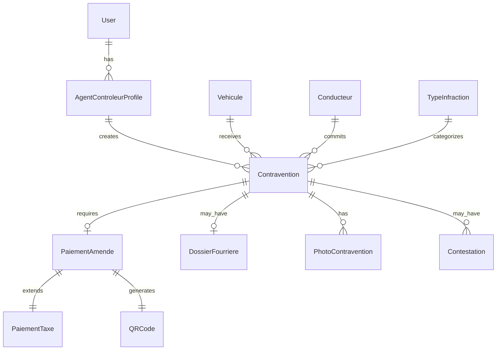

# Design Document - Système de Contravention Numérique

## Overview

Le système de contravention numérique est une extension de la plateforme TaxCollector existante qui permet aux agents de police et de gendarmerie d'enregistrer des infractions routières, d'émettre des contraventions numériques, et de gérer les paiements d'amendes. Le système s'intègre étroitement avec les modules existants (véhicules, paiements, utilisateurs) et réutilise les infrastructures de paiement (MVola, Stripe, espèces) déjà en place.

### Objectifs de Design

1. **Intégration transparente** avec les modèles Django existants (Vehicule, PaiementTaxe, UserProfile, QRCode)
2. **Réutilisation maximale** des systèmes de paiement existants (MVola, Stripe, Cash)
3. **Conformité légale** avec la Loi n°2017-002 du Code de la Route Malagasy
4. **Traçabilité complète** via un système d'audit immutable
5. **Support mobile** avec mode hors ligne pour les agents sur le terrain
6. **Performance** pour gérer des milliers de contraventions quotidiennes

## Architecture

### Architecture Globale

Le système suit l'architecture Django existante avec une nouvelle application `contraventions` qui s'intègre aux applications existantes:

```
taxcollector_project/
├── contraventions/          # Nouvelle application
│   ├── models.py           # Modèles de données
│   ├── views.py            # Vues web
│   ├── api_views.py        # API REST pour mobile
│   ├── forms.py            # Formulaires Django
│   ├── services/           # Logique métier
│   │   ├── contravention_service.py
│   │   ├── infraction_service.py
│   │   ├── fourriere_service.py
│   │   └── audit_service.py
│   ├── management/commands/
│   │   ├── import_infractions.py
│   │   └── calculate_penalties.py
│   └── templates/contraventions/
├── vehicles/               # Application existante
├── payments/               # Application existante
├── core/                   # Application existante
└── administration/         # Application existante
```

### Diagramme de Relations




## Components and Interfaces

### 1. Modèles de Données (contraventions/models.py)

#### TypeInfraction
Catalogue des infractions conformes à la Loi n°2017-002.

**Champs:**
- `id`: UUID (PK)
- `nom`: CharField(255) - Nom de l'infraction
- `article_code`: CharField(50) - Article du Code (ex: L7.1-1)
- `loi_reference`: CharField(100) - Référence légale (Loi n°2017-002)
- `categorie`: CharField(50) - Choices: DELIT_GRAVE, CIRCULATION, DOCUMENTAIRE, SECURITE
- `montant_min_ariary`: DecimalField - Montant minimum
- `montant_max_ariary`: DecimalField - Montant maximum
- `montant_variable`: BooleanField - Si montant déterminé par autorité
- `sanctions_administratives`: TextField - Description des sanctions
- `fourriere_obligatoire`: BooleanField
- `emprisonnement_possible`: CharField(100) - Durée possible
- `penalite_accident_ariary`: DecimalField(null=True) - Majoration si accident
- `penalite_recidive_pct`: DecimalField(null=True) - % majoration récidive
- `est_actif`: BooleanField(default=True)
- `created_at`: DateTimeField(auto_now_add=True)
- `updated_at`: DateTimeField(auto_now=True)

**Méthodes:**
- `get_montant_pour_autorite(autorite)`: Retourne le montant applicable
- `calculer_montant_avec_aggravations(has_accident, is_recidive)`: Calcule le montant final

#### AgentControleurProfile
Profil des agents de police/gendarmerie autorisés.

**Champs:**
- `id`: UUID (PK)
- `user`: OneToOneField(User) - Lien vers compte utilisateur
- `matricule`: CharField(50, unique=True) - Matricule unique
- `nom_complet`: CharField(200)
- `unite_affectation`: CharField(200) - Unité/brigade
- `grade`: CharField(100) - Grade de l'agent
- `autorite_type`: CharField(50) - Choices: POLICE_NATIONALE, GENDARMERIE, POLICE_COMMUNALE
- `juridiction`: CharField(200) - Zone de compétence
- `telephone`: CharField(20)
- `est_actif`: BooleanField(default=True)
- `created_at`: DateTimeField(auto_now_add=True)

**Relations:**
- Extends UserProfile via user.profile
- Utilise les permissions Django existantes

#### Conducteur
Informations sur le conducteur en infraction.

**Champs:**
- `id`: UUID (PK)
- `cin`: CharField(12) - Numéro CIN
- `nom_complet`: CharField(200)
- `date_naissance`: DateField(null=True)
- `adresse`: TextField(blank=True)
- `telephone`: CharField(20, blank=True)
- `numero_permis`: CharField(50, blank=True)
- `categorie_permis`: CharField(20, blank=True)
- `date_delivrance_permis`: DateField(null=True)
- `created_at`: DateTimeField(auto_now_add=True)
- `updated_at`: DateTimeField(auto_now=True)

**Indexes:**
- Index sur `cin`
- Index sur `numero_permis`

#### Contravention
Enregistrement principal d'une contravention.

**Champs:**
- `id`: UUID (PK)
- `numero_pv`: CharField(50, unique=True) - Format: PV-YYYYMMDD-XXXXXX
- `agent_controleur`: ForeignKey(AgentControleurProfile)
- `type_infraction`: ForeignKey(TypeInfraction)
- `vehicule`: ForeignKey(Vehicule, null=True) - Peut être null si non enregistré
- `vehicule_plaque_manuelle`: CharField(20, blank=True) - Si véhicule non trouvé
- `vehicule_marque_manuelle`: CharField(100, blank=True)
- `vehicule_modele_manuelle`: CharField(100, blank=True)
- `conducteur`: ForeignKey(Conducteur)
- `date_heure_infraction`: DateTimeField
- `lieu_infraction`: TextField - Adresse textuelle
- `route_type`: CharField(50) - Choices: NATIONALE, COMMUNALE, AUTRE
- `route_numero`: CharField(20, blank=True)
- `coordonnees_gps_lat`: DecimalField(null=True)
- `coordonnees_gps_lon`: DecimalField(null=True)
- `montant_amende_ariary`: DecimalField
- `a_accident_associe`: BooleanField(default=False)
- `est_recidive`: BooleanField(default=False)
- `observations`: TextField(blank=True)
- `statut`: CharField(20) - Choices: IMPAYEE, PAYEE, CONTESTEE, ANNULEE
- `delai_paiement_jours`: IntegerField(default=15)
- `date_limite_paiement`: DateField
- `date_paiement`: DateTimeField(null=True)
- `signature_electronique_conducteur`: TextField(blank=True) - Base64
- `qr_code`: ForeignKey(QRCode, null=True) - Réutilise le modèle existant
- `created_at`: DateTimeField(auto_now_add=True)
- `updated_at`: DateTimeField(auto_now=True)

**Méthodes:**
- `generate_numero_pv()`: Génère le numéro unique
- `calculer_date_limite()`: Calcule la date limite de paiement
- `est_en_retard()`: Vérifie si le délai est dépassé
- `calculer_penalite_retard()`: Calcule la majoration de retard
- `get_montant_total()`: Montant avec pénalités si applicable

**Indexes:**
- Index sur `numero_pv`
- Index sur `agent_controleur`, `date_heure_infraction`
- Index sur `vehicule`, `statut`
- Index sur `conducteur`, `statut`
- Index sur `statut`, `date_limite_paiement`


#### PaiementAmende
Extension du modèle PaiementTaxe pour les amendes.

**Approche:** Réutiliser PaiementTaxe avec un type spécifique plutôt que créer un nouveau modèle.

**Modifications à PaiementTaxe:**
- Ajouter `type_paiement`: CharField - Choices: TAXE_VEHICULE, AMENDE_CONTRAVENTION
- Ajouter `contravention`: ForeignKey(Contravention, null=True)

**Logique:**
- Quand une amende est payée, créer un PaiementTaxe avec type=AMENDE_CONTRAVENTION
- Utiliser les méthodes de paiement existantes (MVola, Stripe, Cash)
- Générer un QRCode via le système existant
- Appliquer les frais de plateforme selon la configuration

#### DossierFourriere
Gestion des véhicules mis en fourrière.

**Champs:**
- `id`: UUID (PK)
- `contravention`: OneToOneField(Contravention)
- `numero_dossier`: CharField(50, unique=True) - Format: FOUR-YYYYMMDD-XXXXX
- `date_mise_fourriere`: DateTimeField
- `lieu_fourriere`: CharField(200)
- `adresse_fourriere`: TextField
- `type_vehicule`: CharField(50) - Pour calcul des frais
- `frais_transport_ariary`: DecimalField
- `frais_gardiennage_journalier_ariary`: DecimalField
- `duree_minimale_jours`: IntegerField(default=10)
- `date_sortie_fourriere`: DateTimeField(null=True)
- `frais_totaux_ariary`: DecimalField(default=0)
- `statut`: CharField(20) - Choices: EN_FOURRIERE, RESTITUE, VENDU_AUX_ENCHERES
- `bon_sortie_numero`: CharField(50, blank=True)
- `notes`: TextField(blank=True)
- `created_at`: DateTimeField(auto_now_add=True)

**Méthodes:**
- `calculer_frais_gardiennage()`: Calcule les frais selon jours écoulés
- `calculer_frais_totaux()`: Transport + gardiennage
- `peut_etre_restitue()`: Vérifie si durée minimale atteinte et paiements effectués
- `generer_bon_sortie()`: Génère le bon de sortie avec QR code

#### PhotoContravention
Photos et preuves de l'infraction.

**Champs:**
- `id`: UUID (PK)
- `contravention`: ForeignKey(Contravention, related_name='photos')
- `fichier`: ImageField(upload_to='contraventions/%Y/%m/%d/')
- `description`: CharField(200, blank=True)
- `ordre`: IntegerField(default=0) - Pour tri
- `metadata_exif`: JSONField(default=dict) - Date, GPS, etc.
- `hash_fichier`: CharField(64) - SHA-256 pour intégrité
- `annotations`: JSONField(default=dict) - Marqueurs et textes
- `uploaded_by`: ForeignKey(User)
- `created_at`: DateTimeField(auto_now_add=True)

**Méthodes:**
- `save()`: Override pour compression via ImageOptimizer et calcul du hash
- `verify_integrity()`: Vérifie que le hash correspond au fichier

#### Contestation
Gestion des contestations de contraventions.

**Champs:**
- `id`: UUID (PK)
- `contravention`: ForeignKey(Contravention, related_name='contestations')
- `numero_contestation`: CharField(50, unique=True)
- `demandeur`: ForeignKey(User, null=True) - Si compte utilisateur
- `nom_demandeur`: CharField(200)
- `email_demandeur`: EmailField(blank=True)
- `telephone_demandeur`: CharField(20, blank=True)
- `motif`: TextField
- `date_soumission`: DateTimeField(auto_now_add=True)
- `statut`: CharField(20) - Choices: EN_ATTENTE, EN_EXAMEN, ACCEPTEE, REJETEE
- `examine_par`: ForeignKey(User, null=True, related_name='contestations_examinees')
- `date_examen`: DateTimeField(null=True)
- `decision_motif`: TextField(blank=True)
- `documents_justificatifs`: JSONField(default=list) - URLs des documents
- `created_at`: DateTimeField(auto_now_add=True)

**Méthodes:**
- `suspendre_delai_paiement()`: Suspend le délai pendant examen
- `reactiver_delai_paiement()`: Réactive si rejetée
- `annuler_contravention()`: Annule si acceptée

#### ContraventionAuditLog
Journal d'audit immutable pour traçabilité.

**Champs:**
- `id`: UUID (PK)
- `action_type`: CharField(50) - Choices: CREATE, UPDATE, PAYMENT, CANCEL, CONTEST, etc.
- `user`: ForeignKey(User, null=True)
- `contravention`: ForeignKey(Contravention, null=True)
- `action_data`: JSONField(default=dict)
- `ip_address`: GenericIPAddressField(null=True)
- `user_agent`: TextField(blank=True)
- `previous_hash`: CharField(64, blank=True)
- `current_hash`: CharField(64)
- `timestamp`: DateTimeField(auto_now_add=True)

**Méthodes:**
- `calculate_hash()`: Calcule SHA-256 comme CashAuditLog
- `get_last_hash()`: Récupère le hash précédent pour chaînage

#### ConfigurationSysteme
Configuration globale du système de contraventions.

**Champs:**
- `id`: AutoField(PK) - Singleton
- `delai_paiement_standard_jours`: IntegerField(default=15)
- `delai_paiement_immediat_jours`: IntegerField(default=1)
- `penalite_retard_pct`: DecimalField(default=10.00)
- `frais_transport_fourriere_ariary`: DecimalField(default=20000)
- `frais_gardiennage_journalier_ariary`: DecimalField(default=10000)
- `duree_minimale_fourriere_jours`: IntegerField(default=10)
- `duree_minimale_fourriere_perissable_jours`: IntegerField(default=5)
- `delai_annulation_directe_heures`: IntegerField(default=24)
- `delai_contestation_jours`: IntegerField(default=30)
- `created_at`: DateTimeField(auto_now_add=True)
- `updated_at`: DateTimeField(auto_now=True)

**Méthodes:**
- `get_config()`: Singleton getter
- `save()`: Override pour garantir pk=1


### 2. Services (contraventions/services/)

#### ContraventionService
Logique métier pour la gestion des contraventions.

**Méthodes:**
```python
class ContraventionService:
    @staticmethod
    def creer_contravention(agent, type_infraction, vehicule_data, 
                           conducteur_data, lieu_data, **kwargs):
        """
        Crée une nouvelle contravention avec validation et calculs automatiques.
        
        - Vérifie les permissions de l'agent
        - Détecte les récidives du conducteur
        - Calcule le montant avec aggravations
        - Génère le numéro PV unique
        - Crée le QR code de vérification
        - Envoie les notifications
        - Enregistre dans l'audit log
        """
        
    @staticmethod
    def detecter_recidive(conducteur, type_infraction, periode_mois=12):
        """Détecte si le conducteur a commis la même infraction récemment."""
        
    @staticmethod
    def calculer_montant_amende(type_infraction, has_accident=False, 
                                is_recidive=False, autorite=None):
        """Calcule le montant final de l'amende avec aggravations."""
        
    @staticmethod
    def annuler_contravention(contravention, user, motif):
        """Annule une contravention avec validation des règles métier."""
        
    @staticmethod
    def get_contraventions_impayees(conducteur=None, vehicule=None):
        """Récupère les contraventions impayées pour un conducteur ou véhicule."""
```

#### InfractionService
Gestion du catalogue des infractions.

**Méthodes:**
```python
class InfractionService:
    @staticmethod
    def importer_infractions_loi_2017():
        """
        Importe les 24 types d'infractions de la Loi n°2017-002.
        Utilise les données du fichier infractions_loi_articles_complet.md
        """
        
    @staticmethod
    def get_infractions_par_categorie():
        """Retourne les infractions groupées par catégorie."""
        
    @staticmethod
    def get_montant_pour_autorite(type_infraction, autorite):
        """Retourne le montant applicable selon l'autorité."""
```

#### FourriereService
Gestion des dossiers de fourrière.

**Méthodes:**
```python
class FourriereService:
    @staticmethod
    def creer_dossier_fourriere(contravention, lieu_fourriere, **kwargs):
        """Crée un dossier de fourrière lié à une contravention."""
        
    @staticmethod
    def calculer_frais_fourriere(dossier):
        """Calcule les frais totaux de fourrière."""
        
    @staticmethod
    def peut_restituer_vehicule(dossier):
        """Vérifie si le véhicule peut être restitué."""
        
    @staticmethod
    def generer_bon_sortie(dossier):
        """Génère le bon de sortie avec QR code."""
```

#### PaiementAmendeService
Intégration avec le système de paiement existant.

**Méthodes:**
```python
class PaiementAmendeService:
    @staticmethod
    def initier_paiement_mvola(contravention, customer_msisdn):
        """
        Initie un paiement MVola pour une amende.
        Réutilise MvolaAPIClient existant.
        """
        
    @staticmethod
    def initier_paiement_stripe(contravention, payment_method):
        """
        Initie un paiement Stripe pour une amende.
        Réutilise l'intégration Stripe existante.
        """
        
    @staticmethod
    def enregistrer_paiement_cash(contravention, agent_partenaire, 
                                  montant_remis):
        """
        Enregistre un paiement en espèces via un agent partenaire.
        Réutilise le système CashSession/CashTransaction.
        """
        
    @staticmethod
    def confirmer_paiement(contravention, paiement):
        """
        Confirme le paiement d'une amende.
        - Met à jour le statut de la contravention
        - Génère le reçu avec QR code
        - Envoie les notifications
        """
```

#### ContestationService
Gestion des contestations.

**Méthodes:**
```python
class ContestationService:
    @staticmethod
    def soumettre_contestation(contravention, demandeur_data, motif, documents):
        """Soumet une nouvelle contestation."""
        
    @staticmethod
    def examiner_contestation(contestation, examinateur, decision, motif):
        """Examine et décide d'une contestation."""
        
    @staticmethod
    def accepter_contestation(contestation):
        """Accepte une contestation et annule la contravention."""
        
    @staticmethod
    def rejeter_contestation(contestation):
        """Rejette une contestation et réactive le délai de paiement."""
```

### 3. API REST (contraventions/api_views.py)

API pour l'application mobile des agents contrôleurs.

**Endpoints:**

```
POST   /api/contraventions/                    # Créer une contravention
GET    /api/contraventions/                    # Liste des contraventions
GET    /api/contraventions/{id}/               # Détails d'une contravention
PUT    /api/contraventions/{id}/               # Modifier une contravention
DELETE /api/contraventions/{id}/               # Annuler une contravention

GET    /api/contraventions/infractions/        # Liste des types d'infractions
GET    /api/contraventions/vehicule/{plaque}/  # Recherche véhicule
GET    /api/contraventions/conducteur/{cin}/   # Recherche conducteur
POST   /api/contraventions/{id}/photos/        # Upload photo
GET    /api/contraventions/{id}/recidives/     # Vérifier récidives

POST   /api/contraventions/{id}/sync/          # Sync mode hors ligne
GET    /api/contraventions/pending-sync/       # Contraventions à synchroniser
```

**Authentification:**
- Token JWT pour les agents contrôleurs
- Permissions basées sur AgentControleurProfile

**Format de réponse:**
```json
{
  "success": true,
  "data": {
    "id": "uuid",
    "numero_pv": "PV-20251113-ABC123",
    "type_infraction": {
      "nom": "Excès de vitesse",
      "article": "L7.2-5"
    },
    "montant_amende": 400000,
    "qr_code_url": "https://..."
  },
  "errors": []
}
```


### 4. Vues Web (contraventions/views.py)

#### Vues pour Agents Contrôleurs

**ContraventionCreateView**
- Formulaire de création de contravention
- Recherche véhicule/conducteur en temps réel (AJAX)
- Calcul automatique du montant
- Upload de photos
- Signature électronique

**ContraventionListView**
- Liste des contraventions de l'agent
- Filtres: statut, date, type d'infraction
- Export PDF/Excel

**ContraventionDetailView**
- Détails complets de la contravention
- Photos et preuves
- Historique des actions
- Bouton d'annulation (si dans délai)

#### Vues pour Conducteurs (Publiques)

**ContraventionPublicDetailView**
- Consultation via QR code ou numéro PV
- Pas d'authentification requise
- Affichage des détails et statut
- Boutons de paiement
- Formulaire de contestation

**ContraventionPaymentView**
- Sélection de la méthode de paiement
- Redirection vers MVola/Stripe/Agent partenaire
- Confirmation et reçu

#### Vues pour Administrateurs

**InfractionManagementView**
- CRUD des types d'infractions
- Import des infractions de la loi
- Configuration des montants par autorité

**ContraventionReportView**
- Statistiques et rapports
- Graphiques par type, période, agent
- Export des données

**ContestationManagementView**
- Liste des contestations en attente
- Examen et décision
- Historique des décisions

### 5. Formulaires (contraventions/forms.py)

**ContraventionForm**
```python
class ContraventionForm(forms.ModelForm):
    class Meta:
        model = Contravention
        fields = [
            'type_infraction', 'vehicule_plaque_manuelle',
            'conducteur_cin', 'lieu_infraction', 'observations'
        ]
    
    def __init__(self, *args, **kwargs):
        self.agent = kwargs.pop('agent')
        super().__init__(*args, **kwargs)
        # Filtrer les infractions selon l'autorité de l'agent
        
    def clean(self):
        # Validation personnalisée
        # Recherche véhicule/conducteur
        # Détection récidive
```

**ContestationForm**
```python
class ContestationForm(forms.ModelForm):
    documents = forms.FileField(
        widget=forms.ClearableFileInput(attrs={'multiple': True}),
        required=False
    )
    
    class Meta:
        model = Contestation
        fields = ['motif', 'nom_demandeur', 'email_demandeur']
```

## Data Models

### Schéma de Base de Données

```sql
-- Table principale des types d'infractions
CREATE TABLE contraventions_typeinfraction (
    id UUID PRIMARY KEY,
    nom VARCHAR(255) NOT NULL,
    article_code VARCHAR(50) NOT NULL,
    loi_reference VARCHAR(100),
    categorie VARCHAR(50) NOT NULL,
    montant_min_ariary DECIMAL(12,2) NOT NULL,
    montant_max_ariary DECIMAL(12,2) NOT NULL,
    montant_variable BOOLEAN DEFAULT FALSE,
    sanctions_administratives TEXT,
    fourriere_obligatoire BOOLEAN DEFAULT FALSE,
    emprisonnement_possible VARCHAR(100),
    penalite_accident_ariary DECIMAL(12,2),
    penalite_recidive_pct DECIMAL(5,2),
    est_actif BOOLEAN DEFAULT TRUE,
    created_at TIMESTAMP DEFAULT NOW(),
    updated_at TIMESTAMP DEFAULT NOW()
);

-- Index pour recherche rapide
CREATE INDEX idx_typeinfraction_categorie ON contraventions_typeinfraction(categorie);
CREATE INDEX idx_typeinfraction_article ON contraventions_typeinfraction(article_code);

-- Table des agents contrôleurs
CREATE TABLE contraventions_agentcontroleurprofile (
    id UUID PRIMARY KEY,
    user_id INTEGER REFERENCES auth_user(id),
    matricule VARCHAR(50) UNIQUE NOT NULL,
    nom_complet VARCHAR(200) NOT NULL,
    unite_affectation VARCHAR(200),
    grade VARCHAR(100),
    autorite_type VARCHAR(50) NOT NULL,
    juridiction VARCHAR(200),
    telephone VARCHAR(20),
    est_actif BOOLEAN DEFAULT TRUE,
    created_at TIMESTAMP DEFAULT NOW()
);

CREATE UNIQUE INDEX idx_agent_matricule ON contraventions_agentcontroleurprofile(matricule);
CREATE INDEX idx_agent_user ON contraventions_agentcontroleurprofile(user_id);

-- Table des conducteurs
CREATE TABLE contraventions_conducteur (
    id UUID PRIMARY KEY,
    cin VARCHAR(12) NOT NULL,
    nom_complet VARCHAR(200) NOT NULL,
    date_naissance DATE,
    adresse TEXT,
    telephone VARCHAR(20),
    numero_permis VARCHAR(50),
    categorie_permis VARCHAR(20),
    date_delivrance_permis DATE,
    created_at TIMESTAMP DEFAULT NOW(),
    updated_at TIMESTAMP DEFAULT NOW()
);

CREATE INDEX idx_conducteur_cin ON contraventions_conducteur(cin);
CREATE INDEX idx_conducteur_permis ON contraventions_conducteur(numero_permis);

-- Table principale des contraventions
CREATE TABLE contraventions_contravention (
    id UUID PRIMARY KEY,
    numero_pv VARCHAR(50) UNIQUE NOT NULL,
    agent_controleur_id UUID REFERENCES contraventions_agentcontroleurprofile(id),
    type_infraction_id UUID REFERENCES contraventions_typeinfraction(id),
    vehicule_id VARCHAR(20) REFERENCES vehicles_vehicule(plaque_immatriculation),
    vehicule_plaque_manuelle VARCHAR(20),
    vehicule_marque_manuelle VARCHAR(100),
    vehicule_modele_manuelle VARCHAR(100),
    conducteur_id UUID REFERENCES contraventions_conducteur(id),
    date_heure_infraction TIMESTAMP NOT NULL,
    lieu_infraction TEXT NOT NULL,
    route_type VARCHAR(50),
    route_numero VARCHAR(20),
    coordonnees_gps_lat DECIMAL(10,8),
    coordonnees_gps_lon DECIMAL(11,8),
    montant_amende_ariary DECIMAL(12,2) NOT NULL,
    a_accident_associe BOOLEAN DEFAULT FALSE,
    est_recidive BOOLEAN DEFAULT FALSE,
    observations TEXT,
    statut VARCHAR(20) DEFAULT 'IMPAYEE',
    delai_paiement_jours INTEGER DEFAULT 15,
    date_limite_paiement DATE NOT NULL,
    date_paiement TIMESTAMP,
    signature_electronique_conducteur TEXT,
    qr_code_id UUID REFERENCES payments_qrcode(id),
    created_at TIMESTAMP DEFAULT NOW(),
    updated_at TIMESTAMP DEFAULT NOW()
);

-- Index pour performance
CREATE INDEX idx_contravention_numero ON contraventions_contravention(numero_pv);
CREATE INDEX idx_contravention_agent ON contraventions_contravention(agent_controleur_id, date_heure_infraction);
CREATE INDEX idx_contravention_vehicule ON contraventions_contravention(vehicule_id, statut);
CREATE INDEX idx_contravention_conducteur ON contraventions_contravention(conducteur_id, statut);
CREATE INDEX idx_contravention_statut_date ON contraventions_contravention(statut, date_limite_paiement);
CREATE INDEX idx_contravention_date ON contraventions_contravention(date_heure_infraction);
```

### Relations avec Modèles Existants

**Intégration avec Vehicule:**
```python
# Dans contraventions/models.py
class Contravention(models.Model):
    vehicule = models.ForeignKey(
        'vehicles.Vehicule',
        on_delete=models.SET_NULL,
        null=True,
        related_name='contraventions'
    )
```

**Intégration avec PaiementTaxe:**
```python
# Modification de payments/models.py
class PaiementTaxe(models.Model):
    TYPE_CHOICES = [
        ('TAXE_VEHICULE', 'Taxe véhicule'),
        ('AMENDE_CONTRAVENTION', 'Amende contravention'),
    ]
    type_paiement = models.CharField(
        max_length=30,
        choices=TYPE_CHOICES,
        default='TAXE_VEHICULE'
    )
    contravention = models.ForeignKey(
        'contraventions.Contravention',
        on_delete=models.CASCADE,
        null=True,
        blank=True,
        related_name='paiements'
    )
```

**Intégration avec QRCode:**
```python
# Réutilisation directe du modèle existant
# Le QR code contient l'URL de vérification de la contravention
# Format: https://domain.com/contraventions/verify/{token}/
```


## Error Handling

### Stratégie Globale

1. **Validation des Données**
   - Validation Django au niveau des modèles et formulaires
   - Validation métier dans les services
   - Messages d'erreur clairs et localisés (FR/MG)

2. **Gestion des Erreurs API**
   ```python
   {
     "success": false,
     "errors": [
       {
         "code": "INVALID_VEHICLE_PLATE",
         "message": "Plaque d'immatriculation invalide",
         "field": "vehicule_plaque"
       }
     ]
   }
   ```

3. **Transactions Atomiques**
   ```python
   from django.db import transaction
   
   @transaction.atomic
   def creer_contravention(...):
       # Toutes les opérations dans une transaction
       # Rollback automatique en cas d'erreur
   ```

### Codes d'Erreur Spécifiques

**Contraventions:**
- `CONTRAVENTION_NOT_FOUND`: Contravention introuvable
- `CONTRAVENTION_ALREADY_PAID`: Contravention déjà payée
- `CONTRAVENTION_CANCELLED`: Contravention annulée
- `INVALID_VEHICLE_PLATE`: Plaque invalide
- `INVALID_CIN`: Numéro CIN invalide
- `AGENT_NOT_AUTHORIZED`: Agent non autorisé
- `CANCELLATION_DEADLINE_PASSED`: Délai d'annulation dépassé

**Paiements:**
- `PAYMENT_AMOUNT_MISMATCH`: Montant incorrect
- `PAYMENT_ALREADY_EXISTS`: Paiement déjà effectué
- `PAYMENT_GATEWAY_ERROR`: Erreur passerelle de paiement

**Fourrière:**
- `VEHICLE_NOT_IN_FOURRIERE`: Véhicule pas en fourrière
- `MINIMUM_DURATION_NOT_MET`: Durée minimale non atteinte
- `UNPAID_FEES`: Frais impayés

### Logging

```python
import logging

logger = logging.getLogger('contraventions')

# Niveaux de log
logger.info(f"Contravention créée: {numero_pv}")
logger.warning(f"Récidive détectée pour conducteur {cin}")
logger.error(f"Erreur paiement: {error_message}")
logger.critical(f"Erreur intégrité audit log")
```

## Testing Strategy

### 1. Tests Unitaires (Unit Tests)

**Test des Modèles:**
```python
# contraventions/tests/test_models.py
class TypeInfractionTestCase(TestCase):
    def test_calculer_montant_avec_aggravations(self):
        """Test du calcul avec accident et récidive"""
        
    def test_get_montant_pour_autorite(self):
        """Test du montant selon l'autorité"""

class ContraventionTestCase(TestCase):
    def test_generate_numero_pv(self):
        """Test génération numéro PV unique"""
        
    def test_detecter_recidive(self):
        """Test détection de récidive"""
        
    def test_calculer_penalite_retard(self):
        """Test calcul pénalité de retard"""
```

**Test des Services:**
```python
# contraventions/tests/test_services.py
class ContraventionServiceTestCase(TestCase):
    def test_creer_contravention_avec_vehicule_existant(self):
        """Test création avec véhicule enregistré"""
        
    def test_creer_contravention_avec_recidive(self):
        """Test création avec détection récidive"""
        
    def test_annuler_contravention_dans_delai(self):
        """Test annulation dans les 24h"""
        
    def test_annuler_contravention_hors_delai(self):
        """Test annulation après 24h (doit échouer)"""

class PaiementAmendeServiceTestCase(TestCase):
    def test_initier_paiement_mvola(self):
        """Test paiement MVola"""
        
    def test_confirmer_paiement(self):
        """Test confirmation et mise à jour statut"""
```

### 2. Tests d'Intégration

**Test Intégration avec Véhicules:**
```python
class VehiculeIntegrationTestCase(TestCase):
    def test_contravention_avec_vehicule_existant(self):
        """Vérifie que les infos véhicule sont pré-remplies"""
        
    def test_historique_contraventions_vehicule(self):
        """Vérifie l'accès aux contraventions depuis le véhicule"""
```

**Test Intégration avec Paiements:**
```python
class PaiementIntegrationTestCase(TestCase):
    def test_paiement_mvola_amende(self):
        """Test paiement MVola complet"""
        
    def test_paiement_cash_amende(self):
        """Test paiement espèces via agent partenaire"""
        
    def test_generation_qr_code(self):
        """Test génération QR code après paiement"""
```

### 3. Tests API

**Test des Endpoints:**
```python
class ContraventionAPITestCase(APITestCase):
    def test_create_contravention_authenticated(self):
        """Test création via API avec authentification"""
        
    def test_create_contravention_unauthenticated(self):
        """Test création sans auth (doit échouer)"""
        
    def test_sync_offline_contraventions(self):
        """Test synchronisation mode hors ligne"""
```

### 4. Tests de Performance

**Test de Charge:**
```python
from locust import HttpUser, task, between

class ContraventionUser(HttpUser):
    wait_time = between(1, 3)
    
    @task
    def create_contravention(self):
        self.client.post("/api/contraventions/", json={...})
    
    @task
    def list_contraventions(self):
        self.client.get("/api/contraventions/")
```

**Objectifs de Performance:**
- Création de contravention: < 500ms
- Recherche véhicule: < 200ms
- Liste contraventions (100 items): < 1s
- Génération PDF: < 2s

### 5. Tests de Sécurité

**Test des Permissions:**
```python
class SecurityTestCase(TestCase):
    def test_agent_cannot_modify_other_agent_contravention(self):
        """Agent ne peut pas modifier contravention d'un autre"""
        
    def test_public_cannot_access_admin_views(self):
        """Public ne peut pas accéder aux vues admin"""
```

**Test d'Injection:**
- Test injection SQL dans recherches
- Test XSS dans champs texte
- Test CSRF sur formulaires

### 6. Tests d'Audit

**Test du Journal d'Audit:**
```python
class AuditLogTestCase(TestCase):
    def test_audit_log_creation(self):
        """Vérifie création d'entrée audit à chaque action"""
        
    def test_audit_log_chain_integrity(self):
        """Vérifie l'intégrité du chaînage cryptographique"""
        
    def test_audit_log_immutability(self):
        """Vérifie qu'on ne peut pas modifier l'audit log"""
```

### Couverture de Tests

**Objectif:** Minimum 80% de couverture de code

```bash
# Exécuter les tests avec couverture
coverage run --source='contraventions' manage.py test contraventions
coverage report
coverage html
```

## Deployment Considerations

### 1. Migrations de Base de Données

**Ordre des Migrations:**
1. Modifier `payments.PaiementTaxe` (ajouter champs type_paiement et contravention)
2. Créer tables `contraventions`
3. Importer les 24 types d'infractions via management command
4. Créer les permissions et groupes

```bash
python manage.py makemigrations payments
python manage.py makemigrations contraventions
python manage.py migrate
python manage.py import_infractions
python manage.py setup_contravention_permissions
```

### 2. Configuration

**Settings à ajouter:**
```python
# taxcollector_project/settings.py

INSTALLED_APPS = [
    ...
    'contraventions',
]

# Configuration contraventions
CONTRAVENTION_DELAI_PAIEMENT_JOURS = 15
CONTRAVENTION_PENALITE_RETARD_PCT = 10.0
CONTRAVENTION_FRAIS_TRANSPORT_FOURRIERE = 20000
CONTRAVENTION_FRAIS_GARDIENNAGE_JOURNALIER = 10000

# Upload de photos
CONTRAVENTION_PHOTO_MAX_SIZE = 5 * 1024 * 1024  # 5MB
CONTRAVENTION_PHOTO_MAX_COUNT = 5
```

### 3. Permissions et Groupes

**Groupes à créer:**
- `Agent Contrôleur`: Peut créer et consulter contraventions
- `Superviseur Police`: Peut valider annulations et contestations
- `Administrateur Contraventions`: Accès complet

**Permissions:**
```python
# contraventions/management/commands/setup_contravention_permissions.py
from django.contrib.auth.models import Group, Permission

# Créer les groupes et assigner les permissions
agent_group = Group.objects.create(name='Agent Contrôleur')
agent_group.permissions.add(
    Permission.objects.get(codename='add_contravention'),
    Permission.objects.get(codename='view_contravention'),
)
```

### 4. Tâches Planifiées (Celery)

**Tâches à configurer:**
```python
# contraventions/tasks.py
from celery import shared_task

@shared_task
def calculer_penalites_retard():
    """Calcule et applique les pénalités de retard quotidiennement"""
    
@shared_task
def envoyer_rappels_paiement():
    """Envoie des rappels pour contraventions impayées"""
    
@shared_task
def generer_rapport_quotidien():
    """Génère le rapport quotidien des contraventions"""
```

**Configuration Celery Beat:**
```python
CELERY_BEAT_SCHEDULE = {
    'calculer-penalites-retard': {
        'task': 'contraventions.tasks.calculer_penalites_retard',
        'schedule': crontab(hour=0, minute=0),  # Minuit
    },
    'envoyer-rappels-paiement': {
        'task': 'contraventions.tasks.envoyer_rappels_paiement',
        'schedule': crontab(hour=9, minute=0),  # 9h du matin
    },
}
```

### 5. Monitoring et Alertes

**Métriques à surveiller:**
- Nombre de contraventions créées par jour
- Taux de paiement
- Temps de réponse API
- Erreurs de synchronisation mobile
- Taille de la queue de synchronisation

**Alertes:**
- Alerte si taux d'erreur API > 5%
- Alerte si temps de réponse > 2s
- Alerte si queue de sync > 100 items

### 6. Backup et Récupération

**Stratégie de Backup:**
- Backup quotidien de la base de données
- Backup des photos de contraventions (stockage S3/MinIO)
- Backup du journal d'audit (immuable, critique)
- Rétention: 7 jours quotidiens, 4 semaines hebdomadaires, 12 mois mensuels

**Plan de Récupération:**
- RTO (Recovery Time Objective): 4 heures
- RPO (Recovery Point Objective): 24 heures

### 7. Scalabilité

**Optimisations:**
- Index sur toutes les clés étrangères
- Cache Redis pour recherches fréquentes (véhicules, conducteurs)
- CDN pour les photos de contraventions
- Pagination sur toutes les listes
- Lazy loading des photos

**Capacité:**
- Objectif: 10 000 contraventions/jour
- 100 agents contrôleurs simultanés
- 1 000 consultations publiques/heure

