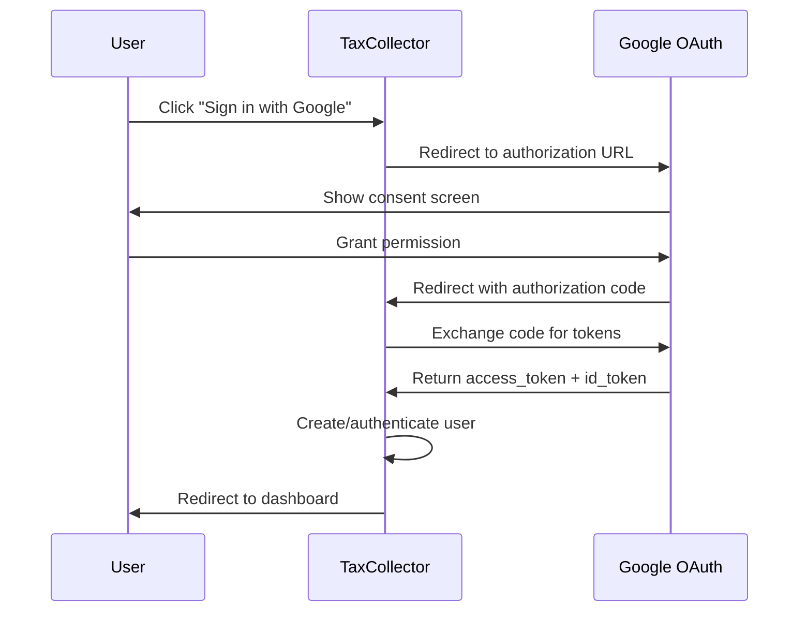
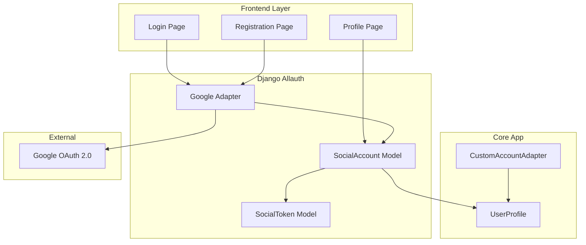
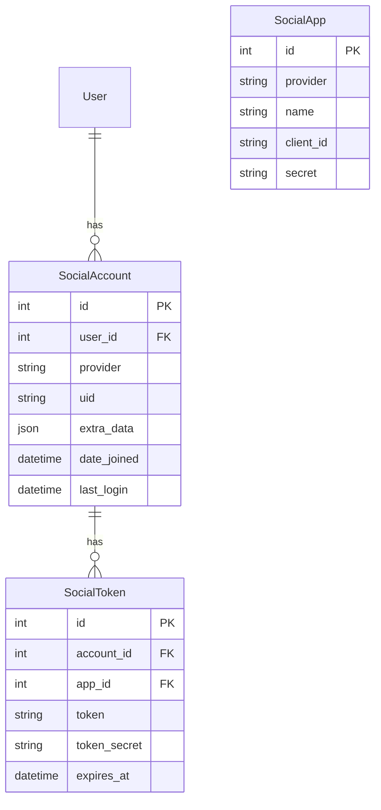

# Design Document: Google OAuth Authentication

## Overview

Cette fonctionnalité intègre l'authentification Google OAuth 2.0 dans la plateforme TaxCollector, permettant aux utilisateurs de s'inscrire et de se connecter via leur compte Google. L'implémentation utilise `django-allauth` qui est déjà installé dans le projet, avec l'ajout du provider Google.

L'intégration offre:
- Inscription rapide via Google (sans formulaire)
- Connexion simplifiée via Google
- Liaison/déliaison de compte Google pour les utilisateurs existants
- Gestion sécurisée des tokens OAuth

## Architecture



### Component Architecture



## Components and Interfaces

### 1. Django Settings Configuration

```python
# settings.py additions
INSTALLED_APPS += [
    'allauth.socialaccount.providers.google',
]

SOCIALACCOUNT_PROVIDERS = {
    'google': {
        'SCOPE': ['profile', 'email'],
        'AUTH_PARAMS': {'access_type': 'online'},
        'OAUTH_PKCE_ENABLED': True,
    }
}

# Environment variables
GOOGLE_OAUTH_CLIENT_ID = os.getenv('GOOGLE_OAUTH_CLIENT_ID', '')
GOOGLE_OAUTH_CLIENT_SECRET = os.getenv('GOOGLE_OAUTH_CLIENT_SECRET', '')
```

### 2. Custom Google Adapter

```python
# core/adapters.py
class CustomGoogleOAuth2Adapter(GoogleOAuth2Adapter):
    """Custom adapter for Google OAuth with TaxCollector-specific logic"""
    
    def complete_login(self, request, app, token, response):
        """Override to handle email verification and profile creation"""
        login = super().complete_login(request, app, token, response)
        # Mark email as verified (Google already verified it)
        login.email_verified = True
        return login
```

### 3. Social Account Signal Handlers

```python
# core/signals.py
@receiver(social_account_added)
def on_social_account_added(sender, request, sociallogin, **kwargs):
    """Handle new social account linking"""
    # Create UserProfile if not exists
    # Set email_verified = True for Google accounts
    pass

@receiver(social_account_removed)
def on_social_account_removed(sender, request, socialaccount, **kwargs):
    """Handle social account unlinking"""
    # Ensure user has password before allowing unlink
    pass
```

### 4. Template Components

```html
<!-- Google Sign-In Button Component -->
<a href="" 
   class="btn btn-outline-danger w-100 d-flex align-items-center justify-content-center gap-2"
   aria-label="">
    <svg><!-- Google Icon --></svg>
    <span></span>
</a>
```

### 5. Account Linking View

```python
# core/views.py
class SocialAccountManageView(LoginRequiredMixin, TemplateView):
    """View for managing linked social accounts"""
    template_name = 'core/social_accounts.html'
    
    def get_context_data(self, **kwargs):
        context = super().get_context_data(**kwargs)
        context['social_accounts'] = SocialAccount.objects.filter(user=self.request.user)
        context['can_disconnect'] = self.request.user.has_usable_password()
        return context
```

## Data Models

### Existing Models (django-allauth)



### Integration with UserProfile

```python
# No new models needed - using existing allauth models
# UserProfile links to User which links to SocialAccount

# Helper method on UserProfile
def has_google_account(self):
    return self.user.socialaccount_set.filter(provider='google').exists()

def get_google_email(self):
    google_account = self.user.socialaccount_set.filter(provider='google').first()
    return google_account.extra_data.get('email') if google_account else None
```

## Correctness Properties

*A property is a characteristic or behavior that should hold true across all valid executions of a system-essentially, a formal statement about what the system should do. Properties serve as the bridge between human-readable specifications and machine-verifiable correctness guarantees.*

### Property 1: Google OAuth Registration Creates Verified User
*For any* valid Google OAuth callback with user data, the system SHALL create a new user with email marked as verified and profile information matching the Google account data.
**Validates: Requirements 1.2, 1.3**

### Property 2: Email Uniqueness on OAuth Registration
*For any* Google OAuth registration attempt where the email already exists in the system, the system SHALL NOT create a duplicate user but instead offer account linking options.
**Validates: Requirements 1.4**

### Property 3: Successful Google Login Authenticates and Updates Session
*For any* valid Google OAuth callback for an existing linked account, the system SHALL authenticate the user, update last_login timestamp, and create a valid session.
**Validates: Requirements 2.2, 2.5**

### Property 4: Unlinked Google Account Offers Options
*For any* Google OAuth login attempt where the Google account is not linked to any existing user, the system SHALL offer to create a new account or link to an existing account.
**Validates: Requirements 2.3**

### Property 5: Account Linking Creates SocialAccount
*For any* successful Google OAuth callback during account linking, the system SHALL create a SocialAccount record associating the Google account with the authenticated user.
**Validates: Requirements 3.3**

### Property 6: Duplicate Link Prevention
*For any* Google account already linked to a user, attempting to link it to another user SHALL fail with an appropriate error.
**Validates: Requirements 3.4**

### Property 7: Unlink Requires Password
*For any* user with only Google authentication and no usable password, the system SHALL prevent unlinking until a password is set.
**Validates: Requirements 4.2**

### Property 8: Unlink Removes SocialAccount
*For any* confirmed unlink action by a user with a usable password, the system SHALL delete the corresponding SocialAccount record.
**Validates: Requirements 4.3**

### Property 9: Missing Credentials Disables Google Auth
*For any* configuration where Google OAuth credentials are missing or empty, the system SHALL hide Google authentication buttons from the UI.
**Validates: Requirements 5.3**

### Property 10: OAuth State Parameter Validation
*For any* OAuth callback, the system SHALL validate the state parameter and reject callbacks with invalid or missing state to prevent CSRF attacks.
**Validates: Requirements 8.2**

### Property 11: Automatic Token Refresh
*For any* API call requiring Google access where the token is expired, the system SHALL automatically refresh the token using the refresh_token.
**Validates: Requirements 8.4**

### Property 12: Secure Error Logging
*For any* security-related OAuth error, the system SHALL log detailed error information server-side while displaying only generic error messages to users.
**Validates: Requirements 8.5**

## Error Handling

### OAuth Error Scenarios

| Error Type | User Message (FR) | User Message (MG) | Action |
|------------|-------------------|-------------------|--------|
| `access_denied` | "Vous avez annulé la connexion Google" | "Najanona ny fidirana Google" | Redirect to login |
| `invalid_request` | "Erreur de configuration. Veuillez réessayer." | "Hadisoana amin'ny configuration. Andramo indray." | Log error, redirect |
| `server_error` | "Google est temporairement indisponible" | "Tsy misy Google ankehitriny" | Retry option |
| `email_exists` | "Un compte existe déjà avec cet email" | "Efa misy kaonty amin'ity email ity" | Offer linking |
| `already_linked` | "Ce compte Google est déjà lié à un autre utilisateur" | "Efa mifandray amin'ny mpampiasa hafa ity Google ity" | Show error |

### Error Handling Flow

```python
class CustomSocialAccountAdapter(DefaultSocialAccountAdapter):
    def authentication_error(self, request, provider_id, error=None, exception=None, extra_context=None):
        """Handle OAuth authentication errors"""
        logger.error(f"OAuth error for {provider_id}: {error}", exc_info=exception)
        
        error_messages = {
            'access_denied': _("Vous avez annulé la connexion Google"),
            'invalid_request': _("Erreur de configuration. Veuillez réessayer."),
        }
        
        messages.error(request, error_messages.get(error, _("Une erreur est survenue")))
        return redirect('core:login')
```

## Testing Strategy

### Dual Testing Approach

Cette implémentation utilise à la fois des tests unitaires et des tests basés sur les propriétés (Property-Based Testing) avec la bibliothèque **Hypothesis**.

### Property-Based Testing Library

- **Library**: Hypothesis (Python)
- **Configuration**: Minimum 100 iterations per property test
- **Location**: `core/tests/test_google_oauth_properties.py`

### Unit Tests

Les tests unitaires couvrent:
- Configuration des settings Google OAuth
- Rendu des boutons Google sur les pages login/register
- Flux de callback OAuth (mocked)
- Gestion des erreurs OAuth
- Liaison/déliaison de compte

### Property-Based Tests

Chaque propriété de correction sera testée avec Hypothesis:

```python
from hypothesis import given, strategies as st, settings

@settings(max_examples=100)
@given(email=st.emails(), name=st.text(min_size=1, max_size=100))
def test_google_oauth_creates_verified_user(email, name):
    """
    **Feature: google-oauth-authentication, Property 1: Google OAuth Registration Creates Verified User**
    """
    # Test implementation
    pass
```

### Test Coverage Requirements

| Component | Unit Tests | Property Tests |
|-----------|------------|----------------|
| OAuth Registration | ✓ | Property 1, 2 |
| OAuth Login | ✓ | Property 3, 4 |
| Account Linking | ✓ | Property 5, 6 |
| Account Unlinking | ✓ | Property 7, 8 |
| Configuration | ✓ | Property 9 |
| Security | ✓ | Property 10, 11, 12 |

### Integration Tests

- End-to-end OAuth flow with mocked Google responses
- Database state verification after OAuth operations
- Session management verification
- Multi-language button rendering
