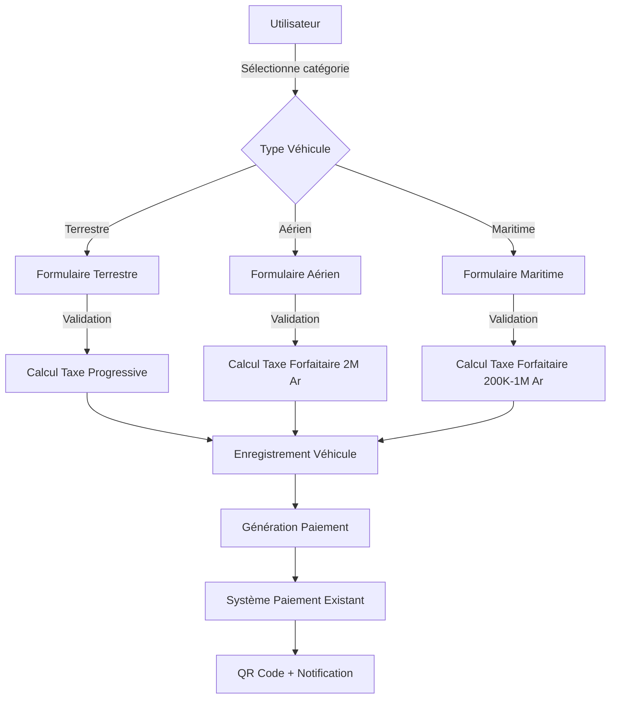

# Design Document - Module de Déclaration Fiscale Multi-Véhicules

## Overview

Ce document décrit l'architecture technique pour étendre le système Tax Collector existant afin de supporter la déclaration fiscale complète des véhicules terrestres, aériens et maritimes conformément au PLFI. Le système actuel gère déjà les véhicules terrestres avec succès. Cette extension réutilisera l'infrastructure existante (paiements, QR codes, notifications) tout en ajoutant les fonctionnalités spécifiques aux véhicules aériens et maritimes.

### Principes de Design

1. **Extension, pas refonte**: Réutiliser au maximum le code existant
2. **Séparation des préoccupations**: Formulaires et validations spécifiques par catégorie
3. **Tarification flexible**: Grilles progressives (terrestres) et forfaitaires (aérien/maritime)
4. **Conformité PLFI**: Respect strict des barèmes officiels
5. **Expérience utilisateur cohérente**: Interface unifiée malgré les différences

## Architecture

### Architecture Globale

```
┌─────────────────────────────────────────────────────────────┐
│                  INTERFACE UTILISATEUR                       │
│  ┌──────────────┐  ┌──────────────┐  ┌──────────────┐      │
│  │  Formulaire  │  │  Formulaire  │  │  Formulaire  │      │
│  │  Terrestre   │  │   Aérien     │  │  Maritime    │      │
│  │  (EXISTANT)  │  │  (NOUVEAU)   │  │  (NOUVEAU)   │      │
│  └──────────────┘  └──────────────┘  └──────────────┘      │
└─────────────────────────────────────────────────────────────┘
                            ↓
┌─────────────────────────────────────────────────────────────┐
│                  COUCHE MÉTIER (Services)                    │
│  ┌──────────────────────────────────────────────────────┐   │
│  │  TaxCalculationService (ÉTENDU)                      │   │
│  │  - calculate_terrestrial_tax() [EXISTANT]           │   │
│  │  - calculate_aerial_tax() [NOUVEAU]                 │   │
│  │  - calculate_maritime_tax() [NOUVEAU]               │   │
│  └──────────────────────────────────────────────────────┘   │
└─────────────────────────────────────────────────────────────┘
                            ↓
┌─────────────────────────────────────────────────────────────┐
│                  MODÈLE DE DONNÉES                           │
│  ┌──────────────┐  ┌──────────────┐  ┌──────────────┐      │
│  │   Vehicule   │  │GrilleTarifaire│  │PaiementTaxe  │      │
│  │  (ÉTENDU)    │  │  (ÉTENDU)    │  │  (EXISTANT)  │      │
│  └──────────────┘  └──────────────┘  └──────────────┘      │
└─────────────────────────────────────────────────────────────┘
```

### Flux de Déclaration



## Components and Interfaces

### 1. Modèles de Données (Extensions)

#### 1.1 Extension du modèle `Vehicule`

**Champs existants à conserver:**
- `plaque_immatriculation` (PK)
- `proprietaire` (FK User)
- `nom_proprietaire`
- `marque`, `modele`, `couleur`, `vin`
- `puissance_fiscale_cv`, `cylindree_cm3`
- `source_energie`, `date_premiere_circulation`
- `categorie_vehicule`, `type_vehicule` (FK VehicleType)
- `specifications_techniques` (JSONField)

**Nouveaux champs à ajouter:**
```python
# Champs spécifiques aériens
immatriculation_aerienne = models.CharField(max_length=20, null=True, blank=True)
masse_maximale_decollage_kg = models.PositiveIntegerField(null=True, blank=True)
numero_serie_aeronef = models.CharField(max_length=100, null=True, blank=True)

# Champs spécifiques maritimes
numero_francisation = models.CharField(max_length=50, null=True, blank=True)
nom_navire = models.CharField(max_length=200, null=True, blank=True)
longueur_metres = models.DecimalField(max_digits=6, decimal_places=2, null=True, blank=True)
tonnage_tonneaux = models.DecimalField(max_digits=10, decimal_places=2, null=True, blank=True)
puissance_moteur_kw = models.DecimalField(max_digits=8, decimal_places=2, null=True, blank=True)

# Catégorie de véhicule (pour classification)
vehicle_category = models.CharField(
    max_length=20,
    choices=[
        ('TERRESTRE', 'Terrestre'),
        ('AERIEN', 'Aérien'),
        ('MARITIME', 'Maritime'),
    ],
    default='TERRESTRE'
)
```


#### 1.2 Extension du modèle `GrilleTarifaire`

**Structure actuelle (pour terrestres):**
- `puissance_min_cv`, `puissance_max_cv`
- `source_energie`
- `age_min_annees`, `age_max_annees`
- `montant_ariary`
- `annee_fiscale`, `est_active`

**Nouveaux champs pour aérien/maritime:**
```python
# Type de grille
grid_type = models.CharField(
    max_length=20,
    choices=[
        ('PROGRESSIVE', 'Progressive (Terrestre)'),
        ('FLAT_AERIAL', 'Forfaitaire Aérien'),
        ('FLAT_MARITIME', 'Forfaitaire Maritime'),
    ],
    default='PROGRESSIVE'
)

# Pour maritime - catégories spécifiques
maritime_category = models.CharField(
    max_length=50,
    null=True,
    blank=True,
    choices=[
        ('NAVIRE_PLAISANCE', 'Navire de plaisance ≥7m ou ≥22CV/90kW'),
        ('JETSKI', 'Jet-ski/moto nautique ≥90kW'),
        ('AUTRES_ENGINS', 'Autres engins maritimes motorisés'),
    ]
)

# Seuils pour maritime
longueur_min_metres = models.DecimalField(max_digits=6, decimal_places=2, null=True, blank=True)
puissance_min_cv_maritime = models.DecimalField(max_digits=8, decimal_places=2, null=True, blank=True)
puissance_min_kw_maritime = models.DecimalField(max_digits=8, decimal_places=2, null=True, blank=True)

# Pour aérien - type d'aéronef
aerial_type = models.CharField(
    max_length=50,
    null=True,
    blank=True,
    choices=[
        ('ALL', 'Tous types d\'aéronefs'),
        ('AVION', 'Avion'),
        ('HELICOPTERE', 'Hélicoptère'),
        ('DRONE', 'Drone'),
        ('ULM', 'ULM'),
        ('PLANEUR', 'Planeur'),
        ('BALLON', 'Ballon'),
    ]
)
```

#### 1.3 Extension du modèle `DocumentVehicule`

**Types de documents existants:**
- `carte_grise`, `assurance`, `controle_technique`, `photo_plaque`, `autre`

**Nouveaux types à ajouter:**
```python
DOCUMENT_TYPE_CHOICES = [
    # Terrestres (existants)
    ('carte_grise', 'Carte grise'),
    ('assurance', 'Assurance'),
    ('controle_technique', 'Contrôle technique'),
    ('photo_plaque', 'Photo de la plaque'),
    
    # Aériens (nouveaux)
    ('certificat_navigabilite', 'Certificat de navigabilité'),
    ('certificat_immatriculation_aerienne', 'Certificat d\'immatriculation aérienne'),
    ('assurance_aerienne', 'Assurance aérienne'),
    ('carnet_vol', 'Carnet de vol'),
    
    # Maritimes (nouveaux)
    ('certificat_francisation', 'Certificat de francisation'),
    ('permis_navigation', 'Permis de navigation'),
    ('assurance_maritime', 'Assurance maritime'),
    ('certificat_jaugeage', 'Certificat de jaugeage'),
    
    # Commun
    ('autre', 'Autre document'),
]
```

### 2. Formulaires

#### 2.1 Formulaire Terrestre (Existant - À maintenir)

**Classe:** `VehiculeForm` (vehicles/forms.py)
**Champs:** Tous les champs terrestres actuels
**Validation:** Cohérence cylindrée/CV existante

#### 2.2 Nouveau Formulaire Aérien

```python
class VehiculeAerienForm(forms.ModelForm):
    """Formulaire pour véhicules aériens"""
    
    class Meta:
        model = Vehicule
        fields = [
            'proprietaire',
            'nom_proprietaire',
            'immatriculation_aerienne',
            'type_vehicule',  # FK vers VehicleType (Avion, Hélicoptère, etc.)
            'marque',
            'modele',
            'numero_serie_aeronef',
            'masse_maximale_decollage_kg',
            'puissance_moteur_kw',
            'date_premiere_circulation',
            'categorie_vehicule',
        ]
    
    def clean(self):
        # Validation format immatriculation (ex: 5R-XXX pour Madagascar)
        # Validation masse maximale (10 kg - 500,000 kg)
        # Auto-set vehicle_category = 'AERIEN'
        pass
```

#### 2.3 Nouveau Formulaire Maritime

```python
class VehiculeMaritimeForm(forms.ModelForm):
    """Formulaire pour véhicules maritimes"""
    
    puissance_moteur_unit = forms.ChoiceField(
        choices=[('CV', 'CV'), ('kW', 'kW')],
        initial='CV',
        label="Unité de puissance"
    )
    
    class Meta:
        model = Vehicule
        fields = [
            'proprietaire',
            'nom_proprietaire',
            'numero_francisation',
            'nom_navire',
            'type_vehicule',  # FK vers VehicleType (Bateau, Yacht, Jet-ski, etc.)
            'marque',
            'modele',
            'longueur_metres',
            'tonnage_tonneaux',
            'puissance_fiscale_cv',  # Réutilisé pour puissance moteur
            'puissance_moteur_kw',
            'date_premiere_circulation',
            'categorie_vehicule',
        ]
    
    def clean(self):
        # Validation format francisation
        # Validation longueur (1m - 400m)
        # Conversion CV ↔ kW (CV × 0.735 = kW, kW × 1.36 = CV)
        # Classification automatique selon seuils
        # Auto-set vehicle_category = 'MARITIME'
        pass
    
    def get_maritime_classification(self):
        """Détermine la catégorie maritime selon les seuils"""
        longueur = self.cleaned_data.get('longueur_metres')
        puissance_cv = self.cleaned_data.get('puissance_fiscale_cv')
        puissance_kw = self.cleaned_data.get('puissance_moteur_kw')
        type_vehicule = self.cleaned_data.get('type_vehicule')
        
        # Logique de classification selon requirements
        if longueur >= 7 or puissance_cv >= 22 or puissance_kw >= 90:
            if 'jet' in type_vehicule.nom.lower() and puissance_kw >= 90:
                return 'JETSKI'
            return 'NAVIRE_PLAISANCE'
        return 'AUTRES_ENGINS'
```

### 3. Services

#### 3.1 Extension de `TaxCalculationService`

```python
class TaxCalculationService:
    """Service étendu pour calcul de taxes multi-véhicules"""
    
    def calculate_tax(self, vehicule, year=None):
        """Point d'entrée principal - route vers la bonne méthode"""
        if vehicule.vehicle_category == 'TERRESTRE':
            return self.calculate_terrestrial_tax(vehicule, year)
        elif vehicule.vehicle_category == 'AERIEN':
            return self.calculate_aerial_tax(vehicule, year)
        elif vehicule.vehicle_category == 'MARITIME':
            return self.calculate_maritime_tax(vehicule, year)
    
    def calculate_terrestrial_tax(self, vehicule, year):
        """Calcul existant pour véhicules terrestres"""
        # Code existant - pas de changement
        pass
    
    def calculate_aerial_tax(self, vehicule, year):
        """Calcul forfaitaire pour véhicules aériens"""
        if year is None:
            year = timezone.now().year
        
        # Vérifier exonération
        if vehicule.est_exonere():
            return {
                'is_exempt': True,
                'amount': Decimal('0.00'),
                'exemption_reason': 'Véhicule exonéré',
                'year': year,
                'grid': None
            }
        
        # Chercher grille forfaitaire aérienne
        try:
            grid = GrilleTarifaire.objects.get(
                grid_type='FLAT_AERIAL',
                annee_fiscale=year,
                est_active=True
            )
            
            return {
                'is_exempt': False,
                'amount': grid.montant_ariary,  # 2,000,000 Ar
                'exemption_reason': None,
                'year': year,
                'grid': grid,
                'calculation_method': 'Tarif forfaitaire aérien'
            }
        except GrilleTarifaire.DoesNotExist:
            return {
                'is_exempt': False,
                'amount': None,
                'error': 'Grille tarifaire aérienne non configurée'
            }
    
    def calculate_maritime_tax(self, vehicule, year):
        """Calcul forfaitaire pour véhicules maritimes avec classification"""
        if year is None:
            year = timezone.now().year
        
        # Vérifier exonération
        if vehicule.est_exonere():
            return {
                'is_exempt': True,
                'amount': Decimal('0.00'),
                'exemption_reason': 'Véhicule exonéré',
                'year': year,
                'grid': None
            }
        
        # Déterminer la catégorie maritime
        category = self._classify_maritime_vehicle(vehicule)
        
        # Chercher grille forfaitaire maritime
        try:
            grid = GrilleTarifaire.objects.get(
                grid_type='FLAT_MARITIME',
                maritime_category=category,
                annee_fiscale=year,
                est_active=True
            )
            
            return {
                'is_exempt': False,
                'amount': grid.montant_ariary,  # 200,000 ou 1,000,000 Ar
                'exemption_reason': None,
                'year': year,
                'grid': grid,
                'maritime_category': category,
                'calculation_method': 'Tarif forfaitaire maritime'
            }
        except GrilleTarifaire.DoesNotExist:
            return {
                'is_exempt': False,
                'amount': None,
                'error': f'Grille tarifaire maritime non configurée pour {category}'
            }
    
    def _classify_maritime_vehicle(self, vehicule):
        """Classifie un véhicule maritime selon les seuils PLFI"""
        longueur = vehicule.longueur_metres or 0
        puissance_cv = vehicule.puissance_fiscale_cv or 0
        puissance_kw = vehicule.puissance_moteur_kw or 0
        
        # Convertir kW en CV si nécessaire
        if puissance_kw > 0 and puissance_cv == 0:
            puissance_cv = puissance_kw * 1.36
        
        # Classification selon PLFI
        type_name = vehicule.type_vehicule.nom.lower() if vehicule.type_vehicule else ''
        
        # Jet-ski avec puissance ≥ 90 kW
        if any(keyword in type_name for keyword in ['jet', 'moto nautique', 'scooter']):
            if puissance_kw >= 90:
                return 'JETSKI'
        
        # Navire de plaisance: longueur ≥ 7m OU puissance ≥ 22 CV/90 kW
        if longueur >= 7 or puissance_cv >= 22 or puissance_kw >= 90:
            return 'NAVIRE_PLAISANCE'
        
        # Autres engins maritimes motorisés
        return 'AUTRES_ENGINS'
```


### 4. Vues et Templates

#### 4.1 Vue de Sélection de Catégorie (Nouvelle)

```python
class VehicleCategorySelectionView(LoginRequiredMixin, TemplateView):
    """Vue pour sélectionner la catégorie de véhicule à déclarer"""
    template_name = 'vehicles/category_selection.html'
    
    def get_context_data(self, **kwargs):
        context = super().get_context_data(**kwargs)
        context['categories'] = [
            {
                'code': 'TERRESTRE',
                'name': 'Véhicule Terrestre',
                'description': 'Voiture, moto, camion, bus, etc.',
                'icon': 'ri-car-line',
                'url': reverse('vehicles:vehicle_create_terrestrial')
            },
            {
                'code': 'AERIEN',
                'name': 'Véhicule Aérien',
                'description': 'Avion, hélicoptère, drone, ULM, etc.',
                'icon': 'ri-plane-line',
                'url': reverse('vehicles:vehicle_create_aerial')
            },
            {
                'code': 'MARITIME',
                'name': 'Véhicule Maritime',
                'description': 'Bateau, navire, yacht, jet-ski, etc.',
                'icon': 'ri-ship-line',
                'url': reverse('vehicles:vehicle_create_maritime')
            },
        ]
        return context
```

#### 4.2 Vues de Création par Catégorie

```python
class VehiculeAerienCreateView(LoginRequiredMixin, CreateView):
    """Création de véhicule aérien"""
    model = Vehicule
    form_class = VehiculeAerienForm
    template_name = 'vehicles/vehicule_aerien_form.html'
    
    def form_valid(self, form):
        form.instance.vehicle_category = 'AERIEN'
        form.instance.proprietaire = self.request.user
        response = super().form_valid(form)
        
        # Notification
        NotificationService.create_vehicle_added_notification(
            user=self.request.user,
            vehicle=form.instance,
            langue=self.request.user.profile.langue_preferee
        )
        
        messages.success(self.request, f'Aéronef {form.instance.immatriculation_aerienne} ajouté avec succès!')
        return response

class VehiculeMaritimeCreateView(LoginRequiredMixin, CreateView):
    """Création de véhicule maritime"""
    model = Vehicule
    form_class = VehiculeMaritimeForm
    template_name = 'vehicles/vehicule_maritime_form.html'
    
    def form_valid(self, form):
        form.instance.vehicle_category = 'MARITIME'
        form.instance.proprietaire = self.request.user
        
        # Classification automatique
        classification = form.get_maritime_classification()
        form.instance.specifications_techniques['maritime_classification'] = classification
        
        response = super().form_valid(form)
        
        # Notification avec classification
        NotificationService.create_vehicle_added_notification(
            user=self.request.user,
            vehicle=form.instance,
            langue=self.request.user.profile.langue_preferee
        )
        
        messages.success(
            self.request, 
            f'Navire {form.instance.nom_navire} ajouté avec succès! '
            f'Classification: {classification}'
        )
        return response
```

#### 4.3 Templates

**Structure des templates:**
```
templates/vehicles/
├── category_selection.html          # Nouvelle - Sélection catégorie
├── vehicule_form.html               # Existant - Terrestre
├── vehicule_aerien_form.html        # Nouveau - Aérien
├── vehicule_maritime_form.html      # Nouveau - Maritime
├── vehicule_list.html               # Existant - À étendre avec filtres
├── vehicule_detail.html             # Existant - À adapter par catégorie
└── partials/
    ├── terrestrial_fields.html      # Existant
    ├── aerial_fields.html           # Nouveau
    └── maritime_fields.html         # Nouveau
```

### 5. API REST (Extensions)

#### 5.1 Endpoints Existants à Étendre

```python
# vehicles/api_views.py

class VehicleViewSet(viewsets.ModelViewSet):
    """ViewSet étendu pour tous types de véhicules"""
    
    def get_serializer_class(self):
        """Retourne le serializer approprié selon la catégorie"""
        if self.request.data.get('vehicle_category') == 'AERIEN':
            return VehiculeAerienSerializer
        elif self.request.data.get('vehicle_category') == 'MARITIME':
            return VehiculeMaritimeSerializer
        return VehiculeSerializer  # Terrestre par défaut
    
    @action(detail=True, methods=['get'])
    def calculate_tax(self, request, pk=None):
        """Calcule la taxe pour un véhicule (toutes catégories)"""
        vehicule = self.get_object()
        year = request.query_params.get('year', timezone.now().year)
        
        service = TaxCalculationService()
        tax_info = service.calculate_tax(vehicule, year)
        
        return Response(tax_info)
    
    @action(detail=False, methods=['get'])
    def by_category(self, request):
        """Liste les véhicules par catégorie"""
        category = request.query_params.get('category', 'TERRESTRE')
        queryset = self.get_queryset().filter(vehicle_category=category)
        
        serializer = self.get_serializer(queryset, many=True)
        return Response(serializer.data)
```

#### 5.2 Nouveaux Serializers

```python
class VehiculeAerienSerializer(serializers.ModelSerializer):
    """Serializer pour véhicules aériens"""
    tax_amount = serializers.SerializerMethodField()
    
    class Meta:
        model = Vehicule
        fields = [
            'plaque_immatriculation',
            'immatriculation_aerienne',
            'proprietaire',
            'nom_proprietaire',
            'marque',
            'modele',
            'numero_serie_aeronef',
            'masse_maximale_decollage_kg',
            'puissance_moteur_kw',
            'type_vehicule',
            'date_premiere_circulation',
            'categorie_vehicule',
            'vehicle_category',
            'tax_amount',
        ]
    
    def get_tax_amount(self, obj):
        service = TaxCalculationService()
        tax_info = service.calculate_aerial_tax(obj)
        return tax_info.get('amount')

class VehiculeMaritimeSerializer(serializers.ModelSerializer):
    """Serializer pour véhicules maritimes"""
    tax_amount = serializers.SerializerMethodField()
    maritime_classification = serializers.SerializerMethodField()
    
    class Meta:
        model = Vehicule
        fields = [
            'plaque_immatriculation',
            'numero_francisation',
            'nom_navire',
            'proprietaire',
            'nom_proprietaire',
            'marque',
            'modele',
            'longueur_metres',
            'tonnage_tonneaux',
            'puissance_fiscale_cv',
            'puissance_moteur_kw',
            'type_vehicule',
            'date_premiere_circulation',
            'categorie_vehicule',
            'vehicle_category',
            'maritime_classification',
            'tax_amount',
        ]
    
    def get_tax_amount(self, obj):
        service = TaxCalculationService()
        tax_info = service.calculate_maritime_tax(obj)
        return tax_info.get('amount')
    
    def get_maritime_classification(self, obj):
        service = TaxCalculationService()
        return service._classify_maritime_vehicle(obj)
```

## Data Models

### Schéma de Base de Données

```sql
-- Extension de la table vehicles_vehicule
ALTER TABLE vehicles_vehicule ADD COLUMN vehicle_category VARCHAR(20) DEFAULT 'TERRESTRE';
ALTER TABLE vehicles_vehicule ADD COLUMN immatriculation_aerienne VARCHAR(20);
ALTER TABLE vehicles_vehicule ADD COLUMN masse_maximale_decollage_kg INTEGER;
ALTER TABLE vehicles_vehicule ADD COLUMN numero_serie_aeronef VARCHAR(100);
ALTER TABLE vehicles_vehicule ADD COLUMN numero_francisation VARCHAR(50);
ALTER TABLE vehicles_vehicule ADD COLUMN nom_navire VARCHAR(200);
ALTER TABLE vehicles_vehicule ADD COLUMN longueur_metres DECIMAL(6,2);
ALTER TABLE vehicles_vehicule ADD COLUMN tonnage_tonneaux DECIMAL(10,2);
ALTER TABLE vehicles_vehicule ADD COLUMN puissance_moteur_kw DECIMAL(8,2);

-- Index pour performance
CREATE INDEX idx_vehicle_category ON vehicles_vehicule(vehicle_category);
CREATE INDEX idx_immatriculation_aerienne ON vehicles_vehicule(immatriculation_aerienne);
CREATE INDEX idx_numero_francisation ON vehicles_vehicule(numero_francisation);

-- Extension de la table vehicles_grilletarifaire
ALTER TABLE vehicles_grilletarifaire ADD COLUMN grid_type VARCHAR(20) DEFAULT 'PROGRESSIVE';
ALTER TABLE vehicles_grilletarifaire ADD COLUMN maritime_category VARCHAR(50);
ALTER TABLE vehicles_grilletarifaire ADD COLUMN longueur_min_metres DECIMAL(6,2);
ALTER TABLE vehicles_grilletarifaire ADD COLUMN puissance_min_cv_maritime DECIMAL(8,2);
ALTER TABLE vehicles_grilletarifaire ADD COLUMN puissance_min_kw_maritime DECIMAL(8,2);
ALTER TABLE vehicles_grilletarifaire ADD COLUMN aerial_type VARCHAR(50);

-- Index pour performance
CREATE INDEX idx_grid_type ON vehicles_grilletarifaire(grid_type);
CREATE INDEX idx_maritime_category ON vehicles_grilletarifaire(maritime_category);
```

### Relations entre Modèles

```
Vehicule (étendu)
├── vehicle_category: TERRESTRE | AERIEN | MARITIME
├── type_vehicule → VehicleType (FK)
├── proprietaire → User (FK)
├── documents → DocumentVehicule (1:N)
├── paiements → PaiementTaxe (1:N)
└── qr_codes → QRCode (1:N)

GrilleTarifaire (étendu)
├── grid_type: PROGRESSIVE | FLAT_AERIAL | FLAT_MARITIME
├── maritime_category: NAVIRE_PLAISANCE | JETSKI | AUTRES_ENGINS
└── aerial_type: ALL | AVION | HELICOPTERE | etc.

PaiementTaxe (existant - pas de changement)
├── vehicule_plaque → Vehicule (FK)
├── type_paiement: TAXE_VEHICULE | AMENDE_CONTRAVENTION
└── methode_paiement: mvola | stripe | cash

QRCode (existant - pas de changement)
├── vehicule_plaque → Vehicule (FK)
└── type_code: TAXE_VEHICULE | CONTRAVENTION
```

## Correctness Properties

*A property is a characteristic or behavior that should hold true across all valid executions of a system-essentially, a formal statement about what the system should do. Properties serve as the bridge between human-readable specifications and machine-verifiable correctness guarantees.*

### Property 1: Catégorie de véhicule cohérente
*For any* véhicule, if vehicle_category is 'AERIEN', then immatriculation_aerienne must be non-null and masse_maximale_decollage_kg must be positive
**Validates: Requirements 3.1, 3.3**

### Property 2: Catégorie de véhicule cohérente (maritime)
*For any* véhicule, if vehicle_category is 'MARITIME', then numero_francisation must be non-null and either longueur_metres or puissance_fiscale_cv must be positive
**Validates: Requirements 4.1, 4.3**

### Property 3: Calcul de taxe aérienne forfaitaire
*For any* véhicule aérien non-exonéré, the calculated tax amount must equal 2,000,000 Ariary regardless of aircraft characteristics
**Validates: Requirements 3.7, 5.3**

### Property 4: Classification maritime déterministe
*For any* véhicule maritime with longueur ≥ 7m OR puissance ≥ 22 CV OR puissance ≥ 90 kW, the classification must be either 'NAVIRE_PLAISANCE' or 'JETSKI' (never 'AUTRES_ENGINS')
**Validates: Requirements 4.7, 10.1, 10.2**

### Property 5: Conversion puissance cohérente
*For any* véhicule maritime, if puissance_fiscale_cv is set, then puissance_moteur_kw should equal puissance_fiscale_cv × 0.735 (within 1% tolerance)
**Validates: Requirements 10.4, 10.5**

### Property 6: Tarif maritime selon classification
*For any* véhicule maritime classified as 'NAVIRE_PLAISANCE' or 'JETSKI', the tax amount must be 200,000 Ariary; for 'AUTRES_ENGINS', it must be 1,000,000 Ariary
**Validates: Requirements 4.7, 5.4, 10.1, 10.2, 10.3**

### Property 7: Unicité des identifiants
*For any* two véhicules, if vehicle_category is 'AERIEN', then immatriculation_aerienne must be unique; if 'MARITIME', then numero_francisation must be unique
**Validates: Requirements 3.3, 4.3, 13.1**

### Property 8: Documents requis par catégorie
*For any* véhicule aérien, at least one document of type 'certificat_navigabilite' must exist before payment; for maritime, at least one 'certificat_francisation' must exist
**Validates: Requirements 6.2, 6.3, 13.4**

### Property 9: Grille tarifaire active unique
*For any* given annee_fiscale and grid_type, at most one GrilleTarifaire with est_active=True should exist
**Validates: Requirements 9.6**

### Property 10: Exonération indépendante de la catégorie
*For any* véhicule with categorie_vehicule in EXEMPT_VEHICLE_CATEGORIES, the calculated tax amount must be 0 regardless of vehicle_category
**Validates: Requirements 5.6**


## Error Handling

### Validation Errors

#### 1. Erreurs de Formulaire

**Véhicules Aériens:**
- Format immatriculation invalide → Message: "Format d'immatriculation aérienne invalide. Exemple: 5R-ABC"
- Masse maximale hors limites → Message: "La masse maximale doit être entre 10 kg et 500,000 kg"
- Certificat de navigabilité expiré → Warning: "Attention: Le certificat de navigabilité est expiré"

**Véhicules Maritimes:**
- Format francisation invalide → Message: "Format de numéro de francisation invalide"
- Longueur hors limites → Message: "La longueur doit être entre 1m et 400m"
- Puissance incohérente → Message: "La conversion CV/kW semble incorrecte. Vérifiez les valeurs"
- Classification ambiguë → Warning: "Classification automatique: {category}. Cliquez pour modifier si incorrect"

#### 2. Erreurs de Calcul de Taxe

```python
class TaxCalculationError(Exception):
    """Exception pour erreurs de calcul de taxe"""
    pass

# Gestion dans le service
try:
    tax_info = service.calculate_tax(vehicule, year)
    if 'error' in tax_info:
        raise TaxCalculationError(tax_info['error'])
except GrilleTarifaire.DoesNotExist:
    return {
        'error': 'Grille tarifaire non configurée pour cette catégorie',
        'action': 'Contactez l'administrateur'
    }
except Exception as e:
    logger.error(f"Erreur calcul taxe: {e}")
    return {
        'error': 'Erreur lors du calcul de la taxe',
        'action': 'Réessayez ou contactez le support'
    }
```

#### 3. Erreurs de Documents

- Document corrompu → Message: "Le fichier est corrompu ou illisible"
- Format non supporté → Message: "Format de fichier non supporté. Utilisez PDF, JPEG, PNG ou WebP"
- Taille excessive → Message: "La taille du fichier ne doit pas dépasser 10 MB"
- Document manquant → Blocage: "Documents requis manquants: {liste}"

### Gestion des Cas Limites

#### 1. Véhicules Hybrides (Terrestre-Maritime)

Certains véhicules amphibies peuvent être à la fois terrestres et maritimes:
```python
# Solution: Forcer l'utilisateur à choisir la catégorie principale
if vehicule.has_both_terrestrial_and_maritime_features():
    raise ValidationError(
        "Ce véhicule semble être amphibie. "
        "Veuillez choisir la catégorie principale (Terrestre ou Maritime)"
    )
```

#### 2. Conversion Puissance avec Arrondis

```python
def convert_cv_to_kw(cv):
    """Conversion CV → kW avec gestion des arrondis"""
    kw = Decimal(str(cv)) * Decimal('0.735')
    return kw.quantize(Decimal('0.01'))  # 2 décimales

def convert_kw_to_cv(kw):
    """Conversion kW → CV avec gestion des arrondis"""
    cv = Decimal(str(kw)) * Decimal('1.36')
    return cv.quantize(Decimal('0.01'))  # 2 décimales

def validate_power_conversion(cv, kw):
    """Valide la cohérence de la conversion"""
    if cv and kw:
        calculated_kw = convert_cv_to_kw(cv)
        tolerance = Decimal('0.01')  # 1% de tolérance
        if abs(calculated_kw - kw) > (kw * tolerance):
            return False, "Incohérence détectée dans la conversion CV/kW"
    return True, None
```

#### 3. Classification Maritime Ambiguë

```python
def classify_with_confidence(vehicule):
    """Classification avec niveau de confiance"""
    classification = _classify_maritime_vehicle(vehicule)
    confidence = 'HIGH'
    
    # Cas ambigus
    if vehicule.longueur_metres == 7.0:  # Exactement au seuil
        confidence = 'MEDIUM'
    if vehicule.puissance_fiscale_cv == 22.0:  # Exactement au seuil
        confidence = 'MEDIUM'
    
    return {
        'classification': classification,
        'confidence': confidence,
        'allow_override': confidence != 'HIGH'
    }
```

## Testing Strategy

### 1. Tests Unitaires

#### Tests de Modèles
```python
class VehiculeModelTests(TestCase):
    """Tests pour le modèle Vehicule étendu"""
    
    def test_aerial_vehicle_requires_aerial_fields(self):
        """Un véhicule aérien doit avoir les champs aériens"""
        vehicule = Vehicule(vehicle_category='AERIEN')
        with self.assertRaises(ValidationError):
            vehicule.full_clean()
    
    def test_maritime_classification_navire_plaisance(self):
        """Classification correcte pour navire de plaisance"""
        vehicule = create_maritime_vehicle(longueur_metres=8)
        service = TaxCalculationService()
        classification = service._classify_maritime_vehicle(vehicule)
        self.assertEqual(classification, 'NAVIRE_PLAISANCE')
    
    def test_power_conversion_cv_to_kw(self):
        """Conversion CV → kW correcte"""
        cv = Decimal('22')
        kw = convert_cv_to_kw(cv)
        self.assertAlmostEqual(kw, Decimal('16.17'), places=2)
```

#### Tests de Services
```python
class TaxCalculationServiceTests(TestCase):
    """Tests pour le service de calcul de taxe"""
    
    def test_aerial_tax_flat_rate(self):
        """Taxe aérienne forfaitaire de 2M Ar"""
        vehicule = create_aerial_vehicle()
        service = TaxCalculationService()
        tax_info = service.calculate_aerial_tax(vehicule, 2026)
        self.assertEqual(tax_info['amount'], Decimal('2000000'))
    
    def test_maritime_tax_jetski(self):
        """Taxe maritime pour jet-ski (200K Ar)"""
        vehicule = create_jetski(puissance_kw=95)
        service = TaxCalculationService()
        tax_info = service.calculate_maritime_tax(vehicule, 2026)
        self.assertEqual(tax_info['amount'], Decimal('200000'))
        self.assertEqual(tax_info['maritime_category'], 'JETSKI')
    
    def test_maritime_tax_autres_engins(self):
        """Taxe maritime pour autres engins (1M Ar)"""
        vehicule = create_small_boat(longueur_metres=5, puissance_cv=15)
        service = TaxCalculationService()
        tax_info = service.calculate_maritime_tax(vehicule, 2026)
        self.assertEqual(tax_info['amount'], Decimal('1000000'))
```

#### Tests de Formulaires
```python
class VehiculeMaritimeFormTests(TestCase):
    """Tests pour le formulaire maritime"""
    
    def test_form_validates_francisation_format(self):
        """Validation du format de francisation"""
        form = VehiculeMaritimeForm(data={
            'numero_francisation': 'INVALID',
            # ... autres champs
        })
        self.assertFalse(form.is_valid())
        self.assertIn('numero_francisation', form.errors)
    
    def test_form_converts_power_units(self):
        """Conversion automatique des unités de puissance"""
        form = VehiculeMaritimeForm(data={
            'puissance_fiscale_cv': 22,
            'puissance_moteur_unit': 'CV',
            # ... autres champs
        })
        self.assertTrue(form.is_valid())
        self.assertAlmostEqual(
            form.cleaned_data['puissance_moteur_kw'],
            Decimal('16.17'),
            places=2
        )
```

### 2. Tests de Propriétés (Property-Based Testing)

Utilisation de **Hypothesis** pour tester les propriétés:

```python
from hypothesis import given, strategies as st
from hypothesis.extra.django import TestCase as HypothesisTestCase

class TaxCalculationPropertyTests(HypothesisTestCase):
    """Tests de propriétés pour le calcul de taxe"""
    
    @given(
        masse_kg=st.integers(min_value=10, max_value=500000),
        puissance_kw=st.decimals(min_value=1, max_value=10000, places=2)
    )
    def test_aerial_tax_always_2m(self, masse_kg, puissance_kw):
        """Property 3: Taxe aérienne toujours 2M Ar"""
        vehicule = create_aerial_vehicle(
            masse_maximale_decollage_kg=masse_kg,
            puissance_moteur_kw=puissance_kw
        )
        service = TaxCalculationService()
        tax_info = service.calculate_aerial_tax(vehicule, 2026)
        
        if not vehicule.est_exonere():
            self.assertEqual(tax_info['amount'], Decimal('2000000'))
    
    @given(
        longueur=st.decimals(min_value=7, max_value=400, places=2),
        puissance_cv=st.decimals(min_value=1, max_value=1000, places=2)
    )
    def test_maritime_classification_navire_plaisance(self, longueur, puissance_cv):
        """Property 4: Classification navire de plaisance si seuils atteints"""
        vehicule = create_maritime_vehicle(
            longueur_metres=longueur,
            puissance_fiscale_cv=puissance_cv
        )
        service = TaxCalculationService()
        classification = service._classify_maritime_vehicle(vehicule)
        
        if longueur >= 7 or puissance_cv >= 22:
            self.assertIn(classification, ['NAVIRE_PLAISANCE', 'JETSKI'])
    
    @given(
        cv=st.decimals(min_value=1, max_value=1000, places=2)
    )
    def test_power_conversion_roundtrip(self, cv):
        """Property 5: Conversion CV → kW → CV préserve la valeur"""
        kw = convert_cv_to_kw(cv)
        cv_back = convert_kw_to_cv(kw)
        
        # Tolérance de 1% pour les arrondis
        tolerance = cv * Decimal('0.01')
        self.assertAlmostEqual(cv, cv_back, delta=tolerance)
```

### 3. Tests d'Intégration

```python
class VehicleDeclarationIntegrationTests(TestCase):
    """Tests d'intégration du processus complet"""
    
    def test_complete_aerial_declaration_flow(self):
        """Flux complet: création aérien → calcul → paiement → QR"""
        # 1. Créer utilisateur
        user = create_test_user()
        
        # 2. Créer véhicule aérien
        vehicule = create_aerial_vehicle(proprietaire=user)
        self.assertEqual(vehicule.vehicle_category, 'AERIEN')
        
        # 3. Calculer taxe
        service = TaxCalculationService()
        tax_info = service.calculate_aerial_tax(vehicule, 2026)
        self.assertEqual(tax_info['amount'], Decimal('2000000'))
        
        # 4. Créer paiement
        payment = create_payment(vehicule, tax_info['amount'])
        self.assertEqual(payment.statut, 'EN_ATTENTE')
        
        # 5. Confirmer paiement
        payment.statut = 'PAYE'
        payment.save()
        
        # 6. Vérifier QR code généré
        qr_code = QRCode.objects.get(vehicule_plaque=vehicule)
        self.assertTrue(qr_code.est_valide())
    
    def test_complete_maritime_declaration_with_classification(self):
        """Flux complet maritime avec classification automatique"""
        user = create_test_user()
        
        # Créer jet-ski (puissance ≥ 90 kW)
        vehicule = create_jetski(
            proprietaire=user,
            puissance_kw=95
        )
        
        # Vérifier classification
        service = TaxCalculationService()
        classification = service._classify_maritime_vehicle(vehicule)
        self.assertEqual(classification, 'JETSKI')
        
        # Vérifier taxe
        tax_info = service.calculate_maritime_tax(vehicule, 2026)
        self.assertEqual(tax_info['amount'], Decimal('200000'))
        self.assertEqual(tax_info['maritime_category'], 'JETSKI')
```

### 4. Tests de Régression

```python
class RegressionTests(TestCase):
    """Tests pour s'assurer que les fonctionnalités existantes fonctionnent toujours"""
    
    def test_terrestrial_vehicles_still_work(self):
        """Les véhicules terrestres existants fonctionnent toujours"""
        vehicule = create_terrestrial_vehicle(
            puissance_fiscale_cv=8,
            source_energie='Essence',
            age_annees=3
        )
        
        service = TaxCalculationService()
        tax_info = service.calculate_tax(vehicule, 2026)
        
        # Doit utiliser la grille progressive
        self.assertIsNotNone(tax_info['grid'])
        self.assertEqual(tax_info['grid'].grid_type, 'PROGRESSIVE')
    
    def test_existing_payments_not_affected(self):
        """Les paiements existants ne sont pas affectés"""
        # Créer un paiement existant pour véhicule terrestre
        vehicule = create_terrestrial_vehicle()
        payment = create_payment(vehicule, Decimal('60000'))
        payment.statut = 'PAYE'
        payment.save()
        
        # Vérifier que le paiement est toujours valide
        self.assertTrue(payment.est_paye())
        self.assertTrue(vehicule.is_paid)
```

### 5. Tests de Performance

```python
class PerformanceTests(TestCase):
    """Tests de performance pour les nouvelles fonctionnalités"""
    
    def test_classification_performance(self):
        """Classification maritime doit être rapide"""
        import time
        
        vehicules = [create_maritime_vehicle() for _ in range(1000)]
        service = TaxCalculationService()
        
        start = time.time()
        for vehicule in vehicules:
            service._classify_maritime_vehicle(vehicule)
        duration = time.time() - start
        
        # Doit classifier 1000 véhicules en moins de 1 seconde
        self.assertLess(duration, 1.0)
    
    def test_tax_calculation_bulk_performance(self):
        """Calcul de taxe en masse doit être performant"""
        import time
        
        vehicules = [
            create_aerial_vehicle() for _ in range(100)
        ] + [
            create_maritime_vehicle() for _ in range(100)
        ] + [
            create_terrestrial_vehicle() for _ in range(100)
        ]
        
        service = TaxCalculationService()
        
        start = time.time()
        for vehicule in vehicules:
            service.calculate_tax(vehicule, 2026)
        duration = time.time() - start
        
        # Doit calculer 300 taxes en moins de 2 secondes
        self.assertLess(duration, 2.0)
```

## Migration Strategy

### Phase 1: Préparation de la Base de Données

```python
# migrations/0XXX_add_multi_vehicle_support.py

from django.db import migrations, models

class Migration(migrations.Migration):
    dependencies = [
        ('vehicles', '0XXX_previous_migration'),
    ]
    
    operations = [
        # Ajouter vehicle_category
        migrations.AddField(
            model_name='vehicule',
            name='vehicle_category',
            field=models.CharField(
                max_length=20,
                choices=[
                    ('TERRESTRE', 'Terrestre'),
                    ('AERIEN', 'Aérien'),
                    ('MARITIME', 'Maritime'),
                ],
                default='TERRESTRE'
            ),
        ),
        
        # Champs aériens
        migrations.AddField(
            model_name='vehicule',
            name='immatriculation_aerienne',
            field=models.CharField(max_length=20, null=True, blank=True),
        ),
        migrations.AddField(
            model_name='vehicule',
            name='masse_maximale_decollage_kg',
            field=models.PositiveIntegerField(null=True, blank=True),
        ),
        migrations.AddField(
            model_name='vehicule',
            name='numero_serie_aeronef',
            field=models.CharField(max_length=100, null=True, blank=True),
        ),
        
        # Champs maritimes
        migrations.AddField(
            model_name='vehicule',
            name='numero_francisation',
            field=models.CharField(max_length=50, null=True, blank=True),
        ),
        migrations.AddField(
            model_name='vehicule',
            name='nom_navire',
            field=models.CharField(max_length=200, null=True, blank=True),
        ),
        migrations.AddField(
            model_name='vehicule',
            name='longueur_metres',
            field=models.DecimalField(
                max_digits=6, decimal_places=2, null=True, blank=True
            ),
        ),
        migrations.AddField(
            model_name='vehicule',
            name='tonnage_tonneaux',
            field=models.DecimalField(
                max_digits=10, decimal_places=2, null=True, blank=True
            ),
        ),
        migrations.AddField(
            model_name='vehicule',
            name='puissance_moteur_kw',
            field=models.DecimalField(
                max_digits=8, decimal_places=2, null=True, blank=True
            ),
        ),
        
        # Index pour performance
        migrations.AddIndex(
            model_name='vehicule',
            index=models.Index(fields=['vehicle_category'], name='idx_vehicle_category'),
        ),
        migrations.AddIndex(
            model_name='vehicule',
            index=models.Index(fields=['immatriculation_aerienne'], name='idx_immat_aerienne'),
        ),
        migrations.AddIndex(
            model_name='vehicule',
            index=models.Index(fields=['numero_francisation'], name='idx_francisation'),
        ),
    ]
```

### Phase 2: Migration des Grilles Tarifaires

```python
# migrations/0XXX_add_tariff_grids_multi_vehicle.py

from django.db import migrations, models
from decimal import Decimal

def create_aerial_tariff_grid(apps, schema_editor):
    """Créer la grille forfaitaire pour aériens"""
    GrilleTarifaire = apps.get_model('vehicles', 'GrilleTarifaire')
    
    GrilleTarifaire.objects.create(
        grid_type='FLAT_AERIAL',
        aerial_type='ALL',
        montant_ariary=Decimal('2000000'),
        annee_fiscale=2026,
        est_active=True
    )

def create_maritime_tariff_grids(apps, schema_editor):
    """Créer les grilles forfaitaires pour maritimes"""
    GrilleTarifaire = apps.get_model('vehicles', 'GrilleTarifaire')
    
    # Navire de plaisance
    GrilleTarifaire.objects.create(
        grid_type='FLAT_MARITIME',
        maritime_category='NAVIRE_PLAISANCE',
        longueur_min_metres=Decimal('7.00'),
        puissance_min_cv_maritime=Decimal('22.00'),
        puissance_min_kw_maritime=Decimal('90.00'),
        montant_ariary=Decimal('200000'),
        annee_fiscale=2026,
        est_active=True
    )
    
    # Jet-ski
    GrilleTarifaire.objects.create(
        grid_type='FLAT_MARITIME',
        maritime_category='JETSKI',
        puissance_min_kw_maritime=Decimal('90.00'),
        montant_ariary=Decimal('200000'),
        annee_fiscale=2026,
        est_active=True
    )
    
    # Autres engins
    GrilleTarifaire.objects.create(
        grid_type='FLAT_MARITIME',
        maritime_category='AUTRES_ENGINS',
        montant_ariary=Decimal('1000000'),
        annee_fiscale=2026,
        est_active=True
    )

class Migration(migrations.Migration):
    dependencies = [
        ('vehicles', '0XXX_add_multi_vehicle_support'),
    ]
    
    operations = [
        # Ajouter champs à GrilleTarifaire
        migrations.AddField(
            model_name='grilletarifaire',
            name='grid_type',
            field=models.CharField(
                max_length=20,
                choices=[
                    ('PROGRESSIVE', 'Progressive (Terrestre)'),
                    ('FLAT_AERIAL', 'Forfaitaire Aérien'),
                    ('FLAT_MARITIME', 'Forfaitaire Maritime'),
                ],
                default='PROGRESSIVE'
            ),
        ),
        # ... autres champs
        
        # Créer les grilles
        migrations.RunPython(create_aerial_tariff_grid),
        migrations.RunPython(create_maritime_tariff_grids),
    ]
```

### Phase 3: Migration des Types de Véhicules

```python
def create_aerial_vehicle_types(apps, schema_editor):
    """Créer les types de véhicules aériens"""
    VehicleType = apps.get_model('vehicles', 'VehicleType')
    
    types = [
        ('Avion', 'Aéronef à voilure fixe', 100),
        ('Hélicoptère', 'Aéronef à voilure tournante', 101),
        ('Drone', 'Aéronef sans pilote', 102),
        ('ULM', 'Ultra-léger motorisé', 103),
        ('Planeur', 'Aéronef sans moteur', 104),
        ('Ballon', 'Aérostat', 105),
    ]
    
    for nom, description, ordre in types:
        VehicleType.objects.create(
            nom=nom,
            description=description,
            ordre_affichage=ordre,
            est_actif=True
        )

def create_maritime_vehicle_types(apps, schema_editor):
    """Créer les types de véhicules maritimes"""
    VehicleType = apps.get_model('vehicles', 'VehicleType')
    
    types = [
        ('Bateau de plaisance', 'Embarcation de loisir', 200),
        ('Navire de commerce', 'Navire commercial', 201),
        ('Yacht', 'Bateau de luxe', 202),
        ('Jet-ski', 'Moto nautique', 203),
        ('Voilier', 'Bateau à voile', 204),
        ('Bateau de pêche', 'Embarcation de pêche', 205),
    ]
    
    for nom, description, ordre in types:
        VehicleType.objects.create(
            nom=nom,
            description=description,
            ordre_affichage=ordre,
            est_actif=True
        )
```

## Deployment Plan

### Étape 1: Déploiement en Staging (Semaine 1)
1. Appliquer les migrations
2. Créer les grilles tarifaires
3. Créer les types de véhicules
4. Tests d'intégration complets
5. Tests de performance

### Étape 2: Formation et Documentation (Semaine 2)
1. Former les administrateurs
2. Créer la documentation utilisateur
3. Préparer les FAQ
4. Vidéos de démonstration

### Étape 3: Déploiement en Production (Semaine 3)
1. Maintenance programmée (2h)
2. Backup complet de la base
3. Application des migrations
4. Vérification post-déploiement
5. Monitoring intensif (48h)

### Étape 4: Communication (Semaine 3-4)
1. Annonce aux utilisateurs
2. Campagne d'information
3. Support renforcé
4. Collecte de feedback

