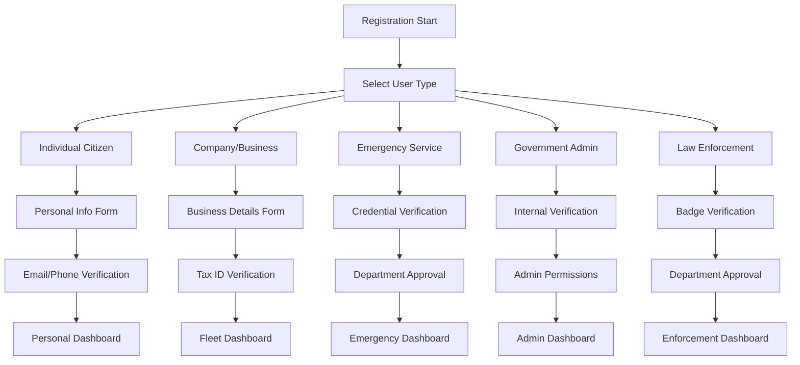

# Product Requirements Document (PRD): User Registration System with Role-Based Access Control

**Version:** 1.0  
**Date:** December 2024  
**Project:** Digital Vehicle Tax Platform - Madagascar  
**Status:** Draft

## 1. Product Overview

The User Registration System is a comprehensive authentication and authorization module for the Madagascar Digital Vehicle Tax Platform. It provides role-based access control with distinct user types, each having specific attributes, permissions, and vehicle registration capabilities. The system focuses exclusively on terrestrial vehicles (moto, scooter, voiture, camion, bus) and implements strict validation based on user credentials and organizational affiliations.

The system addresses the need for different user personas identified in the main PRD: Individual Citizens, Fleet Managers, Emergency Service Providers, Government Administrators, and Law Enforcement Officers. Each user type has tailored registration flows, dashboard views, and vehicle management capabilities.

## 2. Core Features

### 2.1 User Roles

| Role | Registration Method | Core Permissions | Vehicle Types Allowed |
|------|---------------------|------------------|----------------------|
| Individual Citizen | Email/Phone + Personal Info | Register personal vehicles, view own tax status | Moto, Scooter, Voiture (personal use) |
| Company/Business | Business Registration + Tax ID | Manage fleet vehicles, bulk operations, accounting features | All terrestrial vehicles for commercial use |
| Emergency Service Provider | Official credentials + verification | Register specialized emergency vehicles, exemption management | Ambulance, Fire trucks, Emergency vehicles |
| Government Administrator | Internal invitation + verification | System administration, user management, tax rate updates | Administrative vehicles |
| Law Enforcement Officer | Badge verification + department approval | QR code verification, vehicle status lookup | Police vehicles, patrol cars |

### 2.2 Feature Module

Our user registration system consists of the following main pages:

1. **Registration Selection Page**: User type selection, guidance for each registration path, clear differentiation between user types.

2. **Dynamic Registration Forms**: Type-specific form fields, real-time validation, credential verification interfaces.

3. **User Profile Management**: Profile editing, credential updates, organization information management.

4. **Role-Based Dashboard**: Customized views per user type, relevant features and actions, permission-based navigation.

5. **Vehicle Registration Interface**: Type-restricted vehicle registration, validation based on user permissions, specialized vehicle categories.

### 2.3 Page Details

| Page Name | Module Name | Feature Description |
|-----------|-------------|---------------------|
| Registration Selection | User Type Selector | Display available user types with descriptions, guide users to appropriate registration path, show requirements for each type |
| Individual Registration | Personal Info Form | Collect personal details, phone/email validation, identity verification, create basic user profile |
| Company Registration | Business Details Form | Business registration number validation, tax ID verification, company information collection, fleet management setup |
| Emergency Service Registration | Credential Verification | Official document upload, department verification, specialized permissions setup, emergency vehicle categories |
| Government Admin Registration | Internal Verification | Invitation-based registration, department authentication, administrative permissions assignment, system access levels |
| Law Enforcement Registration | Badge Verification | Badge number validation, department approval workflow, verification permissions setup, patrol vehicle access |
| User Profile Dashboard | Profile Management | Edit personal/business information, update credentials, manage organization details, view account status |
| Vehicle Registration | Type-Based Vehicle Form | Vehicle registration with user type restrictions, terrestrial vehicle categories (moto, scooter, voiture, camion, bus), validation based on user permissions |

## 3. Core Process

### Individual User Flow
Users select "Individual Citizen" → Complete personal information → Email/phone verification → Access personal vehicle registration → Manage personal vehicles and tax payments.

### Company User Flow  
Users select "Company/Business" → Provide business registration details → Tax ID verification → Fleet management setup → Access bulk vehicle registration and payment features.

### Emergency Service Flow
Users select "Emergency Service" → Upload official credentials → Department verification process → Specialized permissions granted → Register emergency vehicles with exemption status.

### Government Administrator Flow
Administrators receive invitation → Complete internal verification → Department authentication → Administrative permissions assigned → Access system management features.

### Law Enforcement Flow
Officers select "Law Enforcement" → Badge verification → Department approval → Verification permissions granted → Access QR code verification and vehicle lookup tools.



## 4. User Interface Design

### 4.1 Design Style

- **Primary Colors**: Government blue (#1e3a8a), Official green (#059669)
- **Secondary Colors**: Warning amber (#f59e0b), Error red (#dc2626), Success green (#10b981)
- **Button Style**: Rounded corners (8px), elevated shadows, clear hierarchy
- **Font**: Inter or system fonts, 16px base size, clear typography hierarchy
- **Layout Style**: Card-based design, clean government aesthetic, mobile-responsive
- **Icons**: Heroicons or Feather icons, consistent style, role-specific iconography

### 4.2 Page Design Overview

| Page Name | Module Name | UI Elements |
|-----------|-------------|-------------|
| Registration Selection | User Type Cards | Large selection cards with icons, clear descriptions, color-coded by user type, hover effects, progress indicators |
| Individual Registration | Personal Form | Clean form layout, step-by-step progress, real-time validation, mobile-optimized inputs, clear error messages |
| Company Registration | Business Form | Multi-step wizard, document upload areas, validation indicators, business-focused styling, tax ID formatting |
| Emergency Service Registration | Credential Upload | Secure upload interface, verification status indicators, official document previews, department selection dropdowns |
| Government Admin Registration | Internal Form | Restricted access styling, department authentication, permission level indicators, security-focused design |
| Law Enforcement Registration | Badge Verification | Badge number input, department selection, verification workflow, enforcement-themed styling |
| User Dashboards | Role-Based Views | Customized layouts per user type, relevant widgets and actions, permission-based navigation, quick access tools |
| Vehicle Registration | Vehicle Forms | Type-restricted forms, terrestrial vehicle categories, image upload for vehicle photos, specification inputs |

### 4.3 Responsiveness

The system is mobile-first with desktop enhancement. Touch-optimized interactions for mobile users, responsive form layouts, and adaptive navigation. Special consideration for field workers (law enforcement, emergency services) who primarily use mobile devices.

## 5. Technical Architecture

### 5.1 User Type System

```python
# User Type Choices
USER_TYPE_CHOICES = [
    ('individual', 'Individual Citizen'),
    ('company', 'Company/Business'),
    ('emergency', 'Emergency Service Provider'),
    ('government', 'Government Administrator'),
    ('law_enforcement', 'Law Enforcement Officer'),
]

# Terrestrial Vehicle Subtypes
TERRESTRIAL_VEHICLE_SUBTYPES = [
    ('moto', 'Moto'),
    ('scooter', 'Scooter'),
    ('voiture', 'Voiture'),
    ('camion', 'Camion'),
    ('bus', 'Bus'),
    ('camionnette', 'Camionnette'),
    ('remorque', 'Remorque'),
]
```

### 5.2 Permission Matrix

| User Type | Personal Vehicles | Commercial Vehicles | Emergency Vehicles | Admin Functions | Verification Tools |
|-----------|------------------|--------------------|--------------------|-----------------|-------------------|
| Individual | ✅ | ❌ | ❌ | ❌ | ❌ |
| Company | ❌ | ✅ | ❌ | ❌ | ❌ |
| Emergency | ❌ | ❌ | ✅ | ❌ | ❌ |
| Government | ✅ | ✅ | ✅ | ✅ | ✅ |
| Law Enforcement | ✅ | ❌ | ❌ | ❌ | ✅ |

### 5.3 Data Models

```sql
-- Extended User Profile with Type
CREATE TABLE user_profiles (
    id UUID PRIMARY KEY DEFAULT gen_random_uuid(),
    user_id INTEGER REFERENCES auth_user(id),
    user_type VARCHAR(20) NOT NULL,
    phone_number VARCHAR(20),
    verification_status VARCHAR(20) DEFAULT 'pending',
    created_at TIMESTAMP DEFAULT NOW()
);

-- Individual Citizen Profile
CREATE TABLE individual_profiles (
    id UUID PRIMARY KEY DEFAULT gen_random_uuid(),
    user_profile_id UUID REFERENCES user_profiles(id),
    identity_number VARCHAR(50),
    date_of_birth DATE,
    address TEXT,
    emergency_contact VARCHAR(100)
);

-- Company Profile
CREATE TABLE company_profiles (
    id UUID PRIMARY KEY DEFAULT gen_random_uuid(),
    user_profile_id UUID REFERENCES user_profiles(id),
    company_name VARCHAR(200) NOT NULL,
    tax_id VARCHAR(50) UNIQUE NOT NULL,
    business_registration_number VARCHAR(50),
    industry_sector VARCHAR(100),
    fleet_size INTEGER DEFAULT 0
);

-- Emergency Service Profile
CREATE TABLE emergency_service_profiles (
    id UUID PRIMARY KEY DEFAULT gen_random_uuid(),
    user_profile_id UUID REFERENCES user_profiles(id),
    organization_name VARCHAR(200) NOT NULL,
    service_type VARCHAR(50), -- ambulance, fire, rescue
    official_license VARCHAR(100),
    department_contact VARCHAR(100),
    verification_document_url VARCHAR(500)
);

-- Government Administrator Profile
CREATE TABLE government_admin_profiles (
    id UUID PRIMARY KEY DEFAULT gen_random_uuid(),
    user_profile_id UUID REFERENCES user_profiles(id),
    department VARCHAR(100) NOT NULL,
    position VARCHAR(100),
    employee_id VARCHAR(50),
    access_level INTEGER DEFAULT 1
);

-- Law Enforcement Profile
CREATE TABLE law_enforcement_profiles (
    id UUID PRIMARY KEY DEFAULT gen_random_uuid(),
    user_profile_id UUID REFERENCES user_profiles(id),
    badge_number VARCHAR(50) UNIQUE NOT NULL,
    department VARCHAR(100) NOT NULL,
    rank VARCHAR(50),
    jurisdiction VARCHAR(100)
);

-- Enhanced Vehicle Model with Terrestrial Subtypes
ALTER TABLE vehicles ADD COLUMN terrestrial_subtype VARCHAR(20);
ALTER TABLE vehicles ADD COLUMN allowed_user_types TEXT[]; -- Array of allowed user types
```

### 5.4 Validation Rules

1. **Individual Citizens**: Can only register vehicles with `terrestrial_subtype` in ['moto', 'scooter', 'voiture'] and `categorie_vehicule` = 'Personnel'

2. **Companies**: Can register any terrestrial vehicle with `categorie_vehicule` = 'Commercial'

3. **Emergency Services**: Can register vehicles with `categorie_vehicule` in ['Ambulance', 'Sapeurs-pompiers'] and appropriate terrestrial subtypes

4. **Government Administrators**: Full access to all vehicle types and categories

5. **Law Enforcement**: Can register police vehicles and access verification tools

### 5.5 Security Measures

- Multi-factor authentication for sensitive user types
- Document verification for emergency services and law enforcement
- Department approval workflows
- Audit logging for all user actions
- Role-based API access controls
- Secure credential storage and validation

## 6. Implementation Guidelines

### 6.1 Registration Flow Implementation

1. **User Type Selection**: Create a selection interface with clear descriptions and requirements for each user type
2. **Dynamic Forms**: Implement JavaScript-based form field showing/hiding based on selected user type
3. **Validation**: Server-side validation for each user type's specific requirements
4. **Verification**: Automated and manual verification processes for different user types
5. **Profile Creation**: Automatic profile creation based on user type selection

### 6.2 Permission System

1. **Django Groups**: Create Django groups for each user type with specific permissions
2. **Decorators**: Custom decorators to check user type permissions on views
3. **Template Tags**: Custom template tags to show/hide UI elements based on user type
4. **API Permissions**: DRF permission classes for API endpoints
5. **Middleware**: Custom middleware to enforce user type restrictions

### 6.3 Testing Strategy

1. **Unit Tests**: Test each user type registration flow
2. **Integration Tests**: Test permission enforcement across the system
3. **Security Tests**: Verify that users cannot access unauthorized features
4. **UI Tests**: Automated testing of dynamic form behavior
5. **Load Tests**: Test system performance with multiple user types

This comprehensive user registration system ensures proper role-based access control while maintaining security and usability for all user types in the Madagascar Digital Vehicle Tax Platform.