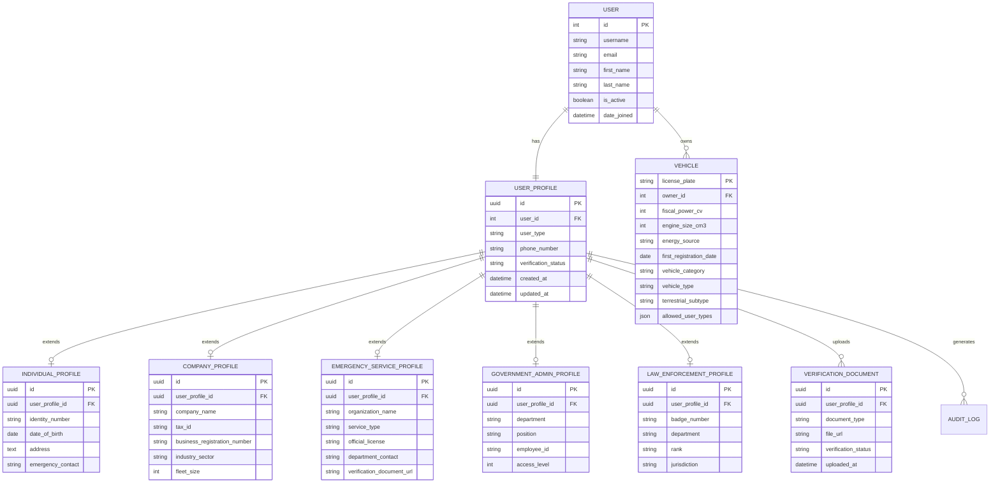

# Technical Architecture Document: User Registration System with Role-Based Access Control

**Version:** 1.0  
**Date:** December 2024  
**Project:** Digital Vehicle Tax Platform - User Registration Module  
**Status:** Draft

## 1. Architecture Design


## 2. Technology Description

- **Frontend**: React@18 + TypeScript + TailwindCSS@3 + Vite + React Hook Form
- **Backend**: Django@4.2 + Django REST Framework + Django Channels (for real-time updates)
- **Database**: Supabase (PostgreSQL) with Row Level Security
- **Authentication**: Django Authentication + JWT tokens + Supabase Auth
- **File Storage**: Supabase Storage for document uploads
- **Notifications**: Supabase Edge Functions for email/SMS
- **Validation**: Django Forms + Pydantic for API validation

## 3. Route Definitions

| Route | Purpose | User Type Access |
|-------|---------|------------------|
| `/register` | User type selection and registration entry point | Public |
| `/register/individual` | Individual citizen registration form | Public |
| `/register/company` | Company/business registration form | Public |
| `/register/emergency` | Emergency service provider registration | Public |
| `/register/government` | Government administrator registration | Invitation only |
| `/register/law-enforcement` | Law enforcement officer registration | Public |
| `/profile` | User profile management and editing | Authenticated users |
| `/dashboard` | Role-based dashboard (redirects to appropriate view) | Authenticated users |
| `/dashboard/individual` | Individual citizen dashboard | Individual users |
| `/dashboard/company` | Company fleet management dashboard | Company users |
| `/dashboard/emergency` | Emergency service dashboard | Emergency service users |
| `/dashboard/admin` | Government administrator dashboard | Admin users |
| `/dashboard/enforcement` | Law enforcement dashboard | Law enforcement users |
| `/vehicles/register` | Vehicle registration (type-restricted) | Authenticated users |
| `/verification/status` | Verification status and document upload | Pending users |

## 4. API Definitions

### 4.1 Core API

**User Registration**
```
POST /api/auth/register/
```

Request:
| Param Name | Param Type | isRequired | Description |
|------------|------------|------------|-------------|
| user_type | string | true | One of: individual, company, emergency, government, law_enforcement |
| email | string | true | User email address |
| password | string | true | User password (min 8 chars) |
| first_name | string | true | User first name |
| last_name | string | true | User last name |
| phone_number | string | false | Phone number in +261xxxxxxxxx format |
| profile_data | object | true | Type-specific profile data |

Response:
| Param Name | Param Type | Description |
|------------|------------|-------------|
| success | boolean | Registration success status |
| user_id | integer | Created user ID |
| verification_required | boolean | Whether verification is needed |
| next_step | string | Next step in registration process |

**User Type Validation**
```
POST /api/auth/validate-user-type/
```

Request:
| Param Name | Param Type | isRequired | Description |
|------------|------------|------------|-------------|
| user_type | string | true | User type to validate |
| credentials | object | true | Type-specific credentials |

Response:
| Param Name | Param Type | Description |
|------------|------------|-------------|
| valid | boolean | Validation result |
| errors | array | Validation error messages |
| requirements | array | Missing requirements |

**Vehicle Registration Permission Check**
```
GET /api/vehicles/registration-permissions/
```

Response:
| Param Name | Param Type | Description |
|------------|------------|-------------|
| allowed_categories | array | Allowed vehicle categories for user |
| allowed_subtypes | array | Allowed terrestrial vehicle subtypes |
| restrictions | object | User-specific restrictions |

**Profile Update**
```
PUT /api/profile/update/
```

Request:
| Param Name | Param Type | isRequired | Description |
|------------|------------|------------|-------------|
| profile_data | object | true | Updated profile information |
| verification_documents | array | false | New verification documents |

Response:
| Param Name | Param Type | Description |
|------------|------------|-------------|
| success | boolean | Update success status |
| verification_status | string | Current verification status |

Example Registration Request:
```json
{
  "user_type": "company",
  "email": "fleet@company.mg",
  "password": "SecurePass123!",
  "first_name": "Jean",
  "last_name": "Rakoto",
  "phone_number": "+261341234567",
  "profile_data": {
    "company_name": "Transport Rakoto SARL",
    "tax_id": "NIF123456789",
    "business_registration_number": "RCS2024001234",
    "industry_sector": "Transport",
    "address": "Antananarivo, Madagascar"
  }
}
```

## 5. Server Architecture Diagram


## 6. Data Model

### 6.1 Data Model Definition



### 6.2 Data Definition Language

**User Profile Tables**
```sql
-- Base user profile table
CREATE TABLE user_profiles (
    id UUID PRIMARY KEY DEFAULT gen_random_uuid(),
    user_id INTEGER REFERENCES auth_user(id) ON DELETE CASCADE,
    user_type VARCHAR(20) NOT NULL CHECK (user_type IN ('individual', 'company', 'emergency', 'government', 'law_enforcement')),
    phone_number VARCHAR(20) CHECK (phone_number ~ '^\+?261\d{9}$'),
    verification_status VARCHAR(20) DEFAULT 'pending' CHECK (verification_status IN ('pending', 'verified', 'rejected', 'under_review')),
    created_at TIMESTAMP WITH TIME ZONE DEFAULT NOW(),
    updated_at TIMESTAMP WITH TIME ZONE DEFAULT NOW()
);

-- Individual citizen profile
CREATE TABLE individual_profiles (
    id UUID PRIMARY KEY DEFAULT gen_random_uuid(),
    user_profile_id UUID REFERENCES user_profiles(id) ON DELETE CASCADE,
    identity_number VARCHAR(50),
    date_of_birth DATE,
    address TEXT,
    emergency_contact VARCHAR(100),
    created_at TIMESTAMP WITH TIME ZONE DEFAULT NOW()
);

-- Company profile
CREATE TABLE company_profiles (
    id UUID PRIMARY KEY DEFAULT gen_random_uuid(),
    user_profile_id UUID REFERENCES user_profiles(id) ON DELETE CASCADE,
    company_name VARCHAR(200) NOT NULL,
    tax_id VARCHAR(50) UNIQUE NOT NULL,
    business_registration_number VARCHAR(50),
    industry_sector VARCHAR(100),
    fleet_size INTEGER DEFAULT 0,
    address TEXT,
    created_at TIMESTAMP WITH TIME ZONE DEFAULT NOW()
);

-- Emergency service profile
CREATE TABLE emergency_service_profiles (
    id UUID PRIMARY KEY DEFAULT gen_random_uuid(),
    user_profile_id UUID REFERENCES user_profiles(id) ON DELETE CASCADE,
    organization_name VARCHAR(200) NOT NULL,
    service_type VARCHAR(50) CHECK (service_type IN ('ambulance', 'fire', 'rescue', 'medical')),
    official_license VARCHAR(100),
    department_contact VARCHAR(100),
    verification_document_url VARCHAR(500),
    created_at TIMESTAMP WITH TIME ZONE DEFAULT NOW()
);

-- Government administrator profile
CREATE TABLE government_admin_profiles (
    id UUID PRIMARY KEY DEFAULT gen_random_uuid(),
    user_profile_id UUID REFERENCES user_profiles(id) ON DELETE CASCADE,
    department VARCHAR(100) NOT NULL,
    position VARCHAR(100),
    employee_id VARCHAR(50),
    access_level INTEGER DEFAULT 1 CHECK (access_level BETWEEN 1 AND 5),
    created_at TIMESTAMP WITH TIME ZONE DEFAULT NOW()
);

-- Law enforcement profile
CREATE TABLE law_enforcement_profiles (
    id UUID PRIMARY KEY DEFAULT gen_random_uuid(),
    user_profile_id UUID REFERENCES user_profiles(id) ON DELETE CASCADE,
    badge_number VARCHAR(50) UNIQUE NOT NULL,
    department VARCHAR(100) NOT NULL,
    rank VARCHAR(50),
    jurisdiction VARCHAR(100),
    created_at TIMESTAMP WITH TIME ZONE DEFAULT NOW()
);

-- Verification documents
CREATE TABLE verification_documents (
    id UUID PRIMARY KEY DEFAULT gen_random_uuid(),
    user_profile_id UUID REFERENCES user_profiles(id) ON DELETE CASCADE,
    document_type VARCHAR(50) NOT NULL,
    file_url VARCHAR(500) NOT NULL,
    verification_status VARCHAR(20) DEFAULT 'pending',
    verified_by INTEGER REFERENCES auth_user(id),
    verified_at TIMESTAMP WITH TIME ZONE,
    uploaded_at TIMESTAMP WITH TIME ZONE DEFAULT NOW()
);

-- Enhanced vehicle table with terrestrial subtypes
ALTER TABLE vehicles ADD COLUMN terrestrial_subtype VARCHAR(20) 
    CHECK (terrestrial_subtype IN ('moto', 'scooter', 'voiture', 'camion', 'bus', 'camionnette', 'remorque'));

ALTER TABLE vehicles ADD COLUMN allowed_user_types TEXT[] DEFAULT ARRAY['individual', 'company', 'government'];

-- Indexes for performance
CREATE INDEX idx_user_profiles_user_type ON user_profiles(user_type);
CREATE INDEX idx_user_profiles_verification_status ON user_profiles(verification_status);
CREATE INDEX idx_company_profiles_tax_id ON company_profiles(tax_id);
CREATE INDEX idx_law_enforcement_badge ON law_enforcement_profiles(badge_number);
CREATE INDEX idx_vehicles_terrestrial_subtype ON vehicles(terrestrial_subtype);
CREATE INDEX idx_verification_documents_status ON verification_documents(verification_status);

-- Row Level Security (RLS) policies for Supabase
ALTER TABLE user_profiles ENABLE ROW LEVEL SECURITY;
ALTER TABLE individual_profiles ENABLE ROW LEVEL SECURITY;
ALTER TABLE company_profiles ENABLE ROW LEVEL SECURITY;
ALTER TABLE emergency_service_profiles ENABLE ROW LEVEL SECURITY;
ALTER TABLE government_admin_profiles ENABLE ROW LEVEL SECURITY;
ALTER TABLE law_enforcement_profiles ENABLE ROW LEVEL SECURITY;

-- Basic RLS policies
CREATE POLICY "Users can view own profile" ON user_profiles FOR SELECT USING (user_id = auth.uid()::integer);
CREATE POLICY "Users can update own profile" ON user_profiles FOR UPDATE USING (user_id = auth.uid()::integer);

-- Grant permissions
GRANT SELECT ON user_profiles TO anon;
GRANT ALL PRIVILEGES ON user_profiles TO authenticated;
GRANT ALL PRIVILEGES ON individual_profiles TO authenticated;
GRANT ALL PRIVILEGES ON company_profiles TO authenticated;
GRANT ALL PRIVILEGES ON emergency_service_profiles TO authenticated;
GRANT ALL PRIVILEGES ON government_admin_profiles TO authenticated;
GRANT ALL PRIVILEGES ON law_enforcement_profiles TO authenticated;
GRANT ALL PRIVILEGES ON verification_documents TO authenticated;

-- Initial data for testing
INSERT INTO user_profiles (user_id, user_type, phone_number, verification_status) VALUES
(1, 'individual', '+261341234567', 'verified'),
(2, 'company', '+261341234568', 'verified'),
(3, 'emergency', '+261341234569', 'under_review');
```

## 7. Security Implementation

### 7.1 Authentication & Authorization

- **JWT Tokens**: Secure token-based authentication with refresh tokens
- **Role-Based Permissions**: Django groups and permissions for each user type
- **Multi-Factor Authentication**: Required for sensitive user types (government, law enforcement)
- **Document Verification**: Automated and manual verification workflows
- **API Rate Limiting**: Prevent abuse and ensure system stability

### 7.2 Data Protection

- **Row Level Security**: Supabase RLS policies to protect user data
- **Encrypted Storage**: Sensitive documents encrypted at rest
- **Audit Logging**: Complete audit trail for all user actions
- **GDPR Compliance**: Data protection and user privacy controls
- **Secure File Upload**: Virus scanning and file type validation

### 7.3 Validation & Verification

- **Server-Side Validation**: All user inputs validated on the backend
- **Document Verification**: Automated checks for official documents
- **Department Approval**: Workflow for emergency services and law enforcement
- **Tax ID Validation**: Integration with government tax systems
- **Phone/Email Verification**: Multi-channel verification process

This technical architecture ensures a secure, scalable, and maintainable user registration system with comprehensive role-based access control for the Madagascar Digital Vehicle Tax Platform.