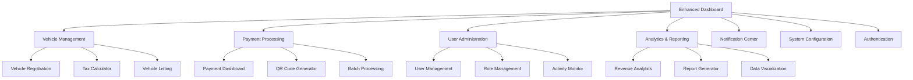

# Velzon Django Admin Template Integration - Product Requirements Document

## 1. Product Overview

Integration of the Velzon Django Admin & Dashboard Template (v4.4.1) into the existing tax collector application to transform the current basic interface into a professional, modern admin dashboard with rich UI components and enhanced user experience.

The integration will preserve all existing business logic while significantly upgrading the visual interface, providing administrators and users with a comprehensive dashboard featuring advanced analytics, intuitive navigation, and responsive design optimized for tax collection management workflows.

This upgrade positions the tax collector platform as a competitive, enterprise-grade solution with professional aesthetics and improved operational efficiency.

## 2. Core Features

### 2.1 User Roles

| Role | Registration Method | Core Permissions |
|------|---------------------|------------------|
| System Administrator | Direct database creation | Full system access, user management, configuration |
| Tax Administrator | Admin invitation | Tax management, payment oversight, reporting |
| Fleet Manager | Company registration | Vehicle fleet management, batch payments |
| Individual User | Self-registration | Personal vehicle registration, tax payments |
| Guest User | No registration | Public information access, tax calculation |

### 2.2 Feature Module

Our Velzon-integrated tax collector platform consists of the following enhanced pages:

1. **Dashboard**: Executive overview with analytics widgets, recent activities, and key performance indicators
2. **Vehicle Management**: Enhanced vehicle registration, listing, and management with advanced filtering and bulk operations
3. **Payment Processing**: Streamlined payment interface with QR code generation, batch processing, and payment tracking
4. **User Administration**: Comprehensive user management with role-based permissions and activity monitoring
5. **Analytics & Reporting**: Advanced data visualization with charts, graphs, and exportable reports
6. **Notification Center**: Centralized notification management with real-time updates and communication tools
7. **System Configuration**: Administrative settings, tax grid management, and system preferences
8. **Authentication Pages**: Modern login, registration, and password management interfaces

### 2.3 Page Details

| Page Name | Module Name | Feature description |
|-----------|-------------|---------------------|
| Dashboard | Analytics Widget | Display key metrics, revenue charts, payment statistics, and system health indicators |
| Dashboard | Activity Feed | Show recent transactions, user activities, and system notifications in real-time |
| Dashboard | Quick Actions | Provide shortcuts to common tasks like adding vehicles, processing payments, generating reports |
| Vehicle Management | Vehicle Registry | Enhanced vehicle listing with advanced search, filtering, sorting, and bulk operations |
| Vehicle Management | Registration Form | Streamlined vehicle registration with validation, auto-completion, and document upload |
| Vehicle Management | Tax Calculator | Interactive tax calculation with real-time updates and breakdown visualization |
| Payment Processing | Payment Dashboard | Comprehensive payment overview with status tracking and analytics |
| Payment Processing | QR Code Generator | Generate and manage QR codes for payments with customization options |
| Payment Processing | Batch Operations | Process multiple payments simultaneously with progress tracking |
| User Administration | User Management | Create, edit, and manage user accounts with role assignment and permissions |
| User Administration | Role Management | Define and manage user roles with granular permission control |
| User Administration | Activity Monitoring | Track user activities, login history, and system usage analytics |
| Analytics & Reporting | Revenue Analytics | Interactive charts showing revenue trends, payment patterns, and forecasting |
| Analytics & Reporting | Report Generator | Create custom reports with filtering, grouping, and export capabilities |
| Analytics & Reporting | Data Visualization | Advanced charts and graphs for data analysis and presentation |
| Notification Center | Message Management | Send, receive, and manage system notifications and user communications |
| Notification Center | Alert System | Configure and manage automated alerts and system notifications |
| System Configuration | Tax Grid Management | Configure tax rates, vehicle categories, and calculation parameters |
| System Configuration | System Settings | Manage application settings, preferences, and configuration options |
| Authentication | Login Interface | Modern, secure login with multi-factor authentication support |
| Authentication | Registration Portal | User-friendly registration with email verification and profile setup |
| Authentication | Password Management | Secure password reset, change, and recovery functionality |

## 3. Core Process

### Administrator Flow
Administrators access the enhanced dashboard to monitor system performance, manage users, configure tax settings, and generate comprehensive reports. They can perform bulk operations, manage notifications, and oversee all system activities through the intuitive Velzon interface.

### Fleet Manager Flow
Fleet managers register their company, add multiple vehicles through batch operations, process group payments, and monitor their fleet's tax compliance status through dedicated fleet management dashboards.

### Individual User Flow
Individual users register accounts, add personal vehicles, calculate taxes using the interactive calculator, make payments through various methods, and track their payment history and vehicle compliance status.

### Payment Processing Flow
Users initiate payments through the enhanced interface, generate QR codes for mobile payments, complete transactions with real-time feedback, and receive confirmation with detailed receipts and compliance certificates.

## 4. User Interface Design

### 4.1 Design Style

- **Primary Colors**: Velzon's default blue palette (#405189) with secondary accent colors (#0ab39c, #f7b84b)
- **Button Style**: Modern rounded buttons with subtle shadows and hover effects
- **Typography**: Inter font family with responsive font sizes (14px-24px) and proper hierarchy
- **Layout Style**: Card-based design with clean spacing, sidebar navigation, and responsive grid system
- **Icons**: Feather icons and Remix icons for consistent visual language
- **Animation**: Smooth transitions, loading animations, and micro-interactions for enhanced UX

### 4.2 Page Design Overview

| Page Name | Module Name | UI Elements |
|-----------|-------------|-------------|
| Dashboard | Analytics Widget | Interactive charts with ApexCharts, KPI cards with gradient backgrounds, responsive grid layout |
| Dashboard | Activity Feed | Timeline component with real-time updates, notification badges, and action buttons |
| Vehicle Management | Vehicle Registry | DataTables with advanced filtering, pagination, bulk action toolbar, and export options |
| Vehicle Management | Registration Form | Multi-step wizard with progress indicator, form validation, and file upload components |
| Payment Processing | Payment Dashboard | Status cards with color coding, progress bars, and interactive payment timeline |
| Payment Processing | QR Code Generator | QR code preview with customization options, download buttons, and sharing capabilities |
| User Administration | User Management | User cards with profile images, role badges, action dropdowns, and search functionality |
| Analytics & Reporting | Revenue Analytics | Interactive dashboard with drill-down capabilities, date range selectors, and export tools |
| Notification Center | Message Management | Inbox-style interface with message threading, priority indicators, and bulk actions |
| System Configuration | Settings Panel | Tabbed interface with form sections, toggle switches, and configuration wizards |

### 4.3 Responsiveness

The application is designed with a mobile-first approach, featuring:
- Responsive breakpoints for desktop (1200px+), tablet (768px-1199px), and mobile (320px-767px)
- Collapsible sidebar navigation for mobile devices
- Touch-optimized interactions with appropriate touch targets (44px minimum)
- Adaptive layouts that reflow content based on screen size
- Progressive enhancement for advanced features on larger screens