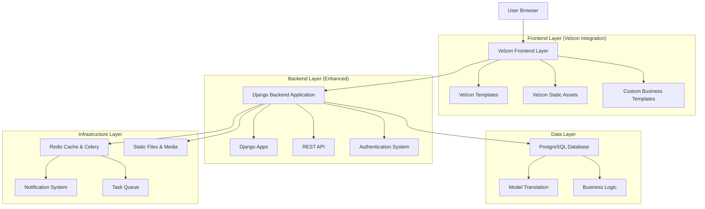
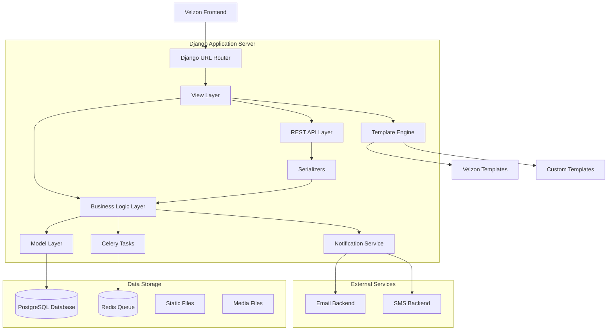
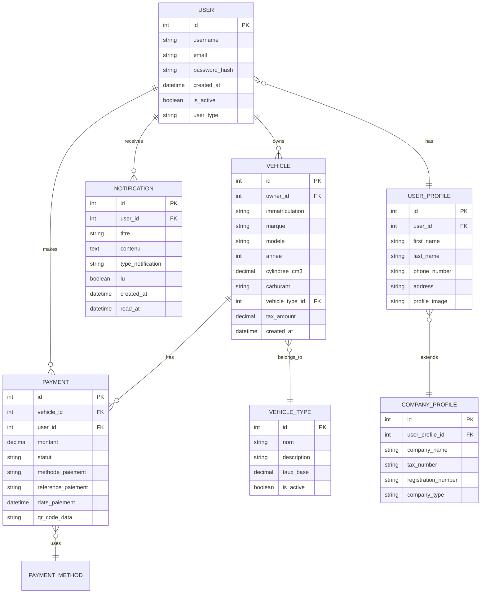

# Velzon Django Admin Template Integration - Technical Architecture Document

## 1. Architecture Design



## 2. Technology Description

- **Frontend**: Django Templates + Velzon Admin Template v4.4.1 + Bootstrap 5 + jQuery + ApexCharts
- **Backend**: Django 5.2.7 + Django REST Framework + Celery + Redis
- **Database**: PostgreSQL with django-modeltranslation
- **Authentication**: Django Auth + django-allauth (new integration)
- **UI Framework**: Velzon Template System + Custom Business Components
- **Build Tools**: Gulp + Node.js + Sass (for Velzon assets)
- **Additional**: django-crispy-forms + multiselectfield + QR code generation

## 3. Route Definitions

| Route | Purpose |
|-------|---------|
| / | Enhanced dashboard with Velzon analytics widgets and KPI overview |
| /dashboard/ | Main admin dashboard with integrated Velzon components |
| /vehicles/ | Vehicle management with enhanced Velzon data tables and forms |
| /vehicles/add/ | Vehicle registration using Velzon form components |
| /vehicles/<id>/ | Vehicle detail view with Velzon card layouts |
| /payments/ | Payment management with Velzon dashboard components |
| /payments/create/ | Payment processing with enhanced Velzon forms |
| /payments/batch/ | Batch payment processing with progress indicators |
| /administration/ | Admin panel with Velzon user management interface |
| /administration/users/ | User management with Velzon data tables |
| /administration/roles/ | Role management with Velzon permission matrices |
| /analytics/ | Analytics dashboard with Velzon chart components |
| /analytics/reports/ | Report generation with Velzon export tools |
| /notifications/ | Notification center with Velzon messaging interface |
| /settings/ | System configuration with Velzon settings panels |
| /auth/login/ | Enhanced login with Velzon authentication templates |
| /auth/register/ | Registration with Velzon form validation |
| /auth/profile/ | User profile management with Velzon components |

## 4. API Definitions

### 4.1 Core API

**Dashboard Analytics API**
```
GET /api/dashboard/analytics/
```

Response:
| Param Name | Param Type | Description |
|------------|------------|-------------|
| total_vehicles | integer | Total registered vehicles |
| total_payments | decimal | Total payment amount |
| pending_payments | integer | Number of pending payments |
| monthly_revenue | array | Monthly revenue data for charts |
| recent_activities | array | Recent system activities |

Example Response:
```json
{
  "total_vehicles": 1250,
  "total_payments": 125000.50,
  "pending_payments": 45,
  "monthly_revenue": [
    {"month": "2024-01", "amount": 15000},
    {"month": "2024-02", "amount": 18000}
  ],
  "recent_activities": [
    {
      "id": 1,
      "type": "payment",
      "description": "Payment processed for vehicle ABC123",
      "timestamp": "2024-01-15T10:30:00Z"
    }
  ]
}
```

**Vehicle Management API**
```
GET /api/vehicles/
POST /api/vehicles/
PUT /api/vehicles/<id>/
DELETE /api/vehicles/<id>/
```

**Payment Processing API**
```
GET /api/payments/
POST /api/payments/
GET /api/payments/<id>/qr-code/
POST /api/payments/batch/
```

**User Management API**
```
GET /api/administration/users/
POST /api/administration/users/
PUT /api/administration/users/<id>/
GET /api/administration/roles/
```

**Notification API**
```
GET /api/notifications/
POST /api/notifications/
PUT /api/notifications/<id>/mark-read/
GET /api/notifications/unread-count/
```

## 5. Server Architecture Diagram



## 6. Data Model

### 6.1 Data Model Definition



### 6.2 Data Definition Language

**Enhanced User Management Tables**
```sql
-- Enhanced user profile table
CREATE TABLE user_profiles (
    id SERIAL PRIMARY KEY,
    user_id INTEGER UNIQUE REFERENCES auth_user(id) ON DELETE CASCADE,
    first_name VARCHAR(100),
    last_name VARCHAR(100),
    phone_number VARCHAR(20),
    address TEXT,
    profile_image VARCHAR(255),
    user_type VARCHAR(20) DEFAULT 'individual' CHECK (user_type IN ('individual', 'company', 'fleet')),
    created_at TIMESTAMP WITH TIME ZONE DEFAULT NOW(),
    updated_at TIMESTAMP WITH TIME ZONE DEFAULT NOW()
);

-- Company profile extension
CREATE TABLE company_profiles (
    id SERIAL PRIMARY KEY,
    user_profile_id INTEGER UNIQUE REFERENCES user_profiles(id) ON DELETE CASCADE,
    company_name VARCHAR(200) NOT NULL,
    tax_number VARCHAR(50) UNIQUE,
    registration_number VARCHAR(50) UNIQUE,
    company_type VARCHAR(50),
    employee_count INTEGER DEFAULT 0,
    created_at TIMESTAMP WITH TIME ZONE DEFAULT NOW()
);

-- Enhanced vehicle table with Velzon integration fields
ALTER TABLE vehicles_vehicule ADD COLUMN IF NOT EXISTS tax_calculation_details JSONB;
ALTER TABLE vehicles_vehicule ADD COLUMN IF NOT EXISTS compliance_status VARCHAR(20) DEFAULT 'pending';
ALTER TABLE vehicles_vehicule ADD COLUMN IF NOT EXISTS last_inspection_date DATE;

-- Enhanced payment table for Velzon dashboard
ALTER TABLE payments_payment ADD COLUMN IF NOT EXISTS payment_gateway VARCHAR(50);
ALTER TABLE payments_payment ADD COLUMN IF NOT EXISTS transaction_fee DECIMAL(10,2) DEFAULT 0.00;
ALTER TABLE payments_payment ADD COLUMN IF NOT EXISTS receipt_url VARCHAR(255);

-- Notification enhancement for Velzon notification center
ALTER TABLE notifications_notification ADD COLUMN IF NOT EXISTS priority VARCHAR(10) DEFAULT 'normal' CHECK (priority IN ('low', 'normal', 'high', 'urgent'));
ALTER TABLE notifications_notification ADD COLUMN IF NOT EXISTS category VARCHAR(50) DEFAULT 'general';
ALTER TABLE notifications_notification ADD COLUMN IF NOT EXISTS action_url VARCHAR(255);

-- Dashboard analytics table for Velzon widgets
CREATE TABLE dashboard_analytics (
    id SERIAL PRIMARY KEY,
    metric_name VARCHAR(100) NOT NULL,
    metric_value DECIMAL(15,2),
    metric_date DATE DEFAULT CURRENT_DATE,
    category VARCHAR(50),
    created_at TIMESTAMP WITH TIME ZONE DEFAULT NOW()
);

-- System configuration for Velzon settings
CREATE TABLE system_configurations (
    id SERIAL PRIMARY KEY,
    config_key VARCHAR(100) UNIQUE NOT NULL,
    config_value TEXT,
    config_type VARCHAR(20) DEFAULT 'string',
    description TEXT,
    is_active BOOLEAN DEFAULT TRUE,
    updated_at TIMESTAMP WITH TIME ZONE DEFAULT NOW()
);

-- Create indexes for performance
CREATE INDEX idx_user_profiles_user_type ON user_profiles(user_type);
CREATE INDEX idx_company_profiles_tax_number ON company_profiles(tax_number);
CREATE INDEX idx_vehicles_compliance_status ON vehicles_vehicule(compliance_status);
CREATE INDEX idx_payments_gateway ON payments_payment(payment_gateway);
CREATE INDEX idx_notifications_priority ON notifications_notification(priority);
CREATE INDEX idx_dashboard_analytics_date ON dashboard_analytics(metric_date);
CREATE INDEX idx_dashboard_analytics_category ON dashboard_analytics(category);

-- Insert initial system configurations
INSERT INTO system_configurations (config_key, config_value, config_type, description) VALUES
('site_name', 'Tax Collector Pro', 'string', 'Application name displayed in Velzon header'),
('default_currency', 'MGA', 'string', 'Default currency for payments'),
('tax_calculation_method', 'progressive', 'string', 'Method for tax calculation'),
('notification_email_enabled', 'true', 'boolean', 'Enable email notifications'),
('dashboard_refresh_interval', '30', 'integer', 'Dashboard auto-refresh interval in seconds'),
('max_file_upload_size', '10485760', 'integer', 'Maximum file upload size in bytes'),
('velzon_theme_color', '#405189', 'string', 'Primary theme color for Velzon interface'),
('enable_qr_payments', 'true', 'boolean', 'Enable QR code payment functionality');

-- Insert sample dashboard analytics data
INSERT INTO dashboard_analytics (metric_name, metric_value, category) VALUES
('total_vehicles', 0, 'vehicles'),
('total_payments', 0, 'payments'),
('pending_payments', 0, 'payments'),
('active_users', 0, 'users'),
('monthly_revenue', 0, 'revenue');
```

## 7. Integration Implementation Plan

### Phase 1: Foundation Setup (Week 1)
1. **Dependencies Installation**
   - Add django-allauth, multiselectfield to requirements.txt
   - Install Node.js dependencies for Velzon build system
   - Configure Gulp build pipeline

2. **Static Files Integration**
   - Copy Velzon static assets to project static directory
   - Configure Django static files settings for Velzon assets
   - Set up build process for SCSS compilation

3. **Template Structure Setup**
   - Create Velzon template hierarchy in templates directory
   - Implement base Velzon layout templates
   - Configure template inheritance structure

### Phase 2: Core Integration (Week 2)
1. **Authentication Enhancement**
   - Integrate django-allauth with existing authentication
   - Implement Velzon authentication templates
   - Configure user profile extensions

2. **Dashboard Implementation**
   - Create enhanced dashboard with Velzon components
   - Implement analytics widgets and KPI cards
   - Integrate existing business data with Velzon charts

3. **Navigation and Layout**
   - Implement Velzon sidebar navigation
   - Configure responsive layout system
   - Integrate existing menu items with Velzon structure

### Phase 3: Business Logic Integration (Week 3)
1. **Module Enhancement**
   - Migrate vehicle management to Velzon interface
   - Enhance payment processing with Velzon components
   - Implement user administration with Velzon tools

2. **API Enhancement**
   - Extend existing APIs for Velzon dashboard needs
   - Implement real-time data endpoints
   - Add analytics and reporting APIs

3. **Testing and Optimization**
   - Comprehensive testing of integrated features
   - Performance optimization and caching
   - Mobile responsiveness verification

### Phase 4: Advanced Features (Week 4)
1. **Advanced Components**
   - Implement advanced Velzon components (charts, forms, tables)
   - Add notification center functionality
   - Configure system settings interface

2. **Customization and Branding**
   - Apply custom branding to Velzon theme
   - Implement business-specific customizations
   - Optimize user experience flows

3. **Documentation and Deployment**
   - Update documentation for new interface
   - Prepare deployment configurations
   - Conduct user acceptance testing