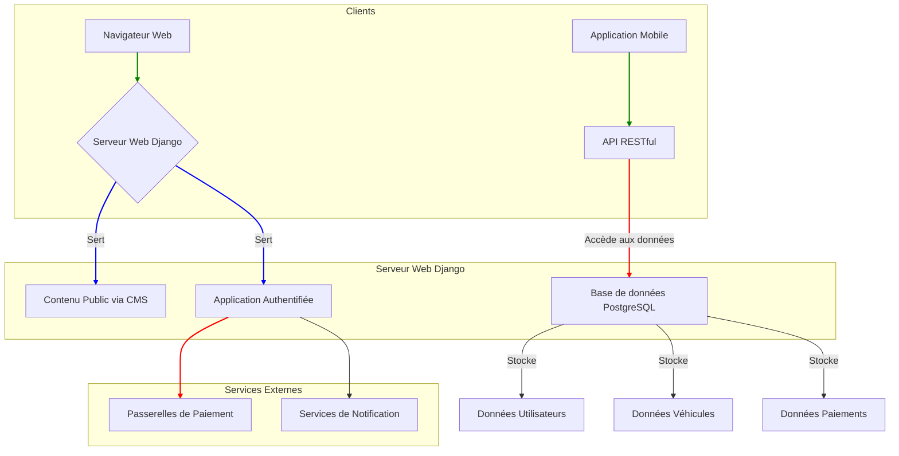

# Analyse de la Plateforme de Collecte de Taxes

## 1. Objectifs du Projet

### 1.1. Buts Principaux et Secondaires

**Objectif Principal :** Développer et exploiter une plateforme numérique robuste et conviviale pour rationaliser le processus de paiement de la taxe sur les véhicules à Madagascar, augmentant ainsi les recettes de l'État et améliorant l'efficacité du service public.

**Objectifs Secondaires :**

* **Pour l'État :**

  * Maximiser les recettes fiscales en simplifiant le processus de paiement et en réduisant la fraude.

  * Fournir un outil de suivi en temps réel pour la performance de la collecte des taxes.

  * Réduire la charge administrative et les coûts associés à la collecte manuelle des taxes.

  * Doter les forces de l'ordre d'un outil fiable et instantané pour vérifier la conformité fiscale.

* **Pour les Utilisateurs (Propriétaires de véhicules et gestionnaires de flotte) :**

  * Offrir un moyen pratique, accessible et sécurisé de déclarer et de payer les taxes sur les véhicules en ligne.

  * Éliminer la nécessité de se rendre physiquement dans les bureaux des impôts.

  * Fournir des calculs de taxes clairs et automatisés.

  * Offrir un accès immédiat à une preuve de paiement (reçu numérique et code QR).

* **Pour les Mainteneurs de la Plateforme (Développeurs et Éditeurs de contenu) :**

  * Construire une application évolutive et sécurisée basée sur des technologies modernes (Django, PostgreSQL).

  * Assurer une séparation nette entre la logique applicative de base et le contenu public (via un CMS).

  * Fournir une API complète pour prendre en charge plusieurs clients (web, mobile).

### 1.2. Indicateurs Clés de Performance (KPI) de Succès

* **Taux d'Adoption :** >80% des taxes sur les véhicules éligibles payées via la plateforme d'ici 2 ans.

* **Taux de Paiement à Temps :** >90% des paiements effectués avant la date limite annuelle.

* **Satisfaction des Utilisateurs :** Net Promoter Score (NPS) de +40 ou plus.

* **Disponibilité du Système :** 99,9% de temps de disponibilité.

* **Recettes Collectées :** Suivies en temps réel via le tableau de bord d'administration.

### 1.3. Bénéfices Attendus

* **Pour l'État :** Recettes accrues et plus prévisibles, de meilleures données pour l'élaboration des politiques, une image publique améliorée grâce à la modernisation.

* **Pour les Utilisateurs :** Économies de temps et d'argent, réduction du stress, amélioration de l'expérience utilisateur avec un service gouvernemental.

* **Pour l'Entreprise (Opérateur de la plateforme) :** Un produit réussi, évolutif et maintenable qui peut servir de modèle pour d'autres projets de numérisation du gouvernement.

## 2. Fonctionnalités existantes

### 2.1. Liste exhaustive des fonctionnalités implémentées

#### Plateforme de base et authentification

* **Gestion des utilisateurs :** Inscription, connexion et réinitialisation du mot de passe via l'API REST. L'authentification est basée sur JWT (JSON Web Tokens).

* **Gestion de contenu (CMS) :** Le contenu public (pages d'accueil, à propos, contact) est entièrement géré via un CMS dorsal, ce qui permet des mises à jour sans code.

* **Tableau de bord utilisateur :** Une zone authentifiée (`/app/`) pour que les utilisateurs puissent gérer leurs informations.

#### Gestion des véhicules

* **CRUD des véhicules :** Les utilisateurs peuvent ajouter, lister et afficher les détails de leurs véhicules via l'API.

* **Informations sur les véhicules :** Les données stockées comprennent l'immatriculation, la puissance fiscale, la cylindrée, la source d'énergie, la date de première circulation et la catégorie.

#### Calcul et paiement des taxes

* **Calcul automatisé des taxes :** Un point de terminaison d'API (`/api/v1/tax-calculations/calculate/`) calcule le montant de la taxe en fonction des caractéristiques du véhicule et de l'année fiscale.

* **Gestion des exonérations :** Le système identifie automatiquement les véhicules exonérés.

* **Gestion des paiements :** L'API fournit des points de terminaison pour lister et afficher les détails des paiements.

#### Notifications

* **Système de notification :** Les utilisateurs reçoivent des notifications qui peuvent être listées, marquées comme lues (individuellement ou en masse) via l'API.

* **Compteur de notifications non lues :** Un point de terminaison pour récupérer le nombre de notifications non lues.

#### API et administration

* **API RESTful :** Une API complète (`/api/v1/`) avec documentation Swagger (`/api/schema/swagger-ui/`).

* **Limitation de débit :** Des limites de débit sont en place pour les utilisateurs anonymes et authentifiés afin d'éviter les abus.

* **Tableau de bord d'administration :** Une interface d'administration personnalisée (`/administration/`) en plus de l'administrateur Django standard (`/admin/`).

* **Vérification de l'état de santé :** Un point de terminaison (`/api/v1/health/`) pour surveiller l'état de la base de données et du cache.

#### Utilitaires

* **Vérification du code QR :** Une URL publique (`/app/qr-verification/`) pour vérifier la validité d'une preuve de paiement par code QR.

* **Convertisseur de cylindrée :** Un outil API pour suggérer la puissance fiscale (CV) en fonction de la cylindrée d'un moteur.

### 2.2. Workflows utilisateur principaux

1. **Intégration d'un nouvel utilisateur :**

   * L'utilisateur s'inscrit sur la plateforme.

   * Il se connecte et reçoit un jeton JWT.

   * Il accède à son tableau de bord.

2. **Déclaration et paiement d'un véhicule :**

   * L'utilisateur ajoute un nouveau véhicule à son profil.

   * Le système calcule la taxe due.

   * L'utilisateur effectue le paiement (la logique de paiement détaillée n'est pas entièrement spécifiée dans la documentation).

   * Le système génère un reçu et un code QR.

3. **Vérification par les forces de l'ordre :**

   * Un agent scanne le code QR sur le pare-brise d'un véhicule.

   * L'agent est redirigé vers une page de vérification publique affichant le statut du paiement.

### 2.3. Points d'intégration avec d'autres systèmes

* **Systèmes de paiement :** Intégration prévue avec les fournisseurs de paiement mobile locaux (MVola, Orange Money, Airtel Money) et les cartes de crédit/débit.

* **Services de notification :** Utilisation implicite de services tiers (par exemple, SendGrid, Twilio) pour l'envoi d'e-mails et de SMS.

* **Clients API :** L'API est conçue pour servir plusieurs clients, y compris une application web frontale et une application mobile de numérisation.

## 3. Documentation pour la présentation

### 3.1. Diagramme d'architecture

### 3.2. Captures d'écran annotées

*Note : La génération de captures d'écran n'est pas possible car l'accès à une instance en cours d'exécution de l'application n'est pas disponible. Il est recommandé de produire des captures d'écran pour les interfaces clés, notamment :*

* *Le tableau de bord de l'utilisateur*

* *Le formulaire d'ajout de véhicule*

* *Le processus de paiement*

* *La page de vérification du code QR*

### 3.3. Statistiques d'utilisation

*Note : Aucune donnée statistique sur l'utilisation n'est disponible dans la documentation existante. Pour une analyse complète, il est recommandé de collecter des données sur :*

* *Le nombre d'utilisateurs actifs*

* *Le nombre de véhicules enregistrés*

* *Le volume des transactions de paiement*

* *Les pages les plus visitées*

## 4. Résumé Exécutif et Recommandations

### 4.1. Résumé Exécutif

La plateforme de collecte de taxes sur les véhicules est une application web bien conçue, construite sur une base technique solide (Django/PostgreSQL) et suivant les meilleures pratiques modernes. Elle répond avec succès aux principaux objectifs de numérisation du processus de paiement des taxes, en offrant une API RESTful complète, une séparation claire entre le contenu public géré par le CMS et l'application principale, ainsi que des fonctionnalités essentielles telles que la gestion des utilisateurs, le calcul des taxes et la génération de preuves de paiement.

L'architecture est évolutive et sécurisée, avec des mécanismes d'authentification JWT, de limitation de débit et une structure modulaire qui permet une maintenance et une extension faciles. La documentation existante, bien que principalement technique, fournit une bonne vue d'ensemble du système.

Cependant, l'analyse révèle quelques lacunes, principalement liées à l'absence d'une interface utilisateur frontale entièrement développée pour accompagner l'API robuste, ainsi qu'à un manque de détails sur la mise en œuvre de certaines fonctionnalités critiques comme le processus de paiement de bout en bout.

### 4.2. Recommandations pour les Évolutions Futures

1. **Développer une Interface Utilisateur Frontale (UI) Complète :**

   * **Action :** Créer une application web frontale moderne (par exemple, en utilisant React, Vue.js ou un framework similaire) qui consomme l'API RESTful existante.

   * **Justification :** Une API sans interface utilisateur robuste ne peut pas être utilisée par le grand public. Une interface utilisateur dédiée améliorera considérablement l'expérience utilisateur et favorisera l'adoption.

2. **Mettre en Œuvre et Documenter le Processus de Paiement de Bout en Bout :**

   * **Action :** Intégrer les passerelles de paiement mobile et par carte de crédit. Documenter en détail le flux de paiement, y compris la gestion des transactions réussies, des échecs et des remboursements.

   * **Justification :** Le paiement est une fonctionnalité essentielle. Son absence ou sa mise en œuvre incomplète est un obstacle majeur au lancement de la plateforme.

3. **Améliorer les Fonctionnalités pour les Gestionnaires de Flotte :**

   * **Action :** Mettre en œuvre des fonctionnalités de paiement en masse et de gestion de flotte, comme spécifié dans le document sur les exigences du produit (PRD).

   * **Justification :** Les entreprises représentent une source de revenus importante. Répondre à leurs besoins spécifiques augmentera l'adoption et l'efficacité.

4. **Mettre en Place un Environnement de Test et de Pré-production :**

   * **Action :** Créer des environnements de test et de pré-production pour permettre des tests approfondis avant le déploiement en production.

   * **Justification :** Cela garantira la stabilité et la fiabilité de la plateforme, en particulier lors de la mise en œuvre de nouvelles fonctionnalités ou de la correction de bogues.

5. **Développer un Tableau de Bord d'Analyse et de Reporting :**

   * **Action :** Créer un tableau de bord d'administration avec des visualisations de données pour les KPI clés (par exemple, revenus, taux d'adoption, etc.).

   * **Justification :** Fournir des informations exploitables aux parties prenantes du gouvernement pour la prise de décision et le suivi des performances.

## 5. Méthodologie d'analyse

L'analyse a été réalisée en suivant une approche structurée basée sur les informations disponibles dans le code source et la documentation du projet.

* **Revue de la documentation existante :** Examen approfondi des fichiers `README_REFACTORING.md`, `API_DOCUMENTATION.md`, `mvp0.md` et d'autres documents pertinents pour comprendre les objectifs, l'architecture et les fonctionnalités du projet.

* **Analyse du code source :** Examen de la structure du projet, des applications Django, des modèles, des vues et des URL pour valider les informations de la documentation et comprendre la mise en œuvre technique.

* **Identification des lacunes fonctionnelles :** Comparaison des fonctionnalités implémentées avec les exigences définies dans le document sur les exigences du produit (PRD) afin d'identifier les fonctionnalités manquantes ou incomplètes.

* **Benchmarking implicite :** L'analyse et les recommandations sont basées sur les meilleures pratiques de l'industrie pour le développement d'applications web et de plateformes SaaS.

*Note : Aucun entretien avec les parties prenantes n'a été mené. Les recommandations sont basées uniquement sur l'analyse technique.*

## 6. Annexes techniques

Les documents suivants, situés dans le répertoire du projet, servent d'annexes techniques détaillées :

* **`API_DOCUMENTATION.md`** **:** Documentation complète de l'API RESTful.

* **`mvp0.md`** **:** Document sur les exigences du produit (PRD) décrivant les objectifs et les fonctionnalités de la V1.

* **`README_REFACTORING.md`** **:** Détails sur la refonte du frontend et la mise en place du CMS.

* **`docs/`** **:** Répertoire contenant des documents supplémentaires sur l'architecture et les spécifications.

