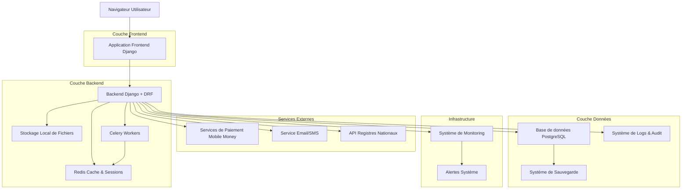
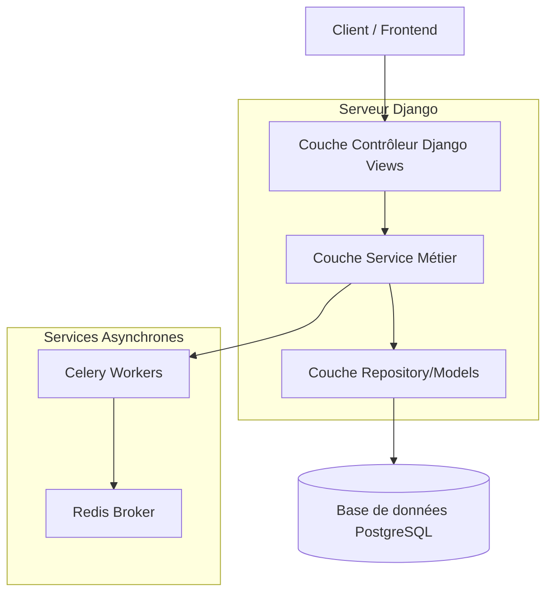
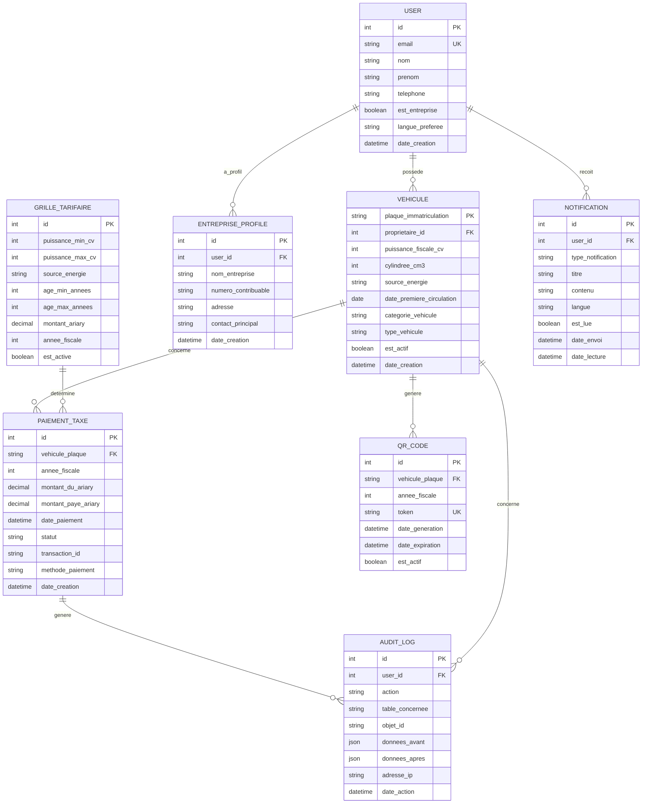

# Architecture Technique : Plateforme de Taxe sur les Véhicules à Moteur

## 1. Conception de l'architecture



## 2. Description des technologies

* **Frontend** : Django Templates + Tailwind CSS + Alpine.js pour l'interactivité + Support multilingue (Français/Malagasy)

* **Backend** : Django 5.2.7 LTS + Django REST Framework + Celery pour les tâches asynchrones

* **Base de données** : PostgreSQL 17.5/18 avec extensions pour UUID, recherche full-text et audit trail

* **Stockage** : Système de fichiers local (compatible S3 via django-storages pour évolution future)

* **Cache & Sessions** : Redis pour les sessions, cache de calculs de taxes et gestion des tâches

* **Paiements** : Intégration APIs Mobile Money Madagascar (MVola, Orange Money, Airtel Money) + Cartes bancaires

* **Notifications** : Service email SMTP + API SMS locale avec templates multilingues

* **Monitoring** : Prometheus + Grafana pour métriques système et business

* **Logs & Audit** : Système centralisé de logs avec Django-auditlog pour traçabilité complète

* **Sécurité** : Conformité OWASP Top 10 + PCI-DSS pour les paiements + HTTPS obligatoire

* **API Externes** : Intégrations futures avec registres nationaux de véhicules

* **Sauvegarde** : Système automatisé de sauvegarde PostgreSQL avec rétention configurable

## 3. Définitions des routes

| Route                         | Objectif                                                        |
| ----------------------------- | --------------------------------------------------------------- |
| `/`                           | Page d'accueil avec présentation du service et grille tarifaire |
| `/inscription/`               | Page d'inscription utilisateur (particulier/entreprise) avec validation email |
| `/inscription/entreprise/`    | Page d'inscription spécifique entreprise avec informations fiscales |
| `/connexion/`                 | Page de connexion sécurisée avec protection CSRF                |
| `/tableau-de-bord/`           | Dashboard utilisateur avec liste des véhicules et statuts       |
| `/vehicules/ajouter/`         | Formulaire d'ajout de véhicule (tous types : terrestre, ferroviaire, maritime, aérien) |
| `/vehicules/<plaque>/`        | Détails d'un véhicule et calcul de taxe                         |
| `/vehicules/flotte/`          | Gestion de flotte pour entreprises avec actions groupées        |
| `/paiement/<plaque>/<annee>/` | Interface de paiement sécurisé                                  |
| `/paiement/groupe/`           | Interface de paiement groupé pour flottes                       |
| `/qr/<token>/`                | Page de vérification publique des QR codes (non-authentifiée)   |
| `/verification/`              | Page publique de vérification manuelle par plaque              |
| `/notifications/`             | Centre de notifications et rappels utilisateur                  |
| `/rapports/`                  | Rapports et historiques pour utilisateurs                       |
| `/admin/`                     | Interface d'administration Django personnalisée                 |
| `/admin/dashboard/`           | Dashboard administrateur avec métriques et KPIs                 |
| `/admin/disputes/`            | Gestion des exceptions et disputes                               |
| `/admin/monitoring/`          | Monitoring système et alertes                                   |
| `/api/v1/`                    | API REST pour intégrations futures                              |
| `/api/v1/bulk/`               | API pour opérations en lot (flottes)                            |
| `/api/v1/external/`           | API pour intégrations registres nationaux                       |

## 4. Définitions des API

### 4.1 API principale

**Calcul de taxe véhicule**

```
POST /api/v1/vehicules/calculer-taxe/
```

Requête :

| Nom du paramètre            | Type    | Obligatoire | Description                                                       |
| --------------------------- | ------- | ----------- | ----------------------------------------------------------------- |
| plaque\_immatriculation     | string  | true        | Plaque d'immatriculation du véhicule                              |
| puissance\_fiscale\_cv      | integer | true        | Puissance fiscale en chevaux (CV)                                 |
| cylindree\_cm3              | integer | false       | Cylindrée en cm³                                                  |
| source\_energie             | string  | true        | Source d'énergie (Essence, Diesel, Electrique, Hybride)           |
| date\_premiere\_circulation | date    | true        | Date de première mise en circulation                              |
| categorie\_vehicule         | string  | true        | Catégorie (Personnel, Ambulance, Sapeurs-pompiers, Administratif) |
| annee\_fiscale              | integer | false       | Année fiscale (défaut: année courante)                            |

Réponse :

| Nom du paramètre      | Type    | Description                        |
| --------------------- | ------- | ---------------------------------- |
| montant\_taxe\_ariary | decimal | Montant de la taxe en Ariary       |
| est\_exonere          | boolean | Indique si le véhicule est exonéré |
| tranche\_age          | string  | Tranche d'âge du véhicule          |
| details\_calcul       | object  | Détails du calcul effectué         |

Exemple :

```json
{
  "plaque_immatriculation": "1234 TAA",
  "puissance_fiscale_cv": 8,
  "cylindree_cm3": 1600,
  "source_energie": "Essence",
  "date_premiere_circulation": "2020-03-15",
  "categorie_vehicule": "Personnel",
  "annee_fiscale": 2026
}
```

**Initiation de paiement**

```
POST /api/v1/paiements/initier/
```

Requête :

| Nom du paramètre  | Type    | Obligatoire | Description                                          |
| ----------------- | ------- | ----------- | ---------------------------------------------------- |
| vehicule\_plaque  | string  | true        | Plaque du véhicule                                   |
| montant\_ariary   | decimal | true        | Montant à payer                                      |
| methode\_paiement | string  | true        | Méthode (mvola, orange\_money, airtel\_money, carte) |
| numero\_telephone | string  | false       | Numéro pour Mobile Money                             |

Réponse :

| Nom du paramètre | Type   | Description                          |
| ---------------- | ------ | ------------------------------------ |
| transaction\_id  | string | Identifiant unique de la transaction |
| url\_paiement    | string | URL de redirection pour le paiement  |
| statut           | string | Statut de l'initiation               |

**Paiement groupé pour flottes**

```
POST /api/v1/paiements/groupe/
```

Requête :

| Nom du paramètre     | Type    | Obligatoire | Description                                    |
| -------------------- | ------- | ----------- | ---------------------------------------------- |
| vehicules\_plaques   | array   | true        | Liste des plaques de véhicules                 |
| montant\_total\_ariary | decimal | true        | Montant total à payer                          |
| methode\_paiement    | string  | true        | Méthode de paiement                            |
| numero\_telephone    | string  | false       | Numéro pour Mobile Money                       |

**Vérification QR Code publique**

```
GET /api/v1/verification/<token>/
```

Réponse :

| Nom du paramètre      | Type    | Description                           |
| --------------------- | ------- | ------------------------------------- |
| plaque\_immatriculation | string  | Plaque d'immatriculation              |
| annee\_fiscale        | integer | Année fiscale                         |
| statut\_paiement      | string  | PAYÉ, EXONÉRÉ, IMPAYÉ                 |
| date\_paiement        | date    | Date de paiement (si applicable)      |
| date\_expiration      | date    | Date d'expiration (31 décembre)       |
| est\_valide           | boolean | Validité du QR code                   |

**API de notifications**

```
POST /api/v1/notifications/envoyer/
```

Requête :

| Nom du paramètre | Type   | Obligatoire | Description                                |
| ---------------- | ------ | ----------- | ------------------------------------------ |
| type\_notification | string | true        | email, sms, push                           |
| destinataires    | array  | true        | Liste des destinataires                    |
| template         | string | true        | Template de notification                   |
| langue           | string | false       | fr, mg (défaut: fr)                        |

## 5. Architecture serveur



## 6. Modèle de données

### 6.1 Définition du modèle de données



### 6.2 Langage de définition des données (DDL)

**Table des utilisateurs**

```sql
-- Étendre le modèle User de Django
CREATE TABLE auth_user_profile (
    id UUID PRIMARY KEY DEFAULT gen_random_uuid(),
    user_id INTEGER UNIQUE REFERENCES auth_user(id) ON DELETE CASCADE,
    telephone VARCHAR(20),
    est_entreprise BOOLEAN DEFAULT FALSE,
    nom_entreprise VARCHAR(200),
    numero_contribuable VARCHAR(50),
    adresse TEXT,
    created_at TIMESTAMP WITH TIME ZONE DEFAULT NOW(),
    updated_at TIMESTAMP WITH TIME ZONE DEFAULT NOW()
);

-- Index pour les recherches
CREATE INDEX idx_user_profile_telephone ON auth_user_profile(telephone);
CREATE INDEX idx_user_profile_entreprise ON auth_user_profile(est_entreprise);
```

**Table des profils entreprise**

```sql
CREATE TABLE entreprise_profiles (
    id UUID PRIMARY KEY DEFAULT gen_random_uuid(),
    user_id INTEGER UNIQUE REFERENCES auth_user(id) ON DELETE CASCADE,
    nom_entreprise VARCHAR(200) NOT NULL,
    numero_contribuable VARCHAR(50) UNIQUE,
    adresse TEXT,
    contact_principal VARCHAR(100),
    secteur_activite VARCHAR(100),
    created_at TIMESTAMP WITH TIME ZONE DEFAULT NOW(),
    updated_at TIMESTAMP WITH TIME ZONE DEFAULT NOW()
);

-- Index pour les recherches
CREATE INDEX idx_entreprise_contribuable ON entreprise_profiles(numero_contribuable);
CREATE INDEX idx_entreprise_nom ON entreprise_profiles(nom_entreprise);
```

**Table des véhicules (étendue pour tous types)**

```sql
CREATE TABLE vehicules (
    plaque_immatriculation VARCHAR(15) PRIMARY KEY,
    proprietaire_id INTEGER REFERENCES auth_user(id) ON DELETE CASCADE,
    puissance_fiscale_cv INTEGER NOT NULL CHECK (puissance_fiscale_cv > 0),
    cylindree_cm3 INTEGER CHECK (cylindree_cm3 > 0),
    source_energie VARCHAR(20) NOT NULL CHECK (source_energie IN ('Essence', 'Diesel', 'Electrique', 'Hybride')),
    date_premiere_circulation DATE NOT NULL,
    categorie_vehicule VARCHAR(50) NOT NULL DEFAULT 'Personnel' 
        CHECK (categorie_vehicule IN ('Personnel', 'Commercial', 'Ambulance', 'Sapeurs-pompiers', 'Administratif', 'Convention_internationale')),
    type_vehicule VARCHAR(30) NOT NULL DEFAULT 'Terrestre'
        CHECK (type_vehicule IN ('Terrestre', 'Ferroviaire', 'Maritime', 'Aerien')),
    specifications_techniques JSONB, -- Pour stocker des infos spécifiques par type
    est_actif BOOLEAN DEFAULT TRUE,
    created_at TIMESTAMP WITH TIME ZONE DEFAULT NOW(),
    updated_at TIMESTAMP WITH TIME ZONE DEFAULT NOW()
);

-- Index pour les recherches fréquentes
CREATE INDEX idx_vehicules_proprietaire ON vehicules(proprietaire_id);
CREATE INDEX idx_vehicules_categorie ON vehicules(categorie_vehicule);
CREATE INDEX idx_vehicules_type ON vehicules(type_vehicule);
CREATE INDEX idx_vehicules_source_energie ON vehicules(source_energie);
CREATE INDEX idx_vehicules_puissance ON vehicules(puissance_fiscale_cv);
CREATE INDEX idx_vehicules_specs ON vehicules USING GIN (specifications_techniques);
```

**Table de la grille tarifaire**

```sql
CREATE TABLE grille_tarifaire (
    id SERIAL PRIMARY KEY,
    puissance_min_cv INTEGER NOT NULL,
    puissance_max_cv INTEGER,
    source_energie VARCHAR(20) NOT NULL CHECK (source_energie IN ('Essence', 'Diesel', 'Electrique', 'Hybride')),
    age_min_annees INTEGER NOT NULL DEFAULT 0,
    age_max_annees INTEGER,
    montant_ariary DECIMAL(12, 2) NOT NULL CHECK (montant_ariary >= 0),
    annee_fiscale INTEGER NOT NULL,
    est_active BOOLEAN DEFAULT TRUE,
    created_at TIMESTAMP WITH TIME ZONE DEFAULT NOW(),
    
    CONSTRAINT check_puissance_coherente CHECK (puissance_max_cv IS NULL OR puissance_max_cv >= puissance_min_cv),
    CONSTRAINT check_age_coherent CHECK (age_max_annees IS NULL OR age_max_annees >= age_min_annees)
);

-- Index pour les calculs de taxes
CREATE INDEX idx_grille_annee_active ON grille_tarifaire(annee_fiscale, est_active);
CREATE INDEX idx_grille_calcul ON grille_tarifaire(puissance_min_cv, puissance_max_cv, source_energie, age_min_annees, age_max_annees);
```

**Table des paiements de taxes**

```sql
CREATE TABLE paiements_taxe (
    id UUID PRIMARY KEY DEFAULT gen_random_uuid(),
    vehicule_plaque VARCHAR(15) REFERENCES vehicules(plaque_immatriculation) ON DELETE CASCADE,
    annee_fiscale INTEGER NOT NULL,
    montant_du_ariary DECIMAL(12, 2) NOT NULL CHECK (montant_du_ariary >= 0),
    montant_paye_ariary DECIMAL(12, 2) CHECK (montant_paye_ariary >= 0),
    date_paiement TIMESTAMP WITH TIME ZONE,
    statut VARCHAR(20) NOT NULL DEFAULT 'IMPAYE' 
        CHECK (statut IN ('IMPAYE', 'EN_ATTENTE', 'PAYE', 'EXONERE', 'ANNULE')),
    transaction_id VARCHAR(100) UNIQUE,
    methode_paiement VARCHAR(30) CHECK (methode_paiement IN ('mvola', 'orange_money', 'airtel_money', 'carte_bancaire')),
    details_paiement JSONB,
    created_at TIMESTAMP WITH TIME ZONE DEFAULT NOW(),
    updated_at TIMESTAMP WITH TIME ZONE DEFAULT NOW(),
    
    UNIQUE(vehicule_plaque, annee_fiscale)
);

-- Index pour les recherches et rapports
CREATE INDEX idx_paiements_vehicule_annee ON paiements_taxe(vehicule_plaque, annee_fiscale);
CREATE INDEX idx_paiements_statut ON paiements_taxe(statut);
CREATE INDEX idx_paiements_date ON paiements_taxe(date_paiement DESC);
CREATE INDEX idx_paiements_transaction ON paiements_taxe(transaction_id);
```

**Table des QR codes**

```sql
CREATE TABLE qr_codes (
    id UUID PRIMARY KEY DEFAULT gen_random_uuid(),
    vehicule_plaque VARCHAR(15) REFERENCES vehicules(plaque_immatriculation) ON DELETE CASCADE,
    annee_fiscale INTEGER NOT NULL,
    token VARCHAR(255) UNIQUE NOT NULL,
    date_generation TIMESTAMP WITH TIME ZONE DEFAULT NOW(),
    date_expiration TIMESTAMP WITH TIME ZONE NOT NULL,
    est_actif BOOLEAN DEFAULT TRUE,
    nombre_scans INTEGER DEFAULT 0,
    derniere_verification TIMESTAMP WITH TIME ZONE,
    
    UNIQUE(vehicule_plaque, annee_fiscale)
);

-- Index pour les vérifications rapides
CREATE INDEX idx_qr_token ON qr_codes(token) WHERE est_actif = TRUE;
CREATE INDEX idx_qr_vehicule_annee ON qr_codes(vehicule_plaque, annee_fiscale);
CREATE INDEX idx_qr_expiration ON qr_codes(date_expiration) WHERE est_actif = TRUE;
```

**Table des notifications**

```sql
CREATE TABLE notifications (
    id UUID PRIMARY KEY DEFAULT gen_random_uuid(),
    user_id INTEGER REFERENCES auth_user(id) ON DELETE CASCADE,
    type_notification VARCHAR(20) NOT NULL CHECK (type_notification IN ('email', 'sms', 'push', 'system')),
    titre VARCHAR(200) NOT NULL,
    contenu TEXT NOT NULL,
    langue VARCHAR(5) DEFAULT 'fr' CHECK (langue IN ('fr', 'mg')),
    est_lue BOOLEAN DEFAULT FALSE,
    date_envoi TIMESTAMP WITH TIME ZONE DEFAULT NOW(),
    date_lecture TIMESTAMP WITH TIME ZONE,
    metadata JSONB, -- Pour stocker des infos supplémentaires
    
    CONSTRAINT check_date_lecture CHECK (date_lecture IS NULL OR date_lecture >= date_envoi)
);

-- Index pour les notifications
CREATE INDEX idx_notifications_user ON notifications(user_id);
CREATE INDEX idx_notifications_type ON notifications(type_notification);
CREATE INDEX idx_notifications_non_lues ON notifications(user_id, est_lue) WHERE est_lue = FALSE;
CREATE INDEX idx_notifications_date ON notifications(date_envoi DESC);
```

**Table d'audit et logs**

```sql
CREATE TABLE audit_logs (
    id UUID PRIMARY KEY DEFAULT gen_random_uuid(),
    user_id INTEGER REFERENCES auth_user(id) ON DELETE SET NULL,
    action VARCHAR(50) NOT NULL,
    table_concernee VARCHAR(50) NOT NULL,
    objet_id VARCHAR(50),
    donnees_avant JSONB,
    donnees_apres JSONB,
    adresse_ip INET,
    user_agent TEXT,
    date_action TIMESTAMP WITH TIME ZONE DEFAULT NOW(),
    session_id VARCHAR(100),
    
    -- Contraintes pour assurer la cohérence
    CONSTRAINT check_donnees_modification CHECK (
        (action = 'CREATE' AND donnees_avant IS NULL) OR
        (action = 'DELETE' AND donnees_apres IS NULL) OR
        (action IN ('UPDATE', 'CREATE', 'DELETE'))
    )
);

-- Index pour les recherches d'audit
CREATE INDEX idx_audit_user ON audit_logs(user_id);
CREATE INDEX idx_audit_table_objet ON audit_logs(table_concernee, objet_id);
CREATE INDEX idx_audit_action ON audit_logs(action);
CREATE INDEX idx_audit_date ON audit_logs(date_action DESC);
CREATE INDEX idx_audit_ip ON audit_logs(adresse_ip);

-- Partition par mois pour optimiser les performances
CREATE TABLE audit_logs_y2026m01 PARTITION OF audit_logs
    FOR VALUES FROM ('2026-01-01') TO ('2026-02-01');
```

**Table des métriques système**

```sql
CREATE TABLE metriques_systeme (
    id UUID PRIMARY KEY DEFAULT gen_random_uuid(),
    nom_metrique VARCHAR(100) NOT NULL,
    valeur DECIMAL(15, 4) NOT NULL,
    unite VARCHAR(20),
    tags JSONB,
    timestamp_mesure TIMESTAMP WITH TIME ZONE DEFAULT NOW(),
    
    UNIQUE(nom_metrique, timestamp_mesure, tags)
);

-- Index pour les métriques
CREATE INDEX idx_metriques_nom_date ON metriques_systeme(nom_metrique, timestamp_mesure DESC);
CREATE INDEX idx_metriques_tags ON metriques_systeme USING GIN (tags);

-- Hypertable pour TimescaleDB (optionnel pour de meilleures performances)
-- SELECT create_hypertable('metriques_systeme', 'timestamp_mesure');
```

**Données initiales de la grille tarifaire PLF 2026**

```sql
-- Insertion de la grille tarifaire officielle PLF 2026
INSERT INTO grille_tarifaire (puissance_min_cv, puissance_max_cv, source_energie, age_min_annees, age_max_annees, montant_ariary, annee_fiscale) VALUES
-- Catégorie 1-4 CV (0-250 cm³)
(1, 4, 'Essence', 0, 5, 15000, 2026),
(1, 4, 'Essence', 6, 10, 40000, 2026),
(1, 4, 'Essence', 11, 20, 90000, 2026),
(1, 4, 'Essence', 21, NULL, 115000, 2026),
(1, 4, 'Diesel', 0, 5, 20000, 2026),
(1, 4, 'Diesel', 6, 10, 45000, 2026),
(1, 4, 'Diesel', 11, 20, 95000, 2026),
(1, 4, 'Diesel', 21, NULL, 120000, 2026),
(1, 4, 'Electrique', 0, 5, 5000, 2026),
(1, 4, 'Electrique', 6, 10, 30000, 2026),
(1, 4, 'Electrique', 11, 20, 80000, 2026),
(1, 4, 'Electrique', 21, NULL, 105000, 2026),
(1, 4, 'Hybride', 0, 5, 10000, 2026),
(1, 4, 'Hybride', 6, 10, 35000, 2026),
(1, 4, 'Hybride', 11, 20, 85000, 2026),
(1, 4, 'Hybride', 21, NULL, 110000, 2026),

-- Catégorie 5-9 CV (251-500 cm³)
(5, 9, 'Essence', 0, 5, 30000, 2026),
(5, 9, 'Essence', 6, 10, 55000, 2026),
(5, 9, 'Essence', 11, 20, 105000, 2026),
(5, 9, 'Essence', 21, NULL, 130000, 2026),
(5, 9, 'Diesel', 0, 5, 40000, 2026),
(5, 9, 'Diesel', 6, 10, 65000, 2026),
(5, 9, 'Diesel', 11, 20, 115000, 2026),
(5, 9, 'Diesel', 21, NULL, 140000, 2026),
(5, 9, 'Electrique', 0, 5, 10000, 2026),
(5, 9, 'Electrique', 6, 10, 35000, 2026),
(5, 9, 'Electrique', 11, 20, 85000, 2026),
(5, 9, 'Electrique', 21, NULL, 110000, 2026),
(5, 9, 'Hybride', 0, 5, 20000, 2026),
(5, 9, 'Hybride', 6, 10, 45000, 2026),
(5, 9, 'Hybride', 11, 20, 95000, 2026),
(5, 9, 'Hybride', 21, NULL, 120000, 2026),

-- Catégorie 10-12 CV (501-1000 cm³)
(10, 12, 'Essence', 0, 5, 60000, 2026),
(10, 12, 'Essence', 6, 10, 85000, 2026),
(10, 12, 'Essence', 11, 20, 135000, 2026),
(10, 12, 'Essence', 21, NULL, 160000, 2026),
(10, 12, 'Diesel', 0, 5, 80000, 2026),
(10, 12, 'Diesel', 6, 10, 105000, 2026),
(10, 12, 'Diesel', 11, 20, 155000, 2026),
(10, 12, 'Diesel', 21, NULL, 180000, 2026),
(10, 12, 'Electrique', 0, 5, 20000, 2026),
(10, 12, 'Electrique', 6, 10, 45000, 2026),
(10, 12, 'Electrique', 11, 20, 95000, 2026),
(10, 12, 'Electrique', 21, NULL, 120000, 2026),
(10, 12, 'Hybride', 0, 5, 40000, 2026),
(10, 12, 'Hybride', 6, 10, 65000, 2026),
(10, 12, 'Hybride', 11, 20, 115000, 2026),
(10, 12, 'Hybride', 21, NULL, 140000, 2026),

-- Catégorie 13-15 CV (>1000 cm³)
(13, 15, 'Essence', 0, 5, 90000, 2026),
(13, 15, 'Essence', 6, 10, 115000, 2026),
(13, 15, 'Essence', 11, 20, 165000, 2026),
(13, 15, 'Essence', 21, NULL, 190000, 2026),
(13, 15, 'Diesel', 0, 5, 120000, 2026),
(13, 15, 'Diesel', 6, 10, 145000, 2026),
(13, 15, 'Diesel', 11, 20, 195000, 2026),
(13, 15, 'Diesel', 21, NULL, 220000, 2026),
(13, 15, 'Electrique', 0, 5, 30000, 2026),
(13, 15, 'Electrique', 6, 10, 55000, 2026),
(13, 15, 'Electrique', 11, 20, 105000, 2026),
(13, 15, 'Electrique', 21, NULL, 130000, 2026),
(13, 15, 'Hybride', 0, 5, 60000, 2026),
(13, 15, 'Hybride', 6, 10, 85000, 2026),
(13, 15, 'Hybride', 11, 20, 135000, 2026),
(13, 15, 'Hybride', 21, NULL, 160000, 2026),

-- Catégorie >15 CV
(16, NULL, 'Essence', 0, 5, 180000, 2026),
(16, NULL, 'Essence', 6, 10, 205000, 2026),
(16, NULL, 'Essence', 11, 20, 255000, 2026),
(16, NULL, 'Essence', 21, NULL, 280000, 2026),
(16, NULL, 'Diesel', 0, 5, 240000, 2026),
(16, NULL, 'Diesel', 6, 10, 265000, 2026),
(16, NULL, 'Diesel', 11, 20, 315000, 2026),
(16, NULL, 'Diesel', 21, NULL, 340000, 2026),
(16, NULL, 'Electrique', 0, 5, 60000, 2026),
(16, NULL, 'Electrique', 6, 10, 85000, 2026),
(16, NULL, 'Electrique', 11, 20, 135000, 2026),
(16, NULL, 'Electrique', 21, NULL, 160000, 2026),
(16, NULL, 'Hybride', 0, 5, 120000, 2026),
(16, NULL, 'Hybride', 6, 10, 145000, 2026),
(16, NULL, 'Hybride', 11, 20, 195000, 2026),
(16, NULL, 'Hybride', 21, NULL, 220000, 2026);
```

## 7. Exigences non-fonctionnelles et conformité

### 7.1 Performance et disponibilité

* **Temps de réponse** : < 3 secondes pour toutes les pages
* **Vérification QR** : < 1 seconde pour la page publique de vérification
* **Disponibilité** : 99.9% (objectif SLA)
* **Charge** : Support de 10,000 utilisateurs simultanés en période de pointe (janvier)
* **Scalabilité** : Architecture horizontale avec load balancing

### 7.2 Sécurité et conformité

* **HTTPS obligatoire** : Toutes les communications chiffrées TLS 1.3
* **OWASP Top 10** : Protection contre toutes les vulnérabilités OWASP
* **PCI-DSS** : Conformité pour le traitement des paiements
* **Authentification** : Hachage sécurisé des mots de passe (Argon2)
* **Sessions** : Gestion sécurisée avec expiration automatique
* **CSRF/XSS** : Protection intégrée Django
* **Rate Limiting** : Protection contre les attaques par déni de service
* **Audit complet** : Traçabilité de toutes les actions sensibles

### 7.3 Conformité légale PLF 2026

* **Article 02.09.02** : Support de tous les types de véhicules (terrestres, ferroviaires, maritimes, aériens)
* **Article 02.09.03** : Gestion automatique des exonérations légales
* **Article 02.09.06** : Calcul exact selon la grille tarifaire officielle
* **Article I-102 bis** : Respect des échéances (31 janvier / immédiat pour nouveaux véhicules)
* **QR Code obligatoire** : Génération et vérification conformes à la loi
* **Plateforme numérique dédiée** : Respect de l'obligation légale

### 7.4 Accessibilité et utilisabilité

* **Mobile-first** : Interface optimisée pour smartphones
* **Responsive design** : Adaptation automatique à tous les écrans
* **Multilingue** : Support français et malagasy
* **Accessibilité** : Conformité WCAG 2.1 niveau AA
* **Offline** : Fonctionnalités de base disponibles hors ligne (PWA)

## 8. Plan de déploiement et monitoring

### 8.1 Infrastructure de déploiement

* **Environnements** : Développement, Test, Pré-production, Production
* **Conteneurisation** : Docker + Docker Compose pour le développement
* **Orchestration** : Kubernetes pour la production (optionnel)
* **Base de données** : PostgreSQL 17.5+ avec réplication maître-esclave
* **Cache** : Redis Cluster pour haute disponibilité
* **Stockage** : Système de fichiers local avec migration S3 planifiée

### 8.2 Monitoring et alertes

* **Métriques système** : CPU, RAM, disque, réseau
* **Métriques applicatives** : Temps de réponse, erreurs, transactions
* **Métriques business** : Paiements, utilisateurs actifs, revenus
* **Logs centralisés** : ELK Stack (Elasticsearch, Logstash, Kibana)
* **Alertes** : Notification automatique des incidents critiques
* **Dashboards** : Grafana pour visualisation temps réel

### 8.3 Sauvegarde et récupération

* **Sauvegarde automatique** : PostgreSQL dump quotidien
* **Rétention** : 30 jours en local, 1 an en stockage froid
* **Test de restauration** : Procédure mensuelle automatisée
* **RTO** : Recovery Time Objective < 4 heures
* **RPO** : Recovery Point Objective < 1 heure

## 9. Roadmap de développement

### 9.1 Phase MVP (3 mois)

* **Authentification** : Inscription/connexion utilisateurs
* **Gestion véhicules** : CRUD véhicules terrestres
* **Calcul taxes** : Implémentation grille tarifaire PLF 2026
* **Paiements** : Intégration Mobile Money de base
* **QR Codes** : Génération et vérification
* **Interface admin** : Dashboard de base

### 9.2 Phase 2 (2 mois)

* **Gestion entreprises** : Comptes et flottes
* **Paiements groupés** : Transactions multiples
* **Notifications** : Email/SMS automatiques
* **Types véhicules** : Support ferroviaire, maritime, aérien
* **Rapports** : Analytics et métriques
* **API publique** : Intégrations tierces

### 9.3 Phase 3 (2 mois)

* **Multilingue** : Interface français/malagasy
* **Mobile app** : Application native (optionnel)
* **Intégrations** : Registres nationaux
* **IA/ML** : Détection fraudes et optimisations
* **Performance** : Optimisations avancées
* **Conformité** : Audit sécurité complet

```

