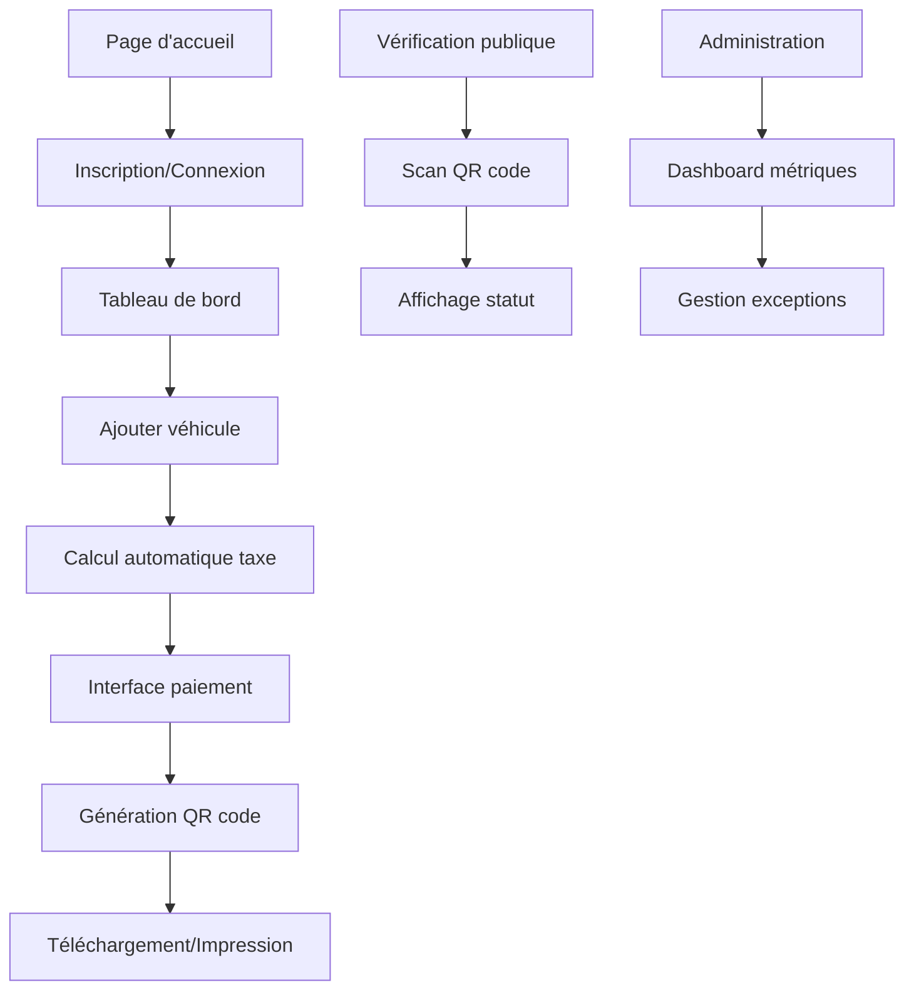

# Document d'Exigences Produit : Plateforme Numérique de Taxe sur les Véhicules à Moteur

## 1. Vue d'ensemble du produit

La Plateforme Numérique de Taxe sur les Véhicules à Moteur est une solution complète pour la déclaration et le paiement de la taxe annuelle sur les véhicules à Madagascar, conformément au Projet de Loi de Finances 2026. Cette plateforme modernise le processus de collecte fiscale en automatisant les calculs, en sécurisant les paiements et en générant des preuves de paiement vérifiables via QR code.

- **Objectif principal** : Digitaliser entièrement le processus de déclaration et paiement de la taxe sur les véhicules à moteur
- **Public cible** : Propriétaires de véhicules particuliers, gestionnaires de flottes d'entreprises, administrations fiscales, forces de l'ordre
- **Valeur ajoutée** : Simplification des démarches, réduction des fraudes, amélioration de la collecte fiscale, conformité légale automatique

## 2. Fonctionnalités principales

### 2.1 Rôles utilisateurs

| Rôle | Méthode d'inscription | Permissions principales |
|------|---------------------|------------------------|
| Particulier | Email + validation | Gestion de ses véhicules personnels, paiement individuel |
| Entreprise | Email + informations fiscales | Gestion de flotte, paiements groupés, rapports comptables |
| Administrateur | Invitation système | Supervision complète, gestion des exceptions, rapports globaux |
| Agent de vérification | Accès public | Vérification QR codes sans authentification |

### 2.2 Modules fonctionnels

Notre plateforme comprend les pages essentielles suivantes :

1. **Page d'accueil** : présentation du service, grille tarifaire officielle, accès rapide à la vérification QR
2. **Espace utilisateur** : tableau de bord personnalisé, gestion des véhicules, historique des paiements
3. **Interface de paiement** : calcul automatique, choix des moyens de paiement, confirmation sécurisée
4. **Système de vérification** : validation publique des QR codes, statut des véhicules
5. **Interface d'administration** : supervision, rapports, gestion des exceptions
6. **Centre de notifications** : rappels automatiques, alertes d'échéances

### 2.3 Détails des fonctionnalités par page

| Page | Module | Description des fonctionnalités |
|------|--------|--------------------------------|
| Accueil | Section héro | Présenter le service, afficher la grille tarifaire PLF 2026, liens rapides vers inscription/connexion |
| Accueil | Vérification rapide | Permettre la vérification publique d'un QR code sans authentification |
| Inscription | Formulaire particulier | Créer un compte avec email, mot de passe, informations personnelles |
| Inscription | Formulaire entreprise | Créer un compte entreprise avec numéro contribuable, informations fiscales |
| Tableau de bord | Liste véhicules | Afficher tous les véhicules avec statut fiscal, échéances, actions rapides |
| Tableau de bord | Notifications | Afficher les rappels d'échéances, confirmations de paiement |
| Gestion véhicules | Ajout véhicule | Formulaire complet pour tous types (terrestre, ferroviaire, maritime, aérien) |
| Gestion véhicules | Calcul automatique | Calculer la taxe selon grille PLF 2026, gérer les exonérations légales |
| Paiement | Interface sécurisée | Intégrer Mobile Money (MVola, Orange, Airtel), cartes bancaires |
| Paiement | Paiement groupé | Permettre le paiement multiple pour les flottes d'entreprises |
| QR Vérification | Page publique | Afficher statut PAYÉ/EXONÉRÉ/IMPAYÉ avec détails de validation |
| Administration | Dashboard global | Métriques de collecte, statistiques d'usage, alertes système |
| Administration | Gestion exceptions | Traiter les disputes, gérer les cas particuliers |

## 3. Processus métier principal

### Flux utilisateur particulier :
L'utilisateur s'inscrit sur la plateforme, ajoute ses véhicules en saisissant les informations techniques, consulte le calcul automatique de la taxe, procède au paiement sécurisé, télécharge son QR code et l'appose sur son pare-brise.

### Flux entreprise :
L'entreprise s'inscrit avec ses informations fiscales, importe ou saisit sa flotte de véhicules, utilise les fonctions de paiement groupé, génère les rapports comptables et gère les QR codes de tous ses véhicules.

### Flux de vérification :
Les agents de contrôle scannent le QR code sur le véhicule, accèdent instantanément à la page de vérification publique et consultent le statut fiscal sans authentification.

## 4. Design de l'interface utilisateur

### 4.1 Style de design

- **Couleurs principales** : Bleu gouvernemental (#1E3A8A), vert validation (#059669), rouge alerte (#DC2626)
- **Couleurs secondaires** : Gris neutre (#6B7280), blanc (#FFFFFF), jaune attention (#F59E0B)
- **Style des boutons** : Arrondis modernes avec ombres subtiles, états hover/focus marqués
- **Typographie** : Inter pour l'interface, tailles 14px (corps), 18px (titres), 24px (en-têtes)
- **Layout** : Design mobile-first avec grille responsive, navigation top fixe
- **Icônes** : Style outline moderne, cohérent avec Heroicons, support des drapeaux Madagascar/France

### 4.2 Aperçu du design par page

| Page | Module | Éléments UI |
|------|--------|-------------|
| Accueil | Section héro | Bannière avec illustration véhicule, CTA proéminents, grille tarifaire interactive |
| Accueil | Navigation | Menu responsive avec langues FR/MG, accès rapide connexion/inscription |
| Tableau de bord | Cards véhicules | Cards avec statut coloré, progress bars échéances, boutons d'action rapides |
| Paiement | Interface sécurisée | Formulaire step-by-step, logos moyens paiement, indicateurs sécurité |
| QR Vérification | Page publique | Design épuré, statut visuel clair, informations essentielles centrées |
| Administration | Dashboard | Graphiques interactifs, KPIs en temps réel, tables de données filtrables |

### 4.3 Responsivité

La plateforme adopte une approche mobile-first avec adaptation automatique pour tablettes et desktop. L'interface tactile est optimisée pour les smartphones, avec des boutons de taille appropriée et une navigation intuitive. Le support hors ligne (PWA) permet l'accès aux fonctionnalités essentielles sans connexion internet.